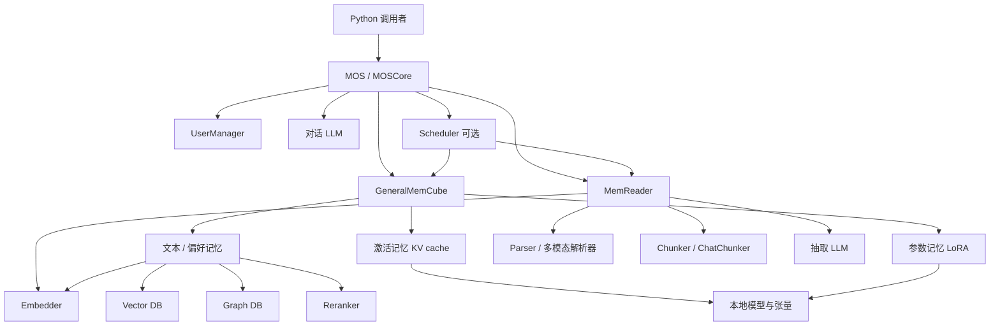
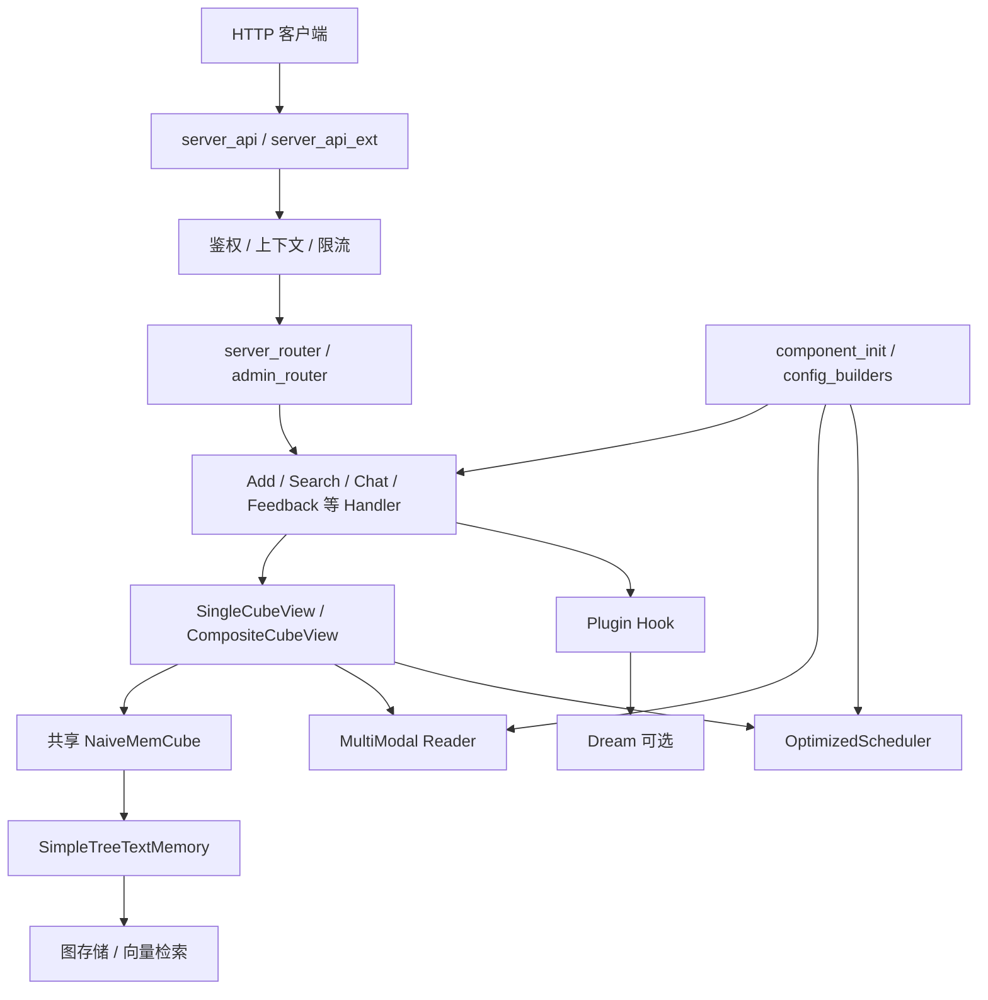
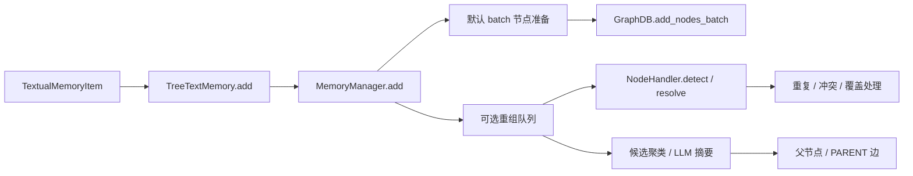
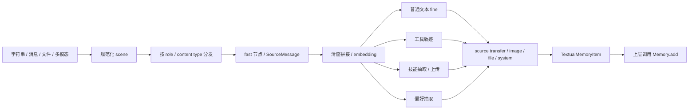
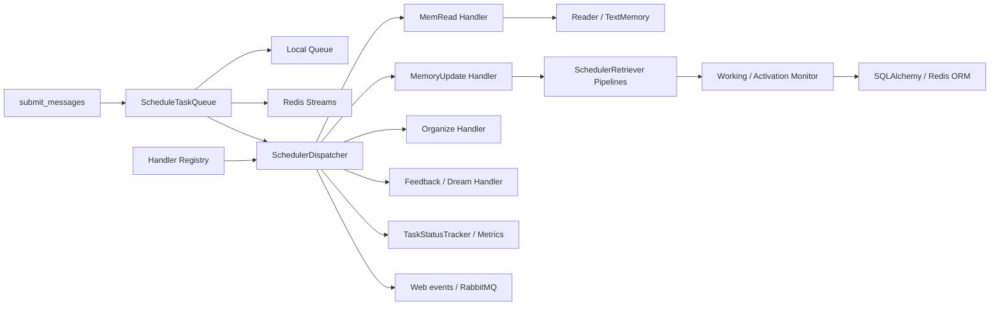
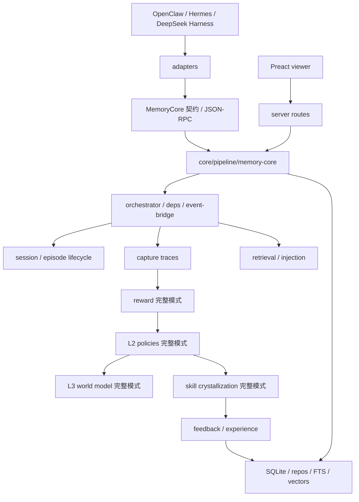

# MemOS 项目结构与模块关系

> 源码快照：2026-10-02；Git 提交 `a7367d07`；Python 包版本 `2.0.33`。本文依据当前工作树的源码、工厂注册、配置、测试与部署入口整理，适合在阅读实现前建立整体地图。
>
> 分析方法：对 `src/`、`apps/`、`packages/`、`evaluation/`、`examples/`、`scripts/`、`tests/`、`.github/` 的 1,593 个源文件进行全量结构与静态导入扫描，共 452,811 行；Python 使用 AST，TypeScript/JavaScript 使用导入与符号扫描，并结合关键入口、实现、调用点和测试阅读。统计包含测试、示例、脚本、HTML、样式和 SQL，不等同于生产代码量。部署 YAML、Dockerfile、包清单另行核对。结论属于静态源码分析，没有以真实模型或数据库完成集成运行验证。

## 阅读导航

1. [仓库范围与总体结构](#1-仓库范围与总体结构)
2. [核心概念、分层及总体关系图](#2-核心概念分层及总体关系图)
3. [Python 模块职责总表](#3-python-模块职责总表)
4. [MOS 与 MemCube 的组织关系](#4-mos-与-memcube-的组织关系)
5. [配置系统与工厂装配](#5-配置系统与工厂装配)
6. [记忆、读取、模型及存储模块](#6-记忆读取模型及存储模块)
7. [HTTP 服务、调度、用户、多 Cube 和插件](#7-http-服务调度用户多-cube-和插件)
8. [TypeScript 应用、共享包与外围工程](#8-typescript-应用共享包与外围工程)
9. [静态依赖、运行依赖与数据流](#9-静态依赖运行依赖与数据流)
10. [当前实现边界与推荐阅读顺序](#10-当前实现边界与推荐阅读顺序)
11. [源码导航附录](#11-源码导航附录)

## 1. 仓库范围与总体结构

当前仓库同时维护 Python 记忆系统、Node/TypeScript 本地记忆系统、云服务适配插件与桌面集成。它们有相近业务概念，但入口、运行环境和存储实现分别存在。

```text
MemOS/
├── src/memos/                 Python MemoryOS 库和 FastAPI 服务
│   ├── mem_os/                多用户、多 Cube 的库级协调入口
│   ├── mem_cube/              记忆容器与装配
│   ├── memories/              文本、激活、参数记忆
│   ├── mem_reader/            消息/文件/多模态数据的读取与抽取
│   ├── mem_scheduler/         消息调度、任务执行、监控和持久化
│   ├── api/                   HTTP/MCP 接口、handler、生命周期
│   ├── multi_mem_cube/        服务中的单 Cube 视图与多 Cube 聚合
│   ├── search/                SearchRequest 到 Cube 检索的桥接
│   ├── mem_user/              用户、Cube 归属、访问和持久化
│   ├── mem_chat/              独立的记忆辅助对话组件
│   ├── mem_agent/             深度检索 Agent
│   ├── mem_feedback/          反馈驱动的记忆更新
│   ├── llms/ embedders/       模型生成与向量编码
│   ├── vec_dbs/ graph_dbs/    向量库与图/关系存储适配
│   ├── chunkers/ parsers/     切分与文件转文本
│   ├── reranker/             候选重排与文本拼接策略
│   ├── configs/              配置模型及配置工厂
│   ├── plugins/ dream/       插件框架与内置 Dream 插件
│   └── context/ types/ templates/ memos_tools/ 等基础设施
├── apps/
│   ├── memos-local-plugin/             v2 本地记忆系统及宿主适配器
│   ├── memos-local-openclaw/           v1 本地 OpenClaw 插件
│   ├── MemOS-Cloud-OpenClaw-Plugin/    OpenClaw 到云 API 的适配插件
│   └── openwork-memos-integration/     OpenWork 桌面与 MCP 集成
├── packages/                 TypeScript 核心与契约源码，需核对实际引用
├── tests/                    Python 测试；apps 各有自身测试
├── examples/                 Python 各能力使用样例
├── evaluation/               基准数据处理、接入、检索、回答与评分
├── scripts/                  依赖检查、云效/GitHub 同步辅助
├── docker/ deploy/helm/       容器、Compose 与 Kubernetes 部署
├── docs/                     原有模块说明与 OpenAPI 文件
└── 教程/                     本教程
```

| 范围 | 本次扫描源文件数 | 源码行数 | 在项目中的作用 |
|---|---:|---:|---|
| `src/` | 384，其中 `src/memos/` 383 | 91,378 | Python 主系统 |
| `apps/` | 885 | 267,132 | 四个独立应用，含内部测试和前端 |
| `packages/` | 55 | 29,924 | TypeScript 核心/契约源码 |
| `evaluation/` | 47 | 23,752 | 评测驱动与指标 |
| `examples/` | 53 | 8,222 | 使用样例 |
| `scripts/` | 2 | 609 | 仓库辅助脚本 |
| `tests/` | 144 | 19,441 | Python 测试与测试辅助 |
| `.github/` 脚本 | 23 | 12,353 | CI 与发布验证源码 |

当前树没有项目说明中提到的 `extensions/`，也没有 `src/memos/api/start_api.py` 或 `routers/product_router.py`。不存在的目录或历史入口不作为本文的现有模块。

## 2. 核心概念、分层及总体关系图

### 2.1 先区分六个概念

| 概念 | 源码中的载体 | 职责与关联 |
|---|---|---|
| MOS | `MOS` / `MOSCore` | 管理已加载 Cube、用户访问、会话、记忆读写与对话；可接入 Scheduler |
| MemCube | `GeneralMemCube` / `NaiveMemCube` | 组合具体 Memory 对象，提供装载与导出；本身不实现检索算法 |
| Memory | `BaseMemory` 的具体实现 | 执行存储、抽取、召回、更新等操作；不同实现支持程度不同 |
| MemoryItem | `TextualMemoryItem` 等 | 记忆内容及元数据的传递格式，不是数据库客户端 |
| MemReader | 各结构化 Reader | 将输入解析成 MemoryItem，承担内容抽取与来源信息整理 |
| Scheduler | `GeneralScheduler` / `OptimizedScheduler` | 消费任务、增强与整理记忆、维护工作记忆/激活记忆及任务状态 |

`textual / activation / parametric` 是实现层面的三类记忆；`WorkingMemory / LongTermMemory / UserMemory / PreferenceMemory / SkillMemory / ToolSchemaMemory / ToolTrajectoryMemory` 等是文本记忆条目的语义类别。二者不是同一级分类。Python 的工作记忆也不能直接等同于本地插件 v2 的 L1/L2/L3。

### 2.2 Python 库级关系

图中的箭头表示主要运行调用或装配方向，未穷举辅助 import。



### 2.3 Python HTTP 服务关系

HTTP 的主业务链由服务初始化器和 handler 直接装配；不能把所有 REST 路由都画成调用 `MOS`。



第三条入口为 `api/mcp_serve.py`：MCP 服务持有 `MOS`，将工具请求转换为库级操作。第四类入口是 `apps/` 中的 TypeScript 应用，它们分别通过本地数据库、MCP 或云 HTTP 工作，详见第 8 节。

## 3. Python 模块职责总表

“主要使用者”表示运行时主要调用方；“主要依赖”展示业务依赖，基础配置、日志、类型依赖在第 9 节单列。

| 模块 | 功能 | 主要使用者 | 主要依赖 |
|---|---|---|---|
| `mem_os` | Cube 注册、用户校验、读写、跨 Cube 检索、会话对话、CoT 查询分解 | Python 调用方、MCP | `mem_cube`、`mem_reader`、`mem_user`、`mem_scheduler`、`llms` |
| `mem_cube` | 记忆类型装配、配置合并、导入导出 | `mem_os`、服务初始化、多 Cube 视图 | `memories`、`configs` |
| `memories` | 文本/树/偏好、KV cache、LoRA 的具体能力 | Cube、Reader、Scheduler、Agent | `llms`、`embedders`、`graph_dbs`、`vec_dbs`、`reranker` 等 |
| `mem_reader` | 普通/多模态输入解析、切片、语义抽取、工具与技能抽取 | MOS、Cube 视图、Scheduler、Feedback | `parsers`、`chunkers`、`llms`、`embedders`、MemoryItem |
| `mem_scheduler` | 队列分发、任务处理、增强、整理、监控、ORM 状态 | MOS、API、Cube 视图 | Reader、Cube、Memory、Feedback、用户存储、Redis/RabbitMQ |
| `mem_user` | 用户角色、Cube 元信息、归属和关联持久化 | MOS、API 初始化、Scheduler | SQLAlchemy、SQLite/MySQL、Redis 分支 |
| `mem_chat` | 可单独实例化的记忆辅助对话 | MemChatFactory 调用者、示例 | `mem_cube`、`llms`、MemoryItem |
| `mem_agent` | 深度检索与查询分解代理 | 搜索 Handler / 调用者 | `llms`、`memories`、提示词、类型 |
| `mem_feedback` | 理解反馈、检索旧记忆、决定新增/修改/删除 | FeedbackHandler、Scheduler | Reader、LLM、Embedder、GraphDB、Reranker、Hook |
| `multi_mem_cube` | 单 Cube 逻辑视图、多 Cube 聚合与读写路由 | API Handler | 共享 Cube、Reader、Scheduler、SearchService |
| `search` | 将 SearchRequest 转成 Cube/Memory 检索调用 | Cube 视图、Scheduler | API 请求模型、通用类型 |
| `llms` | 生成、流式输出、工具调用、Responses、模型缓存、请求限速 | MOS、Reader、Memory、Scheduler、Agent | 各模型 SDK/HTTP、本地 transformers 等 |
| `embedders` | 文本/多模态向量编码、缓存、长度控制、备份请求 | Reader、Memory、Scheduler、Feedback | API/本地模型、cachetools、tiktoken 等 |
| `vec_dbs` | 纯向量库的 CRUD、相似度检索、过滤、导入导出 | GeneralTextMemory、偏好记忆、部分图后端 | Qdrant、Milvus |
| `graph_dbs` | 节点/边与向量/全文检索、租户隔离 | 树记忆、Reader、Scheduler、Feedback、Dream | Neo4j、PolarDB/AGE、PostgreSQL/pgvector |
| `chunkers` | 文本和 Markdown 切分 | Reader、Memory | chonkie、LangChain 分割器等 |
| `parsers` | 文件到 Markdown/文本转换 | Reader、Memory | MarkItDown |
| `reranker` | 候选重排、拼接待评分文本、远端 BGE 调用 | Memory、Scheduler、Feedback、SearchHandler | HTTP、sklearn、numpy、记忆条目 |
| `configs` | Pydantic 配置、backend 校验、具体配置实例化 | 所有功能模块 | Pydantic；部分反向依赖 Scheduler/Reader/Memory |
| `plugins` | 自实现 Hook、发现/注册、组件及生命周期扩展 | API、Reader、Feedback、Scheduler | Hook 注册表、entry points |
| `dream` | 可选的离线动机推理、上下文化、日记、检索增强 | Plugin Hook、Scheduler、扩展 API | 插件框架、服务组件、图存储、LLM |
| `context` | 请求字段与 trace 的线程传播 | API、MOS、Reader、Scheduler、Embedder | ContextVar、线程池 |
| `types` | 消息、检索结果、用户上下文、权限结构 | 模型、MOS、API、Reader、Memory | Pydantic、TypedDict、MemoryItem |
| `templates` | 抽取、搜索、调度、反馈、技能、对话提示词 | 各业务模块 | 大多为常量；instruction_completion 依赖 Reader |
| `memos_tools` | 线程安全容器、工厂单例、通知辅助 | 服务初始化、模型工厂、MOS 等 | 线程锁、弱引用、通知/OSS 等可选服务 |
| 根级工具 | 日志、计时、依赖检查、异常、弃用、CLI | 全系统 | Python 标准库及日志/HTTP 包 |
| `extras` | 扩展命名空间 | 当前无实际实现 | 当前仅空 `__init__.py` |

## 4. MOS 与 MemCube 的组织关系

### 4.1 顶层导出和 CLI

[src/memos/__init__.py](../src/memos/__init__.py) 导出 `MOS`、`GeneralMemCube`、两个主配置、`GeneralScheduler` 及调度工厂。它会 import 这些实现，所以 `import memos` 会沿配置、日志、记忆与调度模块产生较宽的加载依赖；不能认为顶层包只是没有副作用的符号表。

[cli.py](../src/memos/cli.py) 是 `pyproject.toml` 的 `memos = memos.cli:main` 对应入口。现有命令为 `download_examples` 和 `export_openapi`；导出 OpenAPI 时加载的是 `memos.api.server_api:app`。库级、HTTP、MCP 与 CLI 入口的职责不同。

### 4.2 MOSCore：协调对象，不是存储引擎

关键实现：[core.py](../src/memos/mem_os/core.py)。

| 操作 | 实际协作关系 |
|---|---|
| 初始化 | 从配置工厂创建 chat LLM、Reader；建立 chat_history_manager 和 mem_cubes；接入/创建 UserManager；按开关初始化 Scheduler |
| `register_mem_cube` | 接收对象、目录或远端仓库；必要时调用 GeneralMemCube 装载，再登记用户与 Cube 的关系 |
| `search` | 取得用户可见 Cube 列表；逐 Cube 将文本与偏好检索投递到两个线程并收集结果；显式 session_id 可成为过滤条件 |
| `add(messages)` | 普通文本后端可直接包装 MemoryItem；tree_text 后端调用 Reader；文本与偏好处理并行；async 时提交 mem_read，sync 时可提交 add |
| `add(memory_content/doc_path)` | 文本内容转消息抽取，或遍历文档交给 Reader，再写入具体文本记忆 |
| `chat` | 先检索可访问 Cube 文本记忆，构建 system prompt，再调用 chat LLM、更新会话，并向 Scheduler 提交 query/answer 事件 |
| `get/update/delete` | 主要委托 `cube.text_mem`，不意味着四种记忆统一支持同一套 CRUD |
| `get_all` | 当前实现主要返回文本与激活记忆；返回结构与 search 的具体键应以实现为准 |
| `dump/load` | 委托某个已加载 Cube 做持久化；用户元数据与 Scheduler ORM 不是自动包含在 Cube 导出中 |
| 用户操作 | 创建、列举、分享 Cube 等转给 UserManager |

当前 `search` 中跨 Cube 遍历是顺序的，单个 Cube 内文本/偏好查询并行；不能仅因为使用线程池就推断所有 Cube 同时执行。`chat` 的 KV cache 接入针对 HuggingFace 后端并优先取单 Cube 的缓存；远端模型 API 不具有读取本地张量缓存的能力。

### 4.3 MOS：自动配置与复杂查询

[main.py](../src/memos/mem_os/main.py) 的 `MOS` 继承 `MOSCore`。无显式配置时读取环境配置并尝试创建默认 Cube；`simple()` 是 `MOS()` 的便捷入口。`PRO_MODE` 增加查询复杂度判断、子问题拆分、并行子问题检索、分别回答和最终综合；失败或无需拆分时回到普通 chat。

`mem_os/utils` 三个模块的作用分别是：

| 文件 | 功能与关联 |
|---|---|
| [default_config.py](../src/memos/mem_os/utils/default_config.py) | 生成 MOSConfig/CubeConfig 和默认 Cube；连接模型、Embedder 与存储配置 |
| [format_utils.py](../src/memos/mem_os/utils/format_utils.py) | 图转工作记忆树、质量评估/采样、按记忆类型排序、重复 ID 校验、去除 embedding、KV cache 序列化摘要；API Formatter 会使用这些展示工具 |
| [reference_utils.py](../src/memos/mem_os/utils/reference_utils.py) | 整理连续引用标记、处理流式引用、准备引用映射；服务流式对话使用 |

自动配置函数当前存在配置与校验约束的差异：例如默认 Cube 构造给出空的 act_mem/para_mem 字典且没有完整填入 pref_mem，而相应工厂有必填 backend/config。这里说明入口的调用关系，不将源码中的便捷示例当成已验证成功的启动配方。

### 4.4 两种 Cube

| 实现 | 创建方式 | 容纳的记忆 | 主要场景 |
|---|---|---|---|
| [GeneralMemCube](../src/memos/mem_cube/general.py) | 输入 GeneralMemCubeConfig，经 MemoryFactory 创建实例 | text、act、para、pref 四个槽；uninitialized 对应不创建 | Python 库、按配置装载/导出 |
| [NaiveMemCube](../src/memos/mem_cube/navie.py) | 直接注入 Memory 实例 | text、act、para；偏好整合进 text | HTTP 服务共享组件 |

文件名在当前仓库实际拼为 `navie.py`，类名为 `NaiveMemCube`。GeneralMemCube 的 `load/dump` 分别调用各个 Memory 的持久化方法，并写/读配置文件；`init_from_dir` 支持合并默认配置；`init_from_remote_repo` 调用 utils 的 Git 下载函数。

[utils.py](../src/memos/mem_cube/utils.py) 的配置合并保留 user_id/cube_id/model_schema 等身份字段，并在图后端变化时处理后端特定字段。Cube 的磁盘快照不等价于模型 checkpoint、用户库与调度数据库的完整备份。NaiveMemCube 构造器没有设置 `self.config`，但其 load/dump 仍引用配置，因此它的服务容器角色与 GeneralMemCube 的可完整导出角色不能混用。

## 5. 配置系统与工厂装配

### 5.1 常见装配模式


[BaseConfig](../src/memos/configs/base.py) 基于 Pydantic v2，默认 `extra="forbid"`、`strict=True`，维护 model_schema，并提供 JSON/YAML 文件读取与写出。配置工厂通常先校验 backend，再把 config 字典变成具体配置对象。运行工厂才真正建立模型客户端、数据库连接或组件。

这是一种常见约定，并非所有工厂完全一致：Reranker 配置只是较宽松的 BaseModel；用户与部分图配置工厂也直接继承 BaseModel；部分 Reader 允许额外字段，GeneralSchedulerConfig 忽略额外字段。具体依赖与校验以相应类为准。

### 5.2 配置文件职责

| 配置文件 | 配置的对象/关系 |
|---|---|
| `mem_os.py` | user/session、chat_model、Reader、Scheduler、UserManager 和各记忆开关 |
| `mem_cube.py` | 四种 Memory 槽及其允许的 backend 子集 |
| `memory.py` | 文本、树、偏好、KV、LoRA 与 Feedback 所需的嵌套配置 |
| `mem_reader.py` | 主抽取/通用/图片/文档/偏好 LLM，Embedder，Chunker，多模态参数 |
| `mem_scheduler.py` | 队列、线程池、监控容量、ORM、Redis/RabbitMQ 与模型/存储认证参数 |
| `mem_user.py` | SQLite/MySQL/Redis 用户持久化配置 |
| `mem_chat.py` | 独立对话模型、会话窗口、记忆开关 |
| `mem_agent.py` | simple/deep_search 代理配置；具体运行工厂只实现 deep_search |
| `llm.py` | 各 LLM 的模型、生成、HTTP、备份参数 |
| `llm_rate_limit.py` | 按显式模型名选择的 QPS/burst/等待/排队/重试策略，默认关闭 |
| `embedder.py` | 向量模型、维数、长度控制、多模态与备份 API |
| `vec_db.py` / `graph_db.py` | 库连接、集合/图、向量维度、连接池、逻辑/物理租户隔离 |
| `chunker.py` / `parser.py` | 切分窗口、Markdown 标题规则、文件解析后端 |
| `reranker.py` | 重排 backend 与实现特定字典 |
| `internet_retriever.py` | 联网检索参数与部分后端所需 Reader |
| `utils.py` | 读取配置文件 model_schema |

### 5.3 当前工厂注册表

此表区分“存在类”“配置接受”和“运行工厂支持”。拼写必须使用源码中的准确字符串。

| 类别 | 运行工厂支持的 backend | 配置/实现边界 |
|---|---|---|
| LLM | openai、azure、ollama、huggingface、huggingface_singleton、vllm、qwen、deepseek、minimax、openai_new | AzureResponses 配置类存在，但不是当前工厂注册项 |
| Embedder | ollama、sentence_transformer、ark、universal_api | 模型选择在后端内配置 |
| Vector DB | qdrant、milvus | 纯向量持久化抽象 |
| Graph DB | neo4j、neo4j-community、polardb、postgres | community 使用连字符；没有 nebular 注册项 |
| Chunker | sentence、markdown | SimpleChunker / CharacterTextChunker 类存在，但不在配置/运行工厂注册 |
| Parser | markitdown | 单一文件解析适配 |
| Memory | naive_text、general_text、tree_text、simple_tree_text、pref_text、simple_pref_text、kv_cache、vllm_kv_cache、lora | uninitialized 是 Cube 跳过创建的配置标记；simple_pref_text 运行项没有对应配置工厂项；mem_feedback 是配置项但不是 MemoryFactory 项 |
| Reader | simple_struct、strategy_struct、multimodal_struct | 三种抽取路线 |
| Scheduler | general_scheduler、optimized_scheduler | 不是 general / optimized |
| MemChat | simple | 独立对话组件 |
| MemAgent | deep_search | 配置接受 simple，但运行工厂不提供 simple |
| 用户管理 | UserManagerFactory：sqlite、mysql；PersistentUserManagerFactory：sqlite、mysql、redis | 两个工厂职责不同，不能互换 |
| Reranker | noop、cosine_local、http_bge、http_bge_strategy | 当前运行工厂通过条件分支装配；concat.py 是辅助模块 |
| 重排策略 | single_turn、concat_background、singleturn_outmem、concat_docsource | 根据来源选择待评分文本拼接规则 |
| 联网检索 | google、bing、xinyu、bocha、tavily | 位于树记忆 retrieve 子模块；None 表示不创建 |

`GeneralMemCubeConfig` 对 text_mem 进一步只允许 naive_text/general_text/tree_text/uninitialized，对 pref_mem 只允许 pref_text/uninitialized；因此运行工厂中的 Simple 实现通常由服务组件直接注入，不能推断它们都能通过 GeneralMemCubeConfig 装配。

## 6. 记忆、读取、模型及存储模块

### 6.1 Memory 抽象与共享数据模型

[BaseMemory](../src/memos/memories/base.py) 规定 load/dump；文本、激活、参数记忆分别继承各自的 base，定义相应抽取/读写协议。声明接口不代表每个子类都完整实现。

[textual/item.py](../src/memos/memories/textual/item.py) 是全系统的数据交汇点：

| 数据结构 | 功能与使用关系 |
|---|---|
| TextualMemoryItem | UUID、正文、可扩展 metadata；Reader 输出、Memory/DB 存储、Search/Feedback/Scheduler 传递 |
| TextualMemoryMetadata | user/session、状态、version/history、来源、标签、时间、info 等公共字段 |
| TreeNodeTextualMemoryMetadata | memory_type、SourceMessage 列表、embedding、usage、background、file_ids |
| SourceMessage | 输入来源消息和文件/工具等证据，支持细化、引用和技能抽取 |
| ArchivedTextualMemory | 归档正文、更新原因、关联节点等版本信息 |
| SearchedTreeNodeTextualMemoryMetadata | 增加 relativity 等检索评分 |
| PreferenceTextualMemoryMetadata | 显式/隐式偏好、原对话、偏好文本与 score |

metadata 中的 version/history 和插件版本 Hook 提供版本处理的接口与路径；不能据此将所有 Memory 后端都描述为实现了相同的版本管理。

### 6.2 文本记忆的四条路线

| 实现 | 实际机制 | 主要依赖与调用方 |
|---|---|---|
| [NaiveTextMemory](../src/memos/memories/textual/naive.py) | LLM 抽取；进程内列表；按 query.split 与正文词集合交集排序；JSON 持久化 | extractor LLM；适合最基础路径，没有向量/图库依赖 |
| [GeneralTextMemory](../src/memos/memories/textual/general.py) | LLM 抽取、Embedder 编码、VecDB CRUD/相似度检索、JSON 导入导出 | LLM、Embedder、Qdrant/Milvus；由 GeneralMemCube 配置装配 |
| [TreeTextMemory](../src/memos/memories/textual/tree.py) | MemoryManager 写入；图节点/关系、类型路由、召回/重排、RawFile、软删除、导入导出；可重组织 | GraphDB、LLM、Embedder、Reranker、可选 BM25/联网检索 |
| [PreferenceTextMemory](../src/memos/memories/textual/preference.py) | 独立 extractor/adder/retriever，显式/隐式偏好集合检索及重排 | LLM、Embedder、向量库、Reranker；默认流程明显面向 Milvus |

[SimpleTreeTextMemory](../src/memos/memories/textual/simple_tree.py) 和 [SimplePreferenceTextMemory](../src/memos/memories/textual/simple_preference.py) 都继承对应实现并接受已创建的依赖。Simple 表示依赖注入方式，主要用于共享组件，不意味着不同的简化算法。

独立 pref_text 与多模态 Reader 输出的图节点型 PreferenceMemory 是两条路径：前者在独立偏好向量集合中工作，后者随树记忆写入 GraphDB。服务当前主要使用后一条路线。

### 6.3 独立偏好记忆内部流水线

`memories/textual/prefer_text_memory/` 内部有三个配置/运行工厂：Extractor、Adder、Retriever，当前都只注册 naive。

| 文件 | 功能与关联 |
|---|---|
| `config.py`、`factory.py` | 三段流水线的配置和装配，注入 LLM/Embedder/DB/Reranker |
| `spliter.py` | 文档 parser/sentence chunker、对话 lookback/overlap、QA 配对 |
| `extractor.py` | 切分后并行调用显式/隐式偏好 LLM，向量化并生成偏好 metadata |
| `adder.py` | 先召回类似偏好，再判断新增/修改；fast/fine 更新、操作记录；可关联普通 text_mem 去重 |
| `retrievers.py` | 并行查 explicit_preference/implicit_preference collection，分别重排和阈值过滤再合并 |
| `utils.py` | 消息序列化、datasketch 偏好去重 |

`PREFERENCE_ADDER_MODE` 控制更新方式。Retriever 调用的 collection/字段参数具有 Milvus 特征，某处 Qdrant 类型注解不能作为所有向量库可互换的证据。

### 6.4 树记忆写入与组织



| `tree_text_memory/organize/` 文件 | 功能与依赖 |
|---|---|
| [manager.py](../src/memos/memories/textual/tree_text_memory/organize/manager.py) | 写入、记忆类型分配、层级路径、working_binding、容量清理、重组消息；连接 Reader 输出与 GraphDB |
| [reorganizer.py](../src/memos/memories/textual/tree_text_memory/organize/reorganizer.py) | PriorityQueue 消费与周期结构整理；NodeHandler 检测/融合；embedding 聚类、LLM 划分/摘要、父节点关系 |
| [handler.py](../src/memos/memories/textual/tree_text_memory/organize/handler.py) | 相似节点检索、关系判断、覆盖/冲突/重复及 metadata/边继承 |
| [relation_reason_detector.py](../src/memos/memories/textual/tree_text_memory/organize/relation_reason_detector.py) | 含因果/条件/顺序/概念推理辅助代码；当前 process_node 的调用块处于字符串中，主重组路径未执行 |

需核对一个与注释不同的行为：MemoryManager 默认 `use_batch=True`；`_add_memories_batch` 准备 working_nodes，但只提交 graph_nodes，未提交工作节点。非批量 `_process_memory` 才写入工作与图节点。因此不能写“任意 add 默认同时生成 WorkingMemory 和 LongTermMemory”。

### 6.5 树记忆检索内部关系

[TreeTextMemory.search](../src/memos/memories/textual/tree.py) 创建 AdvancedSearcher，但普通调用走其继承的 Searcher.search；额外的 deep_search 需要相应调用路线。

```text
Searcher.search
→ TaskGoalParser：fast 分词 / fine LLM 解析
→ 工作记忆、长期/用户、联网等召回路径并行
→ GraphMemoryRetriever：字段匹配、向量、BM25/全文
→ 公共 Reranker
→ post_retrieve：去重、分语义类型排序与 top_k
→ 带 relativity 的 MemoryItem
```

| `tree_text_memory/retrieve/` 文件 | 功能 |
|---|---|
| `searcher.py` | 主召回路径、plugin/simple 路径、full_recall、类型重排/裁切；普通、工具、技能、偏好各有 top_k，最终总数可大于普通 top_k |
| `task_goal_parser.py`、`retrieval_mid_structs.py` | fast tokenizer / fine LLM 的任务解析与 ParsedTaskGoal |
| `recall.py` | 工作节点读取；其他类型字段匹配/向量/BM25/全文并行并按 ID 合并；向量先取命中，再取正文 |
| `advanced_searcher.py` | 多轮检索、判断回答能力、补充查询、再次召回、记忆改写增强 |
| `bm25_util.py` | 分词与语料缓存，BM25，可选 TF-IDF 二次排序 |
| `retrieve_utils.py` | StopwordManager/FastTokenizer、中英文分词、JSON/结构化输出处理 |
| `reasoner.py` | LLM 选择相关 ID 的 MemoryReasoner；普通 Searcher 主干没有实际调用 reason |
| `reranker.py` | 历史本地 embedding/层级余弦 MemoryReranker；与当前注入的公共 Reranker 区分 |
| `utils.py` | 检索提示词辅助 |
| `internet_retriever_factory.py` | 联网检索装配；bing 当前映射 Google Retriever 并留有 TODO |
| `internet_retriever.py` | Google 分页搜索并生成带 web source/embedding 的记忆 |
| `xinyusearch.py`、`bochasearch.py` | Xinyu/Bocha HTTP 检索、Reader 抽取和结果向量化 |
| `tavilysearch.py` | Tavily SDK 检索并转换记忆 |

PolarDB 可在 `MEMOS_POLARDB_LIGHTWEIGHT_SEARCH_ENABLED` 打开且返回字段完整时直接构造结果，减少第二次 get_nodes；字段不足则回退。Searcher `_update_usage_history` 当前完整更新代码位于 docstring，虽然被调用但没有实际写 usage。

### 6.6 激活与参数记忆

| 实现 | 数据和操作 | 与上层关联 |
|---|---|---|
| [KVCacheMemory](../src/memos/memories/activation/kv.py) | extractor LLM.build_kv_cache；DynamicCache 张量、按 ID 字典、序列维拼接、pickle 读写 | HuggingFace 本地模型、MOS/独立 MemChat/激活 Scheduler |
| [VLLMKVCacheMemory](../src/memos/memories/activation/vllmkv.py) | 调用服务端短生成预填充；本地存 prompt 字符串与元数据，可拼接/重新预加载 | 已运行的 vLLM 服务；不在 Python 侧管理 vLLM 张量块 |
| [LoRAMemory](../src/memos/memories/parametric/lora.py) | 当前 load 仅 docstring，dump 写 Placeholder | 接口/配置存在；当前不是 LoRA 训练或加载完整实现 |

activation/item.py 的 KVCacheItem 使用 Transformers DynamicCache，而 VLLMKVCacheItem 的 memory 是字符串；不要只根据共同的“KV”名称把二者的数据结构画成相同。

### 6.7 MemReader：输入到记忆条目

| 顶层文件/实现 | 功能与协作 |
|---|---|
| `base.py` | get_memory/fine_transfer_simple_mem、GraphDB/Searcher 注入协议 |
| `factory.py` | simple_struct/strategy_struct/multimodal_struct；工厂单例，可追加 GraphDB/Searcher 注入 |
| [simple_struct.py](../src/memos/mem_reader/simple_struct.py) | user/session 和 scene 规范化，聊天 token 滑窗，fast 直接记忆/fine LLM 抽取，文档分块/并行抽取/向量化，幻觉过滤与改写 |
| [strategy_struct.py](../src/memos/mem_reader/strategy_struct.py) | 继承 SimpleStruct，替换策略 prompt/scene 切分，按长度或会话条数切块，文档使用 parser |
| [multi_modal_struct.py](../src/memos/mem_reader/multi_modal_struct.py) | 展开多模态 content，fast parse/窗口/embedding，fine 四路处理，逐 source transfer，技能存储与版本 Hook |
| `source_filter.py` | 偏好默认只从 user sources 抽取，清理检索上下文、注入记忆、工具/运行元数据和推理包装 |
| `utils.py` | token 计数、key 派生、JSON/改写/filter 结果解析 |
| `memory.py` | 旧结构化 Memory/QA/文档节摘要；当前主 import/构造链未找到引用 |



Reader 的主要输出是条目，不是 Cube。它确有技能文件/OSS、版本或相关记忆合并等副作用，但主记忆写入一般由上层 Memory.add 完成。

### 6.8 多模态、偏好与技能子模块

| 子模块 | 实际职责 |
|---|---|
| `read_multi_modal/base.py` | sources、消息重建、fast/fine 协议；默认 fast 分块、key 和 embedding |
| `multi_modal_parser.py` | 按角色/content type 分发，从 SourceMessage 重建后 transfer；audio_parser 当前为 None |
| `string_parser.py`、`text_content_parser.py` | 字符串/text part fast 节点与来源；文本 fine 主要由外层统一处理 |
| `user_parser.py`、`assistant_parser.py` | 角色消息的多模态/工具来源保留；assistant fine 返回空 |
| `tool_parser.py` | description/input/output 与工具消息的 sources、fast 分块；工具轨迹 fine 在外层汇总 |
| `system_parser.py` | 重点识别 tool_schema，转换 ToolSchemaMemory |
| `image_parser.py` | fast 保存 image 引用；fine vision LLM 内容解析/向量化 |
| `file_content_parser.py` | URL 下载、文件/Markdown/标题上下文、内嵌图解释、文档 LLM；fine base64/本地路径部分当前返回空串 |
| `read_multi_modal/utils.py` | 输入场景规范化、parser/切分器选择，切分器回退 SimpleTextSplitter |
| `read_pref_memory/process_preference_memory.py` | ENABLE_PREFERENCE_MEMORY 开关，source_filter 后并行显式/隐式偏好，输出图 PreferenceMemory |
| `read_skill_memory/process_skill_memory.py` | 自动技能从工具交互重建、任务分解、已有技能召回、生成/更新技能，写 SKILL.md/脚本/补充文件/ZIP |
| `read_skill_memory/upload_skill_memory.py` | 从来源 ZIP URL 下载解析用户上传技能，标 user_upload，生成 SkillMemory |

自动技能抽取工具轮次少于五轮会跳过，上传路径不受此要求。技能文件可保存本地或 OSS，相关 SDK/配置须可用。SkillMemory 属于程序经验与文件引用，不是 LoRA 参数训练产物。SimpleStruct 的文档 fast 与文档 transfer 部分还会抛 NotImplementedError。

### 6.9 LLM 与 Embedder

| LLM 文件 | 实现职责 |
|---|---|
| `base.py`、`factory.py` | generate/stream 抽象和具体后端选择，工厂实例缓存 |
| `openai.py` | Chat Completions、工具调用、流式、thinking、备份 client；内含 AzureLLM |
| `openai_new.py` | Responses API 的 OpenAI/Azure 类；AzureResponses 类未作为运行工厂项 |
| `qwen.py`、`deepseek.py`、`minimax.py` | OpenAI 兼容路径的供应商子类；Qwen 有特定请求 header |
| `ollama.py` | Ollama 模型检查/拉取、生成/流式 |
| `hf.py`、`hf_singleton.py` | Transformers 模型加载/生成/KV 构建，按模型配置复用 |
| `vllm.py` | OpenAI SDK 连接已有 vLLM 服务，prefill 短请求后返回 prompt |
| `rate_limit.py` | Redis GCRA admission、本地有界等待队列、共享配额、每次网络尝试获取令牌与可重试错误处理 |
| `utils.py` | thinking 标签去除 |

[llm_rate_limit.py](../src/memos/configs/llm_rate_limit.py) 启动构造时加载规则；默认关闭，仅匹配显式模型名，使用 Scheduler Redis 连接配置。`LLMRateLimitError` 与 API 重试/fallback 的关系有专门处理，不应把本地 admission 失败解释为一般模型服务错误。

| Embedder 文件 | 实现职责 |
|---|---|
| `base.py` | embed 协议、输入控制、耗时/长度/hash 摘要；实际主截断路径按字符限制 |
| `factory.py` | 后端选择，可按开关包装缓存 |
| `ollama.py` | Ollama embedding |
| `sentence_transformer.py` | 本地 SentenceTransformer |
| `ark.py` | Ark 分批文本/多模态 embedding |
| `universal_api.py` | OpenAI/Azure 兼容 embedding、Unicode 清洗、dimensions 不支持时重试、备份 client |
| `cache.py` | 批内去重、trace 缓存、TTL 缓存、并发 Future 合并；默认不开启，主要包装远端后端 |

生成 LLM 负责语义处理；Embedder 负责可检索向量。向量维度、模型签名、collection/index 配置必须一致，文本内容不会因为切换 Embedder 自动重新编码全部历史数据。

### 6.10 VecDB 与 GraphDB

| 向量模块 | 能力与依赖 |
|---|---|
| `vec_dbs/base.py`、`item.py` | CRUD/collection/payload index 抽象，id/vector/payload/score；Milvus 条目额外保存正文/原文 |
| `qdrant.py` | 本地或远端 Qdrant、collection/index、query_points、scroll、upsert、set_payload；字典 filter 当前主要转换为等值条件 |
| `milvus.py` | 多 collection、dense/sparse/BM25/hybrid、RRF/weighted 融合、复杂逻辑/比较过滤；payload index 方法主要记录无需另建 |

| 图模块 | 图/向量组织 | 与其他模块的关系 |
|---|---|---|
| `base.py`、`item.py` | 节点/边/子图/metadata/向量接口；GraphDBNode 继承 TextualMemoryItem | 因此 graph_dbs 对 memories 数据模型存在反向依赖 |
| [neo4j.py](../src/memos/graph_dbs/neo4j.py) | Neo4j 节点/边、原生向量索引，多库或共享库 user_name 隔离 | Tree/Reader/Scheduler/Feedback 使用 |
| [neo4j_community.py](../src/memos/graph_dbs/neo4j_community.py) | 正文/关系放 Neo4j，embedding 放组合 VecDB；要求关闭多库/auto_create | 同时依赖 Neo4j 与 VecDB，不只是授权开关变化 |
| [polardb.py](../src/memos/graph_dbs/polardb.py) | AGE/Cypher + SQL 向量/全文、线程连接池、信号量、健康/预热、复杂过滤 | 特定检索优化与关键词反馈路径依赖其扩展方法 |
| [postgres.py](../src/memos/graph_dbs/postgres.py) | 普通 PostgreSQL JSONB memories + edges 表 + pgvector，构造初始化 schema | 不要求 AGE，邻居/路径/子图由关系表实现 |

存储工厂“注册可选”不意味着方法完全等价：Neo4j/community 的 search_by_fulltext 当前返回空；部分图邻居/路径/去重/冲突/merge 方法未实现；Postgres 未找到完整 fulltext/drop_database 覆盖。PolarDB 构造中的部分建库/建图/索引代码位于字符串，不能宣称它默认自动初始化所有资源。

### 6.11 Chunker、Parser、Reranker

| 模块 | 文件与功能 |
|---|---|
| `chunkers` | base 的 Chunk 和 URL 保护；sentence 使用 Chonkie；markdown 做标题层级/递归切分；charactertext 是未注册的递归字符实现；simple 是无第三方依赖的边界切分 fallback |
| `parsers` | base 的文件转正文协议；唯一后端 MarkItDown.convert；工厂复用实例 |
| `reranker` | base 返回 `(item, score)`；cosine_local 做向量/层级权重；http_bge 发 query/documents；http_bge_strategy 先执行拼接策略；noop 保序/零分；concat 是来源拼接辅助 |
| `reranker/strategies` | dialogue_common 记录 QA pair 与原记忆；single_turn 按 pair；singleturn_outmem 聚合回原记忆；concat_background/concat_docsource 分别补背景/文件原文 |

Reranker 工厂还接受别名 bge、cosine、none、disabled、bge_strategy；未配置返回 None。LLM 后处理、向量融合和 Reranker 是三个不同的排序/筛选阶段，不能只用一个“重排模块”概括全部检索算法。

### 6.12 DeepSearch Agent 与反馈

[DeepSearchMemAgent](../src/memos/mem_agent/deepsearch_agent.py) 由 QueryRewriter 和 ReflectionAgent 协作：查询改写 → retriever.search → sufficient/needs_raw/missing_info 判断 → 再次检索。默认输出去重记忆，generated_answer 开关可追加回答。needs_raw 从已有 sources 重建文本，不重新下载文件；timeout 参数保存但未找到实际超时控制。

[mem_feedback/feedback.py](../src/memos/mem_feedback/feedback.py) 的主要流程：

```text
process_feedback：并行反馈回答与存储处理
→ 是否关键词替换 / 有效纠正
→ 无相关历史：Reader → MemoryManager 新增
→ 有相关历史：抽 corrected_info → embed/召回旧记忆
→ LLM 建议 ADD / UPDATE → ID 校正、去重和修改幅度过滤
→ MemoryManager / GraphDB 应用变更
→ 可选版本 Hook、归档/history、清理 working_binding
→ 返回 answer 与变更 record
```

`base.py` 定义反馈协议；`simple_feedback.py` 是依赖注入版，继承相同主要行为；`utils.py` 做变更比例、分块、反馈条目构造及 JSON 解析。关键词替换路径使用 PolarDB 扩展的 keywords_like/tfidf/fulltext，不能认为所有 GraphDB 都覆盖这一分支。

## 7. HTTP 服务、调度、用户、多 Cube 和插件

### 7.1 服务入口与启动生命周期

| 入口 | 职责与关联 |
|---|---|
| [server_api.py:app](../src/memos/api/server_api.py) | 基础 FastAPI 服务，挂载下载目录、请求上下文中间件、`/product` Router，并执行插件 `init_app` |
| [server_api_ext.py:app](../src/memos/api/server_api_ext.py) | Krolik 扩展入口，增加 CORS、安全响应头、限流和 `/admin` |
| [server_router.py](../src/memos/api/routers/server_router.py) | `/product` 路由集合；模块导入阶段即调用 `init_server()` 装配共享组件和 Handler |
| [mcp_serve.py:MOSMCPServer](../src/memos/api/mcp_serve.py) | FastMCP 工具服务；持有 MOS，将工具请求委托给库级方法，支持 stdio/http/sse |
| [client.py:MemOSClient](../src/memos/api/client.py) | 云 API 的 requests SDK，调用 `/add/message`、`/search/memory` 等；与本地 `/product/*` 路径不同 |

基础服务的主要组装发生在 Router 导入阶段，lifespan 退出时通过 [lifecycle.py](../src/memos/api/lifecycle.py) 尝试停止 Scheduler 和 RabbitMQ。插件管理器定义了 shutdown，但当前两个 API lifespan 未调用它；扩展应用也未执行基础应用中的 `plugin_manager.init_app(app)`，所以两者的插件路由挂载不能视为完全相同。

### 7.2 API 子模块职责

| 模块/文件 | 功能 | 依赖或协作对象 |
|---|---|---|
| `config.py` | 环境到 provider/Reader/Scheduler 配置的转换；Nacos properties 拉取与可选周期更新；导入时有初始化行为 | requests、ContextThread、环境配置 |
| `product_models.py` | 搜索、新增、反馈、聊天、任务状态、结果等 Pydantic 契约；兼容部分旧字段 | 通用类型、MemoryItem |
| `handlers/base_handler.py` | HandlerDependencies 和共享依赖校验 | 已装配组件字典 |
| `handlers/config_builders.py` | 将 APIConfig 转成各 ConfigFactory 对象 | `configs` |
| `handlers/component_init.py` | 服务组件装配中心，见下文 | provider 工厂、插件、Memory、Reader、Scheduler |
| `handlers/add_handler.py` | 清理输入信息、选 writable Cube 视图、分发新增/反馈；有 add 前后 Hook | Cube 视图、Reader、Scheduler |
| `handlers/search_handler.py` | 选 readable Cube、调用检索、阈值过滤、sim/MMR 去重、重排、渲染 Hook | Cube 视图、Reranker、插件 |
| `handlers/chat_handler.py` | 检索记忆、选择 chat LLM、提示词、普通或 SSE 对话、后台写记忆 | SearchHandler、AddHandler、引用工具、Scheduler |
| `handlers/feedback_handler.py` | 同步/异步反馈分发 | Cube 视图、SimpleMemFeedback |
| `handlers/memory_handler.py` | 读取记忆/图子图、Dashboard、按 ID 或条件删除 | 共享 Cube 的 text_mem |
| `handlers/scheduler_handler.py` | 任务、队列积压、业务 task_id、等待与 SSE 状态 | Scheduler、Redis 状态客户端 |
| `handlers/cube_handler.py` | Cube 元数据创建与请求校验 | 独立 UserManager；其 register_cube 未调用 MOSCore 注册物理 Cube |
| `handlers/formatters_handler.py` | 引用编号、普通/工具/技能/偏好结果分桶、知识与会话分离及重排 | TextualMemoryItem、格式化工具 |
| `handlers/suggestion_handler.py` | 基于查询和记忆生成建议问题 | LLM |
| `middleware/request_context.py` | 读取 header，建立 trace、路径、环境、用户字段 | 全局 context 模块 |
| `context/dependencies.py` | 请求上下文依赖接口 | 与 middleware 共用同一 ContextVar 系统 |
| `middleware/auth.py` | API Key、哈希、scope 与 PostgreSQL 连接池 | 数据库和密钥工具 |
| `middleware/rate_limit.py` | Redis 滑动窗口限流，失败回退进程内列表 | Redis、时间窗口 |
| `routers/admin_router.py`、`utils/api_keys.py` | 生成、列举、撤销密钥及 admin scope 校验 | PostgreSQL、auth |
| `exceptions.py` | 请求校验、ValueError、HTTPException 等统一响应 | FastAPI/Starlette |

当前明确挂接 scope 依赖的是 `/admin` 操作；`/product` Router 未声明 `verify_api_key`/scope 依赖，扩展 App 也未把它设置成全局依赖。描述“存在鉴权模块”时，不应推断所有路由已受保护。

### 7.3 服务组件如何装配

[component_init.py:init_server](../src/memos/api/handlers/component_init.py) 按以下顺序建立对象关系：

1. 按队列开关初始化 Redis 状态客户端，读取默认 Cube 与 provider 配置。
2. 构造共享 GraphDB、各职责的 LLM、Embedder。
3. 创建插件 mutable context，执行 discover 和 init_components。
4. 构造多模态 Reader、Reranker、InternetRetriever。
5. 创建 MemoryManager、SimpleTreeTextMemory，再包装进 NaiveMemCube；服务当前 act_mem/para_mem 为 None。
6. 从 TextMemory 取得 Searcher，反向设置给 Reader；创建 SimpleMemFeedback。
7. 创建 Scheduler，设置 LLM/Reader、ORM、Redis，注入同一 Cube、Searcher、Feedback。
8. 将 Scheduler 和提交消息函数补入先前的插件 context。
9. 按 `API_SCHEDULER_ON` 启动消费者/监控；创建 DeepSearchAgent；返回依赖字典。

因此，Memory、Reader、Feedback、Scheduler 并不是各自独立创建一套数据库和模型；服务通过直接注入共享对象减少重复实例化。Scheduler 的 `general_modules/init_components_for_scheduler.py` 另有延迟重建组件的路径，应与上述服务启动路径分开理解。

### 7.4 多 Cube 视图与统一 Search

| 模块 | 功能与边界 |
|---|---|
| [views.py:MemCubeView](../src/memos/multi_mem_cube/views.py) | add/search/feedback 的 Protocol |
| [single_cube.py:SingleCubeView](../src/memos/multi_mem_cube/single_cube.py) | 将共享组件绑定到逻辑 cube_id，构建 UserContext，以 user_name/cube_id 传递租户命名空间 |
| [composite_cube.py:CompositeCubeView](../src/memos/multi_mem_cube/composite_cube.py) | 组合多个单视图；写入和反馈顺序 fan-out，搜索用最多两个工作线程并行后合并 |
| [search_service.py](../src/memos/search/search_service.py) | 从请求建立 SearchContext，将 session/priority/filter 等规范化并调用 TextMemory |
| `resolve_filter_for_cube` | 允许共用 and/or 条件或按 Cube 分配的条件；拒绝在同层混用逻辑键与 Cube 键 |

服务中的一个 SingleCubeView 是共享 NaiveMemCube 上的逻辑视图，不能等同于 MOS 中新创建的 GeneralMemCube。Handler 未提供 readable/writable Cube 列表时回退到 `[user_id]`；这一逻辑与 SQL UserManager 的访问关系校验是不同步骤。

### 7.5 新增、搜索、聊天的实际调用链

同步新增：

```text
/product/add
→ AddHandler.handle_add_memories
→ SingleCubeView / CompositeCubeView.add_memories
→ Reader.get_memory(mode=fine 或 fast)
→ shared_cube.text_mem.add(user_name=cube_id)
→ Scheduler.submit_messages(label=add，按开关)
→ AddMessageHandler 读取新增 ID 并生成业务事件
```

异步新增依然先快速提取和写入，然后提交后续处理：

```text
Reader.get_memory(mode=fast) → text_mem.add → 返回快速结果
                                   ↓ memory IDs
Scheduler.submit_messages(label=mem_read)
→ Local/Redis TaskQueue → Dispatcher → MemReadMessageHandler
→ Reader.fine_transfer_simple_mem
→ 精细记忆写入、RawFile 节点/边、旧节点 soft_delete
→ 可选 mem_organize
```

搜索：

```text
/product/search
→ SearchHandler → CubeView → resolve_filter_for_cube
→ FAST / FINE / MIXTURE 分支
→ Memory 搜索与格式化
→ 搜索扩展 Hook → relativity 阈值 → sim/MMR 去重
→ 知识/会话重排 → 上下文渲染 Hook → API 响应
```

| 搜索模式 | 主要协作 |
|---|---|
| FAST | 公共 search_text_memories → text_mem.search |
| FINE | 按 FINE_STRATEGY 选择 DeepSearch/Agentic，或 Searcher.retrieve/post_retrieve + SchedulerRetriever 的增强和补充召回 |
| MIXTURE | OptimizedScheduler 结合当前检索与 Redis 检索历史，并提交 api_mix_search 同步历史；Redis 队列关闭时回退 FAST |

聊天：`ChatHandler → SearchHandler → 记忆提示词 → chat_llms[model].generate/generate_stream`。后处理构造 APIADDRequest 再交给 AddHandler，部分分支还提交 query/answer Scheduler 消息；后台处理用 asyncio task 或 ContextThread，引用处理依赖 mem_os/utils/reference_utils。

### 7.6 Scheduler 顶层与内部子模块



| 顶层实现 | 作用 |
|---|---|
| `base_scheduler.py` | 组合队列、Redis/RabbitMQ、工作记忆、日志 Mixin，装配队列/分发器/监控/检索器/后处理器/激活记忆管理器 |
| `general_scheduler.py` | 组装 HandlerServices/HandlerContext，通过 Registry 注册默认 Handler |
| `optimized_scheduler.py` | 在 GeneralScheduler 上增加 API 历史、混合检索、异步历史同步和工作记忆优化；关闭 Redis 队列时 api_module 为 None |
| `scheduler_factory.py` | 选择 general_scheduler/optimized_scheduler |

| 子目录/文件 | 职责与模块关联 |
|---|---|
| `base_mixins/queue_ops.py` | 消息提交、trace 传递、状态/指标记录、消费者启动停止；LEVEL_1 可直接派发，其他消息入队 |
| `base_mixins/memory_ops.py` | 工作记忆替换、MonitorItem 转换、激活记忆操作接口 |
| `base_mixins/web_log_ops.py` | 业务事件到前端日志、RabbitMQ 发布与本地日志队列 |
| `general_modules/base.py` | 子模块共享的 LLM/Cube 与调度提示词 |
| `general_modules/init_components_for_scheduler.py` | 延迟组装 GraphDB/Reader/TreeMemory/Searcher/Feedback 及插件，与 API 装配部分重复 |
| `general_modules/misc.py` | 环境/字典转换 Mixin、满载丢旧项的 AutoDroppingQueue |
| `general_modules/scheduler_logger.py` | 新增、更新、归档、工作/激活记忆变化的业务事件 |
| `general_modules/task_threads.py` | ThreadManager、线程池、多任务与竞争执行 |
| `general_modules/api_misc.py` | 用户/Cube 的 API 检索历史窗口，与 APIRedisDBManager 合作 |
| `task_schedule_modules/context.py` | 冻结 dataclass 注入对象 getter 与回调，使 Handler 不必继承 Scheduler |
| `task_schedule_modules/base_handler.py` | 标签校验、user/Cube 分组、batch_handler 公共入口 |
| `task_schedule_modules/registry.py` | 默认 task label 到 Handler/priority/pending 配置的注册 |
| `task_schedule_modules/task_queue.py` | Local/Redis 队列门面、stream key、禁用 Handler 过滤、状态关联 |
| `task_schedule_modules/local_queue.py` | 按 user/Cube/label 划分的进程内消息流及积压统计 |
| `task_schedule_modules/redis_queue.py` | Streams consumer group、XADD/XREADGROUP、pending claim、ACK/可选 XDEL、缓存与失活 stream 清理 |
| `task_schedule_modules/orchestrator.py` | label 优先级与 pending 最小 idle；当前 get_stream_priorities 返回 None，没有动态流配额实现 |
| `task_schedule_modules/dispatcher.py` | 分组执行、上下文线程池、任务状态、完成记录、指标、Redis ACK 与关闭线程池 |
| `memory_manage_modules/retriever.py` | SchedulerRetriever 统一门面，调用四类检索处理 Pipeline |
| `memory_manage_modules/search_pipeline.py` | LongTermMemory/UserMemory 搜索与合并 |
| `memory_manage_modules/search_service.py` | Searcher/TextMemory 检索转发；与顶层 memos.search 是不同组件 |
| `memory_manage_modules/enhancement_pipeline.py` | LLM 判断回答能力、并行增强与补充召回提示 |
| `memory_manage_modules/rerank_pipeline.py` | 新旧工作记忆重排、长度及向量过滤 |
| `memory_manage_modules/filter_pipeline.py`、`memory_filter.py` | LLM 去除不相关/冗余内容 |
| `memory_manage_modules/post_processor.py` | 回答能力、重排、过滤的另一门面，BaseScheduler 仍单独创建 |
| `memory_manage_modules/activation_memory_manager.py` | 文本工作记忆转 KV/VLLM cache，extract/add/dump，按 Monitor 时间更新 |
| `monitors/general_monitor.py` | query keyword/意图/时间触发、query/working/activation 状态、重要性与容量 |
| `monitors/dispatcher_monitor.py` | 工作线程池健康、超时/运行任务、必要时恢复线程池 |
| `monitors/task_schedule_monitor.py` | Redis pending/stream 或本地队列与执行中任务汇总 |
| `orm_modules/base_model.py` | SQLAlchemy user/Cube 复合键、serialized_data、锁/版本、保存/加载/合并；SQLite/MySQL engine |
| `orm_modules/monitor_models.py` | memory_monitor_manager/query_monitor_queue 的 ORM 与合并逻辑 |
| `orm_modules/redis_model.py` | Redis 对象、锁、版本与 Monitor/列表合并同步 |
| `orm_modules/api_redis_model.py` | API 历史专用 Redis 锁、窗口合并和同步 |
| `schemas/message_schemas.py` | ScheduleMessageItem/Web 日志、序列化、UserContext 恢复 |
| `schemas/task_schemas.py` | task label/priority/stream/pending 常量与 RunningTaskItem |
| `schemas/monitor_schemas.py` | Query/Memory Monitor 条目、队列、排序与重要性模型 |
| `schemas/api_schemas.py` | API 历史条目和状态窗口 |
| `schemas/general_schemas.py`、`analyzer_schemas.py` | 默认配置、记忆类型、检索/启动模式及评估记录 |
| `utils/status_tracker.py` | Redis Hash 中 waiting/in_progress/completed/failed，业务 task_id 到子 item_id 的 Set 关联，默认七天到期 |
| `utils/metrics.py` | Prometheus 任务数、等待/处理时间、失败、队列和 span |
| 其他 `utils/` | api_utils 记忆格式化；config_utils 配置转 env；db_utils UTC/DB；filter_utils 长度/TF-IDF 去重；misc_utils 消息分组与序列化；monitor_event_utils 事件规范化 |
| `webservice_modules/redis_service.py` | Redis 客户端、环境/本地回退、query stream 监听与关闭 |
| `webservice_modules/rabbitmq_service.py` | pika 异步连接、I/O 线程、exchange/queue、发布缓存、重连和关闭，主要承载 Web 事件 |
| `analyzer/` | API/Router 调用分析、LLM bad case 分析、MOS/Scheduler 评估子类；部分引用历史方法，不能视为生产主链 |

Scheduler 中实际目录是多个 `*_modules`，没有通用 `modules/`。队列与外部服务的用途分别是：Redis Streams 执行任务；Redis Hash/Set 保存状态；SQLAlchemy/Redis ORM 保存 Monitor；GraphDB 保存记忆；RabbitMQ 发布业务/前端事件。

### 7.7 默认任务路由

| label | 默认行为 |
|---|---|
| query | QueryMessageHandler 写查询事件并派生 mem_update |
| answer | AnswerMessageHandler 写 assistant answer 事件 |
| add | AddMessageHandler 读取新增 ID，生成新增/MemoryChange 事件 |
| mem_read | MemReadMessageHandler 将 fast 结果 fine 化、回写/清理、可选组织 |
| mem_update | MemoryUpdateHandler 累积 query、意图/时间触发、检索并更新工作记忆及可选激活缓存 |
| mem_organize | MemReorganizeMessageHandler 组织记忆及生成事件 |
| mem_feedback | FeedbackMessageHandler 执行反馈更新 |
| pref_add | PrefAddMessageHandler 使用 Cube 的独立 pref_mem 抽取/新增；共享 NaiveMemCube 没有独立该槽 |
| mem_dream | MemDreamMessageHandler 规范化 SignalSnapshot、按 Cube 加锁并调用唯一 Dream Hook |
| api_mix_search | OptimizedScheduler 额外注册的 API 检索历史同步 |

mem_archive 常量存在，但默认 Registry 没有独立 Handler。LEVEL_1 在提交阶段绕过队列，不等于强制在当前线程执行；Dispatcher 是否用线程池仍由配置决定。

### 7.8 用户管理与独立 MemChat

| 文件/模块 | 职责 |
|---|---|
| `mem_user/user_manager.py` | SQLite/SQLAlchemy 用户、Cube 元数据、多对多关系，root/admin/user/guest 角色，owner/成员访问与软删除 |
| `mysql_user_manager.py` | MySQL 对应实现 |
| `factory.py` | sqlite/mysql 用户管理工厂 |
| `persistent_user_manager.py`、`mysql_persistent_user_manager.py` | 在对应 SQL 用户库增加 MOSConfig JSON 的保存/读取 |
| `redis_persistent_user_manager.py` | Redis MOSConfig 存取、exists、scan；不是完整 SQL 用户/Cube CRUD 的替代 |
| `persistent_factory.py` | sqlite/mysql/redis 配置持久化工厂；各实现能力不完全相同 |
| `mem_chat/base.py`、`factory.py` | 独立 mem_cube/run 协议，只注册 simple |
| `mem_chat/simple.py` | 终端对话循环、clear/mem/export/bye、文本召回提示词、可选 KV cache、每轮文本记忆抽取和新增 |

SimpleMemChat 与 MOS.chat、HTTP ChatHandler 各有独立逻辑。SimpleMemChatConfig 声明 enable_parametric_memory，但实现没有读取此开关或 para_mem 分支，不能据此宣称 LoRA 已接入这条聊天路线。

### 7.9 插件框架

| 文件 | 职责与关联 |
|---|---|
| [base.py](../src/memos/plugins/base.py) | MemOSPlugin 生命周期、Router/Middleware/Hook 注册接口 |
| [manager.py](../src/memos/plugins/manager.py) | 发现 memos.plugins entry point，按逻辑名称选最高 priority，最高优先级并列报错；应用 enable/disable 过滤与生命周期调用 |
| [component_bootstrap.py](../src/memos/plugins/component_bootstrap.py) | 创建可变 shared/configs context，后续补入 Scheduler 与消息提交句柄 |
| [hook_defs.py](../src/memos/plugins/hook_defs.py) | HookSpec/H 常量、参数、pipe_key，包括新增/检索/抽取/版本/Dream |
| [hooks.py](../src/memos/plugins/hooks.py) | 普通 Hook 顺序执行及返回值管道、single-provider Hook、hookable 的 before/after 包装 |

普通 Hook 记录 callback 异常后继续；single-provider Hook 缺少/重复 provider 或执行失败会抛出。hookable 支持包裹 async 方法，但普通 callback 仍是同步调用。Reader 创建前传入的插件 shared 字典随后原地补齐 Scheduler，使插件无需再次初始化。

### 7.10 Dream：已实现流程与预留能力

Dream 是 `pyproject.toml` 内置 entry point `memos.dream:CommunityDreamPlugin`，逻辑名 dream、priority=10，默认关闭。

| 文件/子模块 | 功能及关联 |
|---|---|
| `plugin.py` | 组装信号、启发式增强、搜索扩展和六阶段 Pipeline；注册 Hook 和路由 |
| `signal_store.py` | 按 Cube 在内存积累新增 ID，snapshot/reset；默认触发阈值 100 |
| `hooks.py` | 新增后收集信号并提交 mem_dream，执行后 reset；Composite 新增当前优先解析 writable_cube_ids 第一项 |
| `enrichment.py` | fine extraction 后无 LLM 启发式补充 weak/batch context、question/correction/chunk signals 和 salience |
| `contextualization.py` | 候选上下文池、LLM 归组/总结、按源记忆重叠匹配已有 Context，向量化并写图；弱信号/单例保守跳过 |
| `search.py` | SEARCH_MEMORY_RESULTS Hook 召回 activated Context，默认 top_k=2 并合入结果 |
| `pipeline/base.py` | Context → Motive → Recall → Reasoning → Diary → Persistence 策略编排 |
| `pipeline/motive.py` | LLM 生成最多三组动机，可判断无需 Dream；不可用时回退单 cluster，当前主要产出 NEWNESS |
| `pipeline/recall.py` | 在 UserMemory/LongTermMemory 中按源 embedding 召回相近记忆，排除源节点并合并评分 |
| `pipeline/reasoning.py` | 基于源/相关记忆生成 InsightMemory CREATE intent；没有有效 LLM 时不保证产生可持久化结果 |
| `pipeline/diary.py` | 生成可解释日记、skipped 状态、Context 更新记录 |
| `pipeline/persistence.py` | 对有 rationale 且 confidence>0 的 intent 执行图 create/update/merge/archive，写 DreamDiary，触发 persist Hook |
| `types.py`、`hook_defs.py` | 动机/Action/Lifecycle/Signal/Diary 契约及 Dream 自有持久化 Hook；枚举范围大于默认实际产出 |
| `prompts/` | context binding/summary、motive、reasoning 提示词 |
| `routers/trigger_router.py` | `/dream/trigger/cube` 手工提交 Cube 范围任务 |
| `routers/diary_router.py` | `/dream/diary` 按 Cube/task/time 查询日记与健康状态 |
| `routes.py` | 两个 Router 的兼容聚合工厂 |
| `maintenance.py` | 只有贡献说明，没有维护函数/任务实现 |

```text
AddHandler 的 add.after Hook
→ on_add_signal → DreamSignalStore → submit_dream_task
→ Scheduler mem_dream → MemDreamMessageHandler
→ trigger_single_hook(DREAM_EXECUTE)
→ Pipeline(Context/Motive/Recall/Reasoning/Diary/Persistence)
→ GraphDB: Context / InsightMemory / DreamDiary
```

Dream 有实际 LLM 与图数据库业务流程，不能整体概括为占位模块；需要单独指出未落地的 maintenance。

## 8. TypeScript 应用、共享包与外围工程

### 8.1 四个应用与 Python 的关系

| 子项目 | 实际入口/运行环境 | 记忆主实现 | 与 Python memos 的关系 |
|---|---|---|---|
| [memos-local-plugin](../apps/memos-local-plugin/package.json) | Node/TypeScript v2；OpenClaw/DeepSeek 适配器，Hermes stdio 桥接，HTTP/Preact Viewer | 本地 SQLite、事件管道、trace/policy/world model/skill | 自有 core；Hermes Python 文件是宿主桥接，不是 src/memos 记忆实现 |
| [memos-local-openclaw](../apps/memos-local-openclaw/package.json) | Node/TypeScript v1 OpenClaw 插件 | SQLite、采集/入库、混合召回、技能与 Hub | 自有 src，实现不通过 MOS |
| [MemOS-Cloud-OpenClaw-Plugin](../apps/MemOS-Cloud-OpenClaw-Plugin/package.json) | JavaScript OpenClaw plugin | 远端云记忆 HTTP API | 不装配本仓库 Python 存储；请求云协议 |
| [openwork-memos-integration](../apps/openwork-memos-integration/package.json) | Electron + React + OpenCode CLI 的桌面工作区 | MemOS 云 API 的检索/回写集成 | MemOS 通过 HTTP 接入；其他工具能力通过 MCP 子服务 |

各 app 具有自己的 package.json、运行依赖和测试体系，Python Poetry 不负责其安装或测试。应用与 Python 模块相近的名称不能作为 import 或数据兼容证据。

### 8.2 本地插件 v2 的职责分解

实际 facade 在 [core/pipeline/memory-core.ts](../apps/memos-local-plugin/core/pipeline/memory-core.ts)，通过 bootstrapMemoryCore/Full 装配再对外提供 MemoryCore。宿主契约位于 [agent-contract/memory-core.ts](../apps/memos-local-plugin/agent-contract/memory-core.ts)。



L3 与 skill 都订阅 L2 事件，图中是两个分支。上图列出完整能力；默认配置的 `algorithm.lightweightMemory.enabled=true` 在 [deps.ts](../apps/memos-local-plugin/core/pipeline/deps.ts) 跳过 reward/L2/L3/skill/feedback 订阅，只保留轻量摘要、embedding 与检索过滤等路径。完整进化需关闭该轻量开关。

| 目录/关键文件 | 职责与关联 |
|---|---|
| `agent-contract/` | DTO、episode 状态、事件、错误、JSON-RPC、日志、MemoryCore 外部契约；供 adapter/server 对接 |
| `adapters/openclaw/` | OpenClaw hooks、上下文转换、工具注册、bridge、运行锁和安装配置 |
| `adapters/hermes/memos_provider/` | Python provider、bridge_client、daemon 管理、runtime home、共享桥接；经 JSON-RPC 调 Node core |
| `adapters/deepseek-harness/` | Cordis/DSH 宿主 hooks、工具、host LLM 与请求 deadline |
| `bridge.mts`、`bridge.cts`、`bridge/` | ESM/兼容入口、stdio 分发、方法映射、状态、Hermes 进程；支持 headless/daemon Viewer；Hermes launcher 优先 dist/bridge.mjs |
| `core/index.ts`、`id.ts`、`time.ts`、`types.ts` | 公共导出、ID、时间及内部类型；实际实现已超过部分旧文件注释描述 |
| `core/config/` | TypeBox schema、YAML、默认配置、路径、迁移、配置写入 |
| `core/runtime/namespace.ts` | 宿主/agent 的运行 namespace，与存储可见范围协作 |
| `core/pipeline/` | facade、依赖组装、orchestrator、事件桥、恢复常量、检索日志和 repository 包装；整个算法的装配中心 |
| `core/session/` | SessionManager/EpisodeManager、意图/关系分类、话题合并与切分、事件及持久化适配 |
| `core/capture/` | 消息/步骤规范化、摘要/标签、工具错误签名、反思抽取/合成、alpha/批量评分、trace embedding、事件订阅 |
| `core/reward/` | 任务摘要、人类奖励评分、trace 价值回传、事件订阅 |
| `core/memory/l2/` | 相似 trace 关联、signature、候选池、跨 episode 归纳 policy、gain 更新 |
| `core/memory/l3/` | policy 聚类、抽象 world model、合并/版本及事件 |
| `core/skill/` | policy 到技能 crystallize、资格/evidence/verifier、工具名、打包、试验、生命周期 worker |
| `core/feedback/` | 显式反馈/信号分类、LLM 分类、证据、合成、事件及反馈记录 |
| `core/experience/` | 反馈经验构造与精炼；与检索使用的 experience 关联 |
| `core/retrieval/` | query builder、多层召回、去重、trace/episode 去重、ranker、LLM filter、决策指导和注入格式 |
| `tier1-skill.ts` | 第一层技能召回 |
| `tier2-trace.ts`、`tier2-experience.ts` | 第二层 trace/经验召回 |
| `tier3-world.ts` | 第三层 world model 召回 |
| `core/injection/scheduler.ts` | 宿主提示词注入调度 |
| `core/storage/` | better-sqlite3 连接、SQL migrations、事务、FTS 关键词/向量检索、policy metadata backfill |
| `core/storage/repos/` | sessions/episodes/traces/policies/candidates/world_model/skills/feedback/decision_repairs 等表的访问边界；另有 trial、embedding 重试/维护、Hub、审计、API 日志、KV |
| `core/embedding/` | provider 选择、输入规范化、缓存/fetcher、失败重试 worker |
| `core/embedding/providers/` | 本地 Transformers 及 OpenAI/Gemini/Cohere/Mistral/Voyage |
| `core/llm/` | LLM client、fetcher、host fallback/bridge、JSON mode、拒绝响应识别 |
| `core/llm/providers/` | OpenAI、Anthropic、Bedrock、Gemini、host、local-only；与 prompt 子目录协作 |
| `core/llm/prompts/` | reflection/reward/L2/L3/skill/retrieval-filter/decision-repair 提示词 |
| `core/hub/` | 共享 Hub client/runtime/server/auth；不等于 MemOS 云服务 SDK |
| `core/logger/` | channel/context/level/redact/retention/self-check/timer；format、sink、transport 分层处理日志 |
| `core/safety/content.ts` | 内容处理规则，为宿主输入/存储路径提供辅助 |
| `core/telemetry/` | 遥测记录与发送 |
| `core/util/` | semaphore、LLM 节流、前台资源优先、deadline/retry-after、ZIP |
| `server/` | HTTP 服务、auth/io/static middleware；routes 通过 facade/repo 提供管理能力 |
| `server/routes/` | health/config/models/overview/session/trace/policies/skill/memory/feedback、embedding、logs/events/metrics、导入导出/迁移、Hub/admin/遥测等 |
| `viewer/src/` | Preact 页面入口；API/SSE client；组件、stores、hooks、views；记忆/任务/策略/技能/world model/设置/日志等可视化 |
| `viewer/src/styles/` | tokens/layout/components 样式 |
| `scripts/`、安装脚本 | 构建资源拷贝、安装后处理、Hermes 版本同步、遥测配置生成；不应作为记忆算法模块 |
| `website/` | 静态介绍/文档，不参与记忆主数据流 |

`core/memory/l1/`、`core/episode/` 当前仅说明文档，实际 L1 能力分布于 capture/reward/retrieval/storage，episode 在 session；`core/update-check/` 也只有说明和占位文件。

### 8.3 v2 事件和数据的关系

当前 orchestrator 的真实边界是：

```text
onTurnStart → 检索并准备注入
onToolOutcome / onSubagentOutcome → 收集执行证据
onTurnEnd → 轻量 episode: runLightweight / 完整 episode: runLite
          → 通常保持 episode OPEN
新话题 / 超时 / session_end → episode.finalized
  完整模式：capture.runReflect → reward → L2 → L3 与 skill 两分支
  轻量模式：不挂接上述完整进化订阅
```

因此，turn 结束、episode 结束和 session 结束是不同事件。不能按旧 orchestrator 注释把每回合结束写成 episode.finalized；迟到的 agent_end 恢复等已有关闭状态的处理另有 finalize 分支。

SQLite migrations 定义 sessions、episodes、traces、policies、l2_candidate_pool、world_model、skills、feedback、decision_repairs、audit_events、api_logs、kv 与 FTS 表；后续迁移加入 embedding retry lease、skill usage/trials、namespace 可见性、world model version、trace-policy 关联、Hub sharing 和 metadata/index。它们不属于 Python 的 SQLAlchemy User/Cube 或 Scheduler ORM 表。

### 8.4 本地 OpenClaw v1

[plugin-impl.ts](../apps/memos-local-openclaw/plugin-impl.ts) 适配宿主；[src/index.ts:initPlugin](../apps/memos-local-openclaw/src/index.ts) 装配 Context、SqliteStore、Embedder、IngestWorker、RecallEngine 和工具。

```text
宿主回合 → captureMessages → IngestWorker.enqueue
→ 切片/去重 → TaskProcessor/摘要/embedding → SQLite

memory_search → RecallEngine
→ FTS + vector + LIKE/pattern + 可选 Hub 候选
→ RRF 融合 → MMR → 时间衰减 → 结果/渐进工具读取
```

| 模块 | 功能与协作 |
|---|---|
| `src/config.ts`、`openclaw-config.ts`、`path-utils.ts`、`types.ts` | 合并插件/宿主配置、模型/路径解析、内部类型 |
| `src/openclaw-api.ts` | 宿主模型/能力桥接 |
| `src/capture/` | 采集消息、来源/turn 标识、避免注入证据反复写入 |
| `src/ingest/worker.ts` | 入库队列、flush、消息 chunk 存储 |
| `src/ingest/chunker.ts`、`dedup.ts`、`task-processor.ts` | 切片、去重、后台摘要/加工 |
| `src/ingest/providers/` | OpenAI/Anthropic/Gemini/Bedrock 生成请求 |
| `src/embedding/` | Embedder 与本地/远端 provider |
| `src/storage/` | SQLite/FTS/向量扫描、原生绑定检查 |
| `src/recall/engine.ts` | 多通道搜索、技能检索、召回配置/过滤 |
| `src/recall/rrf.ts`、`mmr.ts`、`recency.ts`、`session-policy.ts` | 融合、去冗余、时间权重和会话策略 |
| `src/tools/` | memory-search/timeline/get/network-memory-detail |
| `src/skill/` | 技能生成/评估/进化/校验/安装/升级及内置使用指南 |
| `src/hub/` | 本地 Hub server/auth/user-manager |
| `src/client/` | Hub connector、共享记忆和技能同步 |
| `src/shared/`、`sharing/` | LLM 请求、JSON5/OpenRouter/宿主配置辅助与共享契约 |
| `src/viewer/` | HTTP Viewer 服务与内嵌 HTML |
| `src/telemetry.ts`、`update-check.ts` | 遥测和版本检查 |
| `scripts/`、`types/`、`docs/`、`www/` | 回填/重编码/测试脚本、宿主 SDK 声明、静态文档 |

v1 采用 capture/ingest/recall 结构，v2 采用独立 MemoryCore 与事件化层次记忆；不能把 v1 的 RecallEngine 当作 v2 retrieval 的同一个对象。

### 8.5 云 OpenClaw 插件

| 文件/目录 | 功能与依赖 |
|---|---|
| [index.js](../apps/MemOS-Cloud-OpenClaw-Plugin/index.js) | 注册宿主召回/回合结束 Hook；会话/user/agent 标识、输入整理、重复 snapshot 防护、提示词返回 |
| [lib/memos-cloud-api.js](../apps/MemOS-Cloud-OpenClaw-Plugin/lib/memos-cloud-api.js) | 读取/合并配置，HTTP 超时/重试，searchMemory→/search/memory，addMessage→/add/message，输入/结果清理和提示词格式化 |
| `lib/config-resolution-schema.js` | 配置字段解析的共同 schema |
| `lib/config-ui-server.js`、`lib/config-ui/` | 配置 UI 与服务，不承载记忆数据库 |
| `lib/check-update.js`、`semver.js` | 版本检查与语义版本处理 |
| `lib/arms-reporter.js` | 遥测上报 |
| `scripts/`、`.github/scripts/`、`test/` | 版本同步、发布确认/等待/清单检查和 Hook/数据去重等测试 |

召回通常在宿主启动/提示构建 Hook 中执行，结束时把整理的 user/assistant/tool 消息回写云端。云调用协议与 Python 本地 `/product` 协议应分别配置，不能只替换 base URL 就假定兼容。

### 8.6 OpenWork 桌面集成

```text
React Renderer → preload IPC → main/ipc/handlers
→ MemOS services/memory 检索 → systemPromptAppend
→ OpenCode TaskManager → 每任务独立 adapter/PTY
→ 流式事件回 Renderer
→ rememberTask 回写 MemOS 云 API
```

| 目录 | 功能与依赖 |
|---|---|
| `apps/desktop/src/main/index.ts`、`config.ts` | Electron 主进程、窗口与运行配置 |
| `main/ipc/` | Renderer 请求校验、任务启停、权限、模型/记忆设置、事件转发 |
| `main/opencode/` | CLI 查找、配置生成、PTY adapter、stream parser、多任务管理 |
| [main/services/memory.ts](../apps/openwork-memos-integration/apps/desktop/src/main/services/memory.ts) | 直接 HTTP MemOS 云检索/回写、结果归一化、prompt 上下文裁切；默认 /search/memory 和 /add/message |
| `main/services/summarizer.ts` | 为桌面任务生成短标题，使用配置好的模型或截断回退；不是 MemOS 记忆抽取器 |
| `main/store/` | app/provider 配置、任务历史、API key 安全存储、首次启动清理 |
| `main/utils/` | 系统 PATH 与打包 Node 路径 |
| `main/permission-api.ts` | 支持文件权限等技能与主进程交互 |
| `src/preload/` | IPC API 暴露 |
| `src/renderer/` | React 首页、执行页、历史页、TaskLauncher、设置/供应商 UI、Zustand store 与样式 |
| `skills/dev-browser/` | 浏览器 relay/server/client 与注入脚本 |
| `skills/file-permission/`、`skills/ask-user-question/` | 文件权限及用户问题 MCP 服务，配置生成器挂载它们 |
| `packages/shared/src/` | @accomplish/shared 的 task/provider/permission/auth/opencode 公共类型 |
| `scripts/`、`e2e/`、测试配置 | Electron 包装、打包 Node、Vitest 与 Playwright 桌面验证 |

这里用于文件权限/浏览器等的 MCP 与 Python `MOSMCPServer` 是不同服务。当前 OpenWork 有代码 import `renderer/lib/accomplish`、analytics/utils 等，但对应 renderer/lib 目录不存在；本文展示静态关系，不宣称该快照可直接完整构建。

### 8.7 仓库根 packages 的实际状态

| 包源码 | 功能 | 当前引用关系 |
|---|---|---|
| [memos-schema/src/index.ts](../packages/memos-schema/src/index.ts) | MemoryIdentity、隔离策略、MemoryEvent/Query/Hit、PromptInjection、AdapterContext、provider/core 配置、bridge 协议 | adapter-base 引用 @memtensor/memos-schema |
| [adapter-base/src/index.ts](../packages/adapter-base/src/index.ts) | IMemoryCore 契约、BaseMemoryAdapter、host context 规范化/提示注入/回合采集默认逻辑 | 自身依赖 schema；是契约/抽象适配层 |
| [memos-core/src/](../packages/memos-core/src/index.ts) | 53 个文件，与 v1 capture/ingest/recall/storage/skill/hub/viewer 结构相近；入口仍导出 initPlugin | 与旧 app 大量源码复制，未发现 apps 对该包的实际 import |

三个目录当前没有自己的 package.json。memos-core 与 v1 对应源码 29 个文件字节一致、24 个不同，说明存在复制/演化关系；这不构成“全部 apps 已复用共享包”的证据。adapter-base 注释中的 MemoryCore 计划不能代替实际类实现；v2 真正活动的契约是其自身 agent-contract。OpenWork 自己的 packages/shared 则在 workspace package.json 中声明并实际被桌面引用。

### 8.8 示例、评测、测试和部署

| 范围 | 功能与依赖关系 |
|---|---|
| `examples/basic_modules/` | LLM/Embedder/DB/Parser/Chunker/配置等基础使用 |
| `examples/core_memories/`、`mem_cube/` | 各 Memory 和 Cube 创建、载入/导出；带 deprecated 的例子应与当前契约对照 |
| `examples/mem_reader/` | 多模态、偏好、工具/技能等读取路线 |
| `examples/mem_chat/`、`mem_agent/`、`mem_feedback/` | 独立对话、深度检索和反馈 |
| `examples/mem_scheduler/` | Scheduler/监控/调度联动 |
| `examples/api/`、`mem_mcp/`、`dream/`、`extras/` | HTTP、MCP、Dream 与扩展示例；extras 示例不证明主 extras 有实现 |
| `evaluation/scripts/locomo/`、`longmemeval/`、`long_bench-v2/` | 数据 ingest/search/RAG/response/metric/eval 流水线，另有等待 Scheduler 脚本 |
| `evaluation/scripts/PrefEval/` | 偏好数据处理和多个记忆系统接入/比较 |
| `evaluation/scripts/utils/` | 客户端、prompt、Mirix 等适配；本地 MemosApiClient 用 /product/add/search，OnlineClient 用云路径 |
| `tests/` | 目录镜像 Python 功能模块；涉及 provider/Reader/检索/API/插件/Dream/调度等契约，外部调用通常 mock；不是运行时库依赖 |
| `apps/*/tests`、`test`、`e2e` | 各应用的单元、集成/端到端测试，不由根 make test 执行 |
| `scripts/check_dependencies.py` | 检查依赖声明/导入辅助 |
| `scripts/yunxiao_github_sync.py` | 云效/GitHub 同步辅助，不参与记忆流程 |
| `Dockerfile`、`docker/Dockerfile` | uvicorn memos.api.server_api:app 启动 Python API |
| `docker/docker-compose.yml` | API、Neo4j、Qdrant 的编排；实际外部依赖受后端配置决定 |
| `docker/Dockerfile.krolik` | gunicorn + server_api_ext；COPY 的 overlays/krolik 在当前树不存在，需要额外部署输入 |
| `deploy/helm/` | memos/Neo4j/Qdrant 服务、配置、等待初始化、Ingress 等 Kubernetes 模板 |
| `.github/workflows/`、`.github/scripts/` | Python/npm 构建测试发布、成对版本与发布意图检查、云效同步；发布依赖，不属于库的调用链 |
| `docs/` | 原有说明和 OpenAPI 文档；实际 schema 由 CLI 加载基础 app 后导出 |
| `assets/`、`.claude/agents/`、`.codex/agents/` | 静态素材与开发 agent 配置，不是运行记忆后端 |

## 9. 静态依赖、运行依赖与数据流

### 9.1 跨模块基础设施

| 模块/文件 | 功能 | 模块关联 |
|---|---|---|
| [context/context.py](../src/memos/context/context.py) | RequestContext、ContextVar、getter、ContextThread/ContextThreadPoolExecutor | API 写入请求上下文；后台任务复制 trace/路径/环境/用户等信息；日志读取 |
| [log.py](../src/memos/log.py) | get_logger、进程级配置锁、ContextFilter、并发轮转文件日志、可选 HTTP 日志处理、检索/条目统计摘要 | 各模块共同依赖；读取 settings/context；日志初始化可能创建 .memos 文件 |
| [settings.py](../src/memos/settings.py) | MEMOS_BASE_PATH 下的 .memos 路径、DEBUG、日志过滤前缀 | 用户库、默认向量库、日志等读取默认路径 |
| [utils.py](../src/memos/utils.py) | timed_stage、timed_with_status、timed；阶段指标、fallback 或异常重抛 | Memory/Reader/Feedback/Search 等使用 |
| [dependency.py](../src/memos/dependency.py) | require_python_package 在调用时检查第三方模块并给安装提示 | 可选 SDK/模型/数据库构造和方法 |
| [exceptions.py](../src/memos/exceptions.py) | MemOSError 及配置、记忆、Cube、向量库、LLM/限流、Embedder、Parser 语义异常 | 库层抛出；API exceptions 转响应；实际源码仍有 ValueError/NotImplementedError 等 |
| [deprecation.py](../src/memos/deprecation.py) | 函数/类/参数弃用装饰器、警告与标记查询 | 兼容维护辅助 |
| [hello_world.py](../src/memos/hello_world.py) | 示例问候/算法测试入口 | 教学测试，不属于记忆核心 |
| `types/general_types.py` | Message/ChatHistory/MOSSearchResult、UserContext/Permission、SearchMode/FineStrategy | 请求到 Reader/检索/对话/任务的共同模型；反向 import MemoryItem |
| `types/openai_chat_completion_types/` | 角色消息、text/image/audio/file、工具调用等 TypedDict/类型联合 | Reader 和 LLM 使用；类型存在不代表对应解析器已实现 |
| `memos_tools/thread_safe_dict.py` | 读写锁和简单互斥字典 | 共享状态维护 |
| `memos_tools/thread_safe_dict_segment.py` | 分段读写锁、OptimizedThreadSafeDict、写等待公平处理 | 服务与多用户 MOS 的对象缓存 |
| `memos_tools/lockfree_dict.py` | CopyOnWriteDict，写加锁复制、读取快照 | 另一种共享字典策略，不是跨进程数据库 |
| `memos_tools/singleton.py` | 配置 hash、忽略时间字段、WeakValueDictionary 工厂复用 | LLM/Embedder/Reader/Parser/Reranker 工厂；缓存的是实例，不是查询结果 |
| `memos_tools/notification_service.py` | 延迟载入通知函数，缺可选模块时返回 None | 通知工具的可选接入 |
| `notification_utils.py`、`dinding_report_bot.py` | 同步/异步通知、错误事件、钉钉 Markdown/图像和 OSS 上传 | 运维辅助服务；与记忆存储主链分离 |
| `extras/__init__.py` | 当前空命名空间 | 不应按扩展示例推断额外算法已在主包实现 |

提示词目录也有模块关系：mem_reader_prompts/mem_reader_strategy_prompts 用于抽取；mem_search/advanced_search 用于检索；tree_reorganize 用于组织；mem_scheduler 用于调度；mem_feedback 用于纠正；mem_agent 用于 Agent；skill_mem/tool_mem 用于技能/工具；mos/cloud_service 用于对话；prefer_complete/instruction_completion 用于偏好补全。其中 instruction_completion 真实 import 了 Reader 的语言检测，因此 templates 不是绝对无依赖的常量层。

### 9.2 三种依赖不要混淆

| 依赖种类 | 示例 | 判断方式 |
|---|---|---|
| 静态 import | graph_dbs.item import memories.item；types import 各 MemoryItem | AST/import 扫描；含函数内和 TYPE_CHECKING 引用 |
| 运行调用/对象注入 | SimpleTree 由 component_init 取得共享 GraphDB；Scheduler 经回调访问 Cube | 跟踪构造、setter、getter、handler 和实际函数调用 |
| 外部服务/第三方包 | Redis Streams、Neo4j、vLLM 服务、MarkItDown、better-sqlite3 | 对照执行分支、连接初始化与依赖声明；不是有 import 就必须启动所有服务 |

库配置常沿“协调层 → 记忆/读取层 → provider”装配，但静态图有反向依赖：

- configs.memory import 偏好子配置；configs.mem_scheduler import Scheduler schema/Mixin；configs.internet_retriever import Reader 工厂。
- MemoryItem 用于 GraphDB、类型、Reader、Reranker；activation item 又引用 Scheduler 时间工具。
- API 依赖 Scheduler/CubeView；OptimizedScheduler、延迟组件初始化与 SingleCubeView 又引用 API 类型、配置或 Formatter。
- Reader 依赖 MemoryItem/Searcher；树记忆又有 Reader 配置或实现引用。
- Dream 通过插件与服务上下文工作，Scheduler 的 Dream Handler 仅保留任务/锁边界，策略经唯一 Hook 注入。

这些边同时含类型与延迟 import，不能由静态环直接断言模块加载一定发生循环导入错误；也不能把系统画成严格无环的四层架构。

### 9.3 Python 跨模块静态引用表

下面按目录聚合当前 Python AST 的 `memos.*` import。省略本目录内部边；包含 TYPE_CHECKING、函数内 import、analyzer 和辅助路径，所以它比生产运行链更宽。`根级文件` 合并顶层导出、CLI、日志等文件；动态 entry point/Hook/参数注入不在该表中。

| 引用方目录 | 静态引用到的其他 memos 模块 |
|---|---|
| `api` | `configs`, `context`, `dream`, `embedders`, `graph_dbs`, `llms`, `log`, `mem_agent`, `mem_cube`, `mem_feedback`, `mem_os`, `mem_reader`, `mem_scheduler`, `mem_user`, `memories`, `memos_tools`, `multi_mem_cube`, `plugins`, `reranker`, `templates`, `types` |
| `chunkers` | `configs`, `dependency`, `log` |
| `configs` | `exceptions`, `log`, `mem_reader`, `mem_scheduler`, `memories`, `settings` |
| `context` | 无跨目录 memos import；标准库/外部依赖另计 |
| `dream` | `api`, `mem_scheduler`, `plugins` |
| `embedders` | `configs`, `context`, `dependency`, `exceptions`, `log`, `memos_tools` |
| `extras` | 无跨目录 memos import；标准库/外部依赖另计 |
| `graph_dbs` | `configs`, `dependency`, `log`, `memories`, `utils`, `vec_dbs` |
| `llms` | `configs`, `exceptions`, `log`, `memos_tools`, `types`, `utils` |
| `mem_agent` | `configs`, `llms`, `log`, `memories`, `templates`, `types` |
| `mem_chat` | `configs`, `llms`, `log`, `mem_cube`, `memories`, `types` |
| `mem_cube` | `configs`, `exceptions`, `log`, `memories` |
| `mem_feedback` | `configs`, `context`, `dependency`, `embedders`, `graph_dbs`, `llms`, `log`, `mem_reader`, `memories`, `plugins`, `reranker`, `templates`, `types` |
| `mem_os` | `configs`, `context`, `llms`, `log`, `mem_cube`, `mem_reader`, `mem_scheduler`, `mem_user`, `memories`, `memos_tools`, `templates`, `types` |
| `mem_reader` | `chunkers`, `configs`, `context`, `dependency`, `embedders`, `graph_dbs`, `llms`, `log`, `memories`, `memos_tools`, `parsers`, `plugins`, `templates`, `types`, `utils` |
| `mem_scheduler` | `api`, `configs`, `context`, `dependency`, `dream`, `embedders`, `graph_dbs`, `llms`, `log`, `mem_cube`, `mem_feedback`, `mem_os`, `mem_reader`, `mem_user`, `memories`, `plugins`, `reranker`, `search`, `templates`, `types` |
| `mem_user` | `configs`, `dependency`, `log`, `settings` |
| `memories` | `chunkers`, `configs`, `context`, `dependency`, `embedders`, `graph_dbs`, `llms`, `log`, `mem_reader`, `mem_scheduler`, `memos_tools`, `parsers`, `reranker`, `templates`, `types`, `utils`, `vec_dbs` |
| `memos_tools` | `log`, `utils` |
| `multi_mem_cube` | `api`, `context`, `log`, `mem_cube`, `mem_reader`, `mem_scheduler`, `memories`, `search`, `templates`, `types`, `utils` |
| `parsers` | `configs`, `dependency`, `log`, `memos_tools` |
| `plugins` | 无跨目录 memos import；标准库/外部依赖另计 |
| `reranker` | `configs`, `log`, `memories`, `memos_tools`, `utils` |
| `search` | `api`, `types` |
| `templates` | `mem_reader` |
| `types` | `memories` |
| `vec_dbs` | `configs`, `dependency`, `log` |
| `根级文件` | `api`, `configs`, `context`, `log`, `mem_cube`, `mem_os`, `mem_scheduler`, `memories`, `settings` |

### 9.4 外部运行依赖及声明现状

| 依赖 | 主要模块 | 何时需要 |
|---|---|---|
| OpenAI 兼容/其他模型服务 | llms、Reader、Memory、Agent、Feedback、Dream | 启用对应语义抽取、生成或增强 |
| transformers/torch/SentenceTransformer | HF/KV/本地向量后端 | 选本地模型/张量缓存路径 |
| Ollama/vLLM | 对应 LLM/Embedder/KV 实现 | 对应服务必须可访问 |
| Qdrant/Milvus | VecDB、GeneralText、独立偏好、Neo4j community | 选该存储后端；Qdrant 也有本地路径模式 |
| Neo4j | 树图存储 | 选 Neo4j/Community 路线 |
| PolarDB/AGE 或 PostgreSQL/pgvector | GraphDB、部分检索/反馈 | 选对应数据库并满足扩展/表索引要求 |
| Redis | Scheduler Streams/状态/历史、LLM QPS、API 限流、Redis 用户配置 | 相应开关/路径开启；各用途不等价 |
| RabbitMQ/pika | Scheduler Web 事件 | 发布前端/MemoryChange 等事件 |
| SQLite/MySQL/SQLAlchemy | mem_user、Scheduler ORM | 用户/Cube 元数据或 Monitor 状态持久化 |
| MarkItDown/Chonkie/LangChain splitters | Parser/Chunker/Reader | 文件解析/对应切分路径 |
| Tavily/联网 HTTP 服务 | 树 retrieve | 启用对应联网召回 |
| OSS SDK | 技能文件/通知上传 | 选择 OSS 存储而非本地 |
| Node + better-sqlite3 | 两个本地插件 | 与 Python 服务分别安装运行 |
| Electron/OpenCode CLI/PTY | OpenWork | 桌面任务执行，MemOS 是其 HTTP 外部集成 |

当前 [pyproject.toml](../pyproject.toml) 的 extras 事实：

| extras | 声明依赖 |
|---|---|
| tree-mem | neo4j、schedule |
| mem-scheduler | redis、pika |
| mem-user | pymysql |
| mem-reader | chonkie、markitdown、langchain-text-splitters |
| pref-mem | pymilvus、datasketch |
| skill-mem | alibabacloud-oss-v2 |
| tavily | tavily-python |
| all | 汇总以上，并加入 torch、sentence-transformers、qdrant-client、volcengine SDK、jieba、rank-bm25、nltk/rake-nltk 等 |

当前 PyMySQL 同时出现在核心 dependencies 和 extras；某些重量依赖仅归入 all；PolarDB/Postgres 实际使用 psycopg2，但本 pyproject 未声明 psycopg2/psycopg2-binary。多数可选路径用 require_python_package/局部 import 检查，但不是所有实现都采用同一种 guard。这里记录声明现状，不把 AGENTS 中的新增依赖规范当成已经全部实现的事实。

### 9.5 按数据流理解模块

| 场景 | 主调用链 | 结果和副作用 |
|---|---|---|
| 普通向量记忆写入 | GeneralText.add → Embedder → VecDBItem → VecDB.add | 正文/payload 与向量存储 |
| 树记忆写入 | Tree.add → MemoryManager → GraphDB → 可选 Reorganizer/NodeHandler | 图节点、关系、可选组织；默认 batch 的工作节点边界见 6.4 |
| 文档/多模态入库 | Reader → Parser/Chunker/LLM/Embedder → MemoryItem → 上层 Memory.add | sources/类型/正文及引用；技能可另写文件 |
| 精细异步新增 | fast 写入 → mem_read 队列 → fine transfer → 图更新/旧节点清理 | 快速可用结果逐步细化 |
| 普通树检索 | TaskGoalParser → GraphMemoryRetriever/联网 → Reranker → post_retrieve | 各语义类型候选及 relativity |
| 深度检索 | DeepSearch Agent 或 AdvancedSearcher.deep_search → 多轮查询/反思 → Memory 搜索 | 补证/记忆增强，可选答案 |
| 反馈纠正 | Feedback → Reader/旧记忆召回 → LLM ADD/UPDATE → Manager/GraphDB/版本 Hook | 纠正记录、归档/history、绑定清理 |
| 工作/激活更新 | query → Scheduler mem_update → Retriever → Monitor → ActivationMemoryManager | 工作窗口/Monitor/KV cache；需配置和后端支持 |
| Dream | add.after 信号 → mem_dream → 六阶段策略 → GraphDB | Context/Insight/Diary，默认不启用 |
| 本地插件 v2 | 宿主 adapter → MemoryCore → session/capture/retrieval/storage → 可选进化订阅 | 本地 trace/policy/world model/skill |
| 云插件/OpenWork | 宿主 Hook/IPC → HTTP 云 search/add | 云记忆召回提示与回写，不操作本地 Python Cube |

## 10. 当前实现边界与推荐阅读顺序

### 10.1 容易造成误解的边界

| 容易误读的描述 | 当前源码事实 |
|---|---|
| API 入口是 start_api:app | 当前文件不存在；Makefile/CLI/Docker 用 server_api:app |
| 所有 HTTP 操作都经过 MOS | 服务直接共享组件并用 Handler/CubeView；MCP 才持有 MOS |
| 每个服务 Cube 都是新 GeneralMemCube | SingleCubeView 是共享 NaiveMemCube 上的逻辑命名空间 |
| 所有 Memory/GraphDB 后端实现相同接口能力 | Tree/Preference 的部分操作、图后端部分方法为 NotImplementedError/空实现 |
| LoRA 已实现训练、加载和参数更新 | 当前为占位 load/dump，且部分聊天路线无 parametric 分支 |
| 默认 add 必定创建 WorkingMemory | batch 路径未提交准备的 working_nodes |
| Searcher 会自动记录每次 usage | 当前 usage 更新主体在 docstring 中 |
| RelationReasonDetector 已用于新增推理边 | 当前调用块未执行，主新增组织路径用 NodeHandler |
| 多模态类型包含 audio 就能解析音频 | audio_parser=None；部分 file fine 输入分支也未落地 |
| SimpleMemory 后端都可由通用工厂直接构造 | 配置/构造签名不完全匹配，活动路径主要是服务直接注入 |
| 有 auth.py 就代表所有产品路由受保护 | 当前显式 scope 接入主要是 admin 路由 |
| Dream 整体只是骨架 | 主 Pipeline 已实现；maintenance 是预留；默认关闭 |
| v2 每 turn 都完成 episode 和进化 | turn 按轻量/完整 episode 走 runLightweight/runLite；话题/session 等边界 finalize；默认轻量模式跳过进化订阅 |
| packages 已是 apps 共用的发布包 | 当前无 package.json，未发现 apps import；core 与 v1 是复制演化关系 |
| 文档目录/模板存在就代表应用可构建 | Krolik 缺 overlay，OpenWork 缺部分 import 目录，需运行/补齐验证 |

### 10.2 推荐的源码阅读路线

1. 先读 `types/general_types.py` 与 `memories/textual/item.py`，确定消息、来源、记忆条目和用户上下文的含义。
2. 读 `configs/base.py`、各配置工厂及运行 factory，分清配置校验、对象创建和运行连接。
3. 从 `mem_os/core.py`、`mem_cube/general.py` 跟踪库级写入、搜索、对话；先看 Naive/GeneralText，再看 Tree。
4. 深入 `mem_reader` 的 fast/fine 和 sources，接着读树 `organize/manager` 与 `retrieve/searcher/recall`。
5. 从 `api/server_api.py`、Router、component_init、Handler、SingleCubeView 跟踪服务主链，比较它与 MOS 的差异。
6. 读 Scheduler Registry/Handler/Queue/Dispatcher，再读 Retriever/Monitor/ORM，避免先被全部 mixin 和 schema 细节淹没。
7. 读 Feedback、插件 Hook 和 Dream，了解纠正/版本/上下文增强对主流程的扩展。
8. 若目标是本地插件，从 v2 agent-contract → adapter → pipeline/memory-core → deps/orchestrator → storage/retrieval 开始；完整进化再看 capture/reward/L2/L3/skill。
9. 将 tests 和 examples 作为契约/使用证据；历史示例、analyzer 和声明未实现能力都需回到具体方法核对。

对未来改动的影响可以沿反向关系判断：MemoryItem 改动会影响 Reader、DB、API Formatter、Scheduler、Reranker；GraphDB 接口会影响 Tree/Reader/Feedback/Dream；task label/schema 会影响 Registry/Queue/Status/API；MemoryCore DTO 会影响三个宿主适配器、bridge/server/viewer。改变 provider backend 时，需要同时检查配置工厂、运行工厂、上层允许列表和对应 tests。

## 11. 源码导航附录

### 11.1 Python 主包全部源文件

以下逐文件列出 `src/memos/` 的 383 个 Python 文件，以及空的 `src/__init__.py`。符号列是 AST 提取的类与顶层函数，用于查找实现；职责和运行关系见前文。空的包标记、纯提示词常量、类型联合也保留在清单中。

#### src

| 文件 | 行数 | 类 / 顶层函数 |
|---|---:|---|
| [__init__.py](../src/__init__.py) | 0 | 常量、导出、类型联合或包标记 |

#### src/memos

| 文件 | 行数 | 类 / 顶层函数 |
|---|---:|---|
| [__init__.py](../src/memos/__init__.py) | 20 | 常量、导出、类型联合或包标记 |
| [cli.py](../src/memos/cli.py) | 120 | `get_openapi_app`、`export_openapi`、`download_examples`、`main` |
| [dependency.py](../src/memos/dependency.py) | 52 | `require_python_package` |
| [deprecation.py](../src/memos/deprecation.py) | 262 | `deprecated`、`deprecated_class`、`deprecated_parameter`、`warn_deprecated`、`is_deprecated`、`get_deprecation_info` |
| [exceptions.py](../src/memos/exceptions.py) | 43 | `MemOSError`、`ConfigurationError`、`MemoryError`、`MemCubeError`、`VectorDBError`、`LLMError`、`LLMRateLimitError`、`LLMRateLimitTimeoutError`、`LLMRateLimitQueueFullError`、`LLMRateLimitUnavailableError`、`EmbedderError`、`ParserError` |
| [hello_world.py](../src/memos/hello_world.py) | 97 | `memos_hello_world`、`memos_chend_hello_world`、`memos_wanghy_hello_world`、`memos_niusm_hello_world`、`memos_huojh_hello_world`、`memos_dany_hello_world`、`memos_wangyzh_hello_world`、`memos_zhaojihao_hello_world`、`memos_yuqingchen_hello_world`、`memos_chentang_hello_world` |
| [log.py](../src/memos/log.py) | 330 | `text_hash`、`summarize_search_request`、`summarize_search_results`、`summarize_textual_memories`、`_setup_logfile`、`ContextFilter`、`CustomLoggerRequestHandler`、`_get_current_pid`、`configure_logging`、`get_logger` |
| [settings.py](../src/memos/settings.py) | 10 | 常量、导出、类型联合或包标记 |
| [utils.py](../src/memos/utils.py) | 254 | `timed_stage`、`timed_with_status`、`timed` |

#### src/memos/api

| 文件 | 行数 | 类 / 顶层函数 |
|---|---:|---|
| [__init__.py](../src/memos/api/__init__.py) | 0 | 常量、导出、类型联合或包标记 |
| [client.py](../src/memos/api/client.py) | 859 | `MemOSClient` |
| [config.py](../src/memos/api/config.py) | 1366 | `_update_env_from_dict`、`get_config_json`、`get_config_value`、`NacosConfigManager`、`APIConfig` |
| [exceptions.py](../src/memos/api/exceptions.py) | 66 | `APIExceptionHandler` |
| [lifecycle.py](../src/memos/api/lifecycle.py) | 26 | `shutdown_components` |
| [mcp_serve.py](../src/memos/api/mcp_serve.py) | 611 | `load_default_config`、`MOSMCPServer`、`_run_mcp` |
| [product_models.py](../src/memos/api/product_models.py) | 1482 | `BaseRequest`、`BaseResponse`、`UserRegisterRequest`、`GetMemoryPlaygroundRequest`、`Message`、`MemoryCreate`、`MemCubeRegister`、`CreateCubeRequest`、`CreateCubeResponseData`、`CreateCubeResponse`、`RegisterCubeRequest`、`RegisterCubeResponseData`、`RegisterCubeResponse`、`ChatRequest`、`ChatPlaygroundRequest`、`ChatBusinessRequest`、`ChatCompleteRequest`、`UserCreate`、`CubeShare`、`SimpleResponse`、`UserRegisterResponse`、`MemoryResponse`、`SuggestionResponse`、`AddStatusResponse`、`ConfigResponse`、`SearchResponse`、`ChatResponse`、`GetMemoryResponse`、`DeleteMemoryResponse`、`UserResponse`、`UserListResponse`、`MemoryCreateRequest`、`SearchRequest`、`APISearchRequest`、`APIADDRequest`、`APIFeedbackRequest`、`APIChatCompleteRequest`、`AddStatusRequest`、`GetMemoryRequest`、`GetMemoryDashboardRequest`、`DeleteMemoryRequest`、`SuggestionRequest`、`MessageDetail`、`MemoryDetail`、`FileDetail`、`GetMessagesData`、`GetCreateKnowledgebaseData`、`SearchMemoryData`、`GetKnowledgebaseFileData`、`GetMemoryData`、`AddMessageData`、`DeleteMessageData`、`ChatMessageData`、`GetTaskStatusMessageData`、`GetTaskStatusData`、`MemOSGetMessagesResponse`、`MemOSSearchResponse`、`MemOSDeleteKnowledgebaseResponse`、`MemOSDeleteMemoryResponse`、`MemOSChatResponse`、`MemOSGetTaskStatusResponse`、`MemOSCreateKnowledgebaseResponse`、`MemOSAddKnowledgebaseFileResponse`、`MemOSGetMemoryResponse`、`MemOSGetKnowledgebaseFileResponse`、`MemOSAddResponse`、`MemOSAddFeedBackResponse`、`StatusRequest`、`StatusResponseItem`、`StatusResponse`、`TaskQueueData`、`TaskQueueResponse`、`TaskSummary`、`AllStatusResponseData`、`AllStatusResponse`、`GetUserNamesByMemoryIdsRequest`、`GetUserNamesByMemoryIdsResponse`、`ExistMemCubeIdRequest`、`ExistMemCubeIdResponse`、`DeleteMemoryByRecordIdRequest`、`DeleteMemoryByRecordIdResponse`、`RecoverMemoryByRecordIdRequest`、`RecoverMemoryByRecordIdResponse` |
| [server_api.py](../src/memos/api/server_api.py) | 84 | `lifespan`、`health_check` |
| [server_api_ext.py](../src/memos/api/server_api_ext.py) | 135 | `SecurityHeadersMiddleware`、`lifespan`、`health_check` |

#### src/memos/api/context

| 文件 | 行数 | 类 / 顶层函数 |
|---|---:|---|
| [dependencies.py](../src/memos/api/context/dependencies.py) | 50 | `get_g_object`、`get_current_g`、`require_g` |

#### src/memos/api/handlers

| 文件 | 行数 | 类 / 顶层函数 |
|---|---:|---|
| [__init__.py](../src/memos/api/handlers/__init__.py) | 62 | 常量、导出、类型联合或包标记 |
| [add_handler.py](../src/memos/api/handlers/add_handler.py) | 160 | `AddHandler` |
| [base_handler.py](../src/memos/api/handlers/base_handler.py) | 186 | `HandlerDependencies`、`BaseHandler` |
| [chat_handler.py](../src/memos/api/handlers/chat_handler.py) | 1639 | `ChatHandler` |
| [component_init.py](../src/memos/api/handlers/component_init.py) | 352 | `_get_default_memory_size`、`_init_chat_llms`、`init_server` |
| [config_builders.py](../src/memos/api/handlers/config_builders.py) | 260 | `build_graph_db_config`、`build_vec_db_config`、`build_llm_config`、`build_chat_llm_config`、`build_embedder_config`、`build_mem_reader_config`、`build_reranker_config`、`build_feedback_reranker_config`、`build_feedback_llm_config`、`build_suggestion_llm_config`、`build_scheduler_llm_config`、`build_internet_retriever_config`、`build_pref_extractor_config`、`build_pref_adder_config`、`build_pref_retriever_config`、`build_nli_client_config`、`build_general_llm_config`、`build_image_parser_llm_config` |
| [cube_handler.py](../src/memos/api/handlers/cube_handler.py) | 128 | `CubeHandler` |
| [feedback_handler.py](../src/memos/api/handlers/feedback_handler.py) | 93 | `FeedbackHandler` |
| [formatters_handler.py](../src/memos/api/handlers/formatters_handler.py) | 248 | `to_iter`、`format_memory_item`、`post_process_textual_mem`、`separate_knowledge_and_conversation_mem`、`rerank_knowledge_mem` |
| [memory_handler.py](../src/memos/api/handlers/memory_handler.py) | 646 | `handle_get_all_memories`、`handle_get_subgraph`、`handle_get_memory`、`handle_get_memory_by_ids`、`handle_get_memories`、`_build_quick_delete_constraints`、`_merge_delete_filter`、`handle_delete_memories`、`handle_get_memories_dashboard` |
| [scheduler_handler.py](../src/memos/api/handlers/scheduler_handler.py) | 529 | `handle_scheduler_allstatus`、`handle_scheduler_status`、`handle_task_queue_status`、`handle_scheduler_wait`、`handle_scheduler_wait_stream` |
| [search_handler.py](../src/memos/api/handlers/search_handler.py) | 1067 | `_env_enabled`、`_env_int`、`SearchHandler` |
| [suggestion_handler.py](../src/memos/api/handlers/suggestion_handler.py) | 138 | `_get_further_suggestion`、`handle_get_suggestion_queries` |

#### src/memos/api/middleware

| 文件 | 行数 | 类 / 顶层函数 |
|---|---:|---|
| [__init__.py](../src/memos/api/middleware/__init__.py) | 14 | 常量、导出、类型联合或包标记 |
| [auth.py](../src/memos/api/middleware/auth.py) | 268 | `_get_auth_pool`、`hash_api_key`、`validate_key_format`、`get_key_prefix`、`lookup_api_key`、`is_internal_request`、`verify_api_key`、`require_scope` |
| [rate_limit.py](../src/memos/api/middleware/rate_limit.py) | 207 | `_get_redis`、`_get_client_key`、`_check_rate_limit_redis`、`_check_rate_limit_memory`、`RateLimitMiddleware` |
| [request_context.py](../src/memos/api/middleware/request_context.py) | 101 | `extract_trace_id_from_headers`、`RequestContextMiddleware` |

#### src/memos/api/routers

| 文件 | 行数 | 类 / 顶层函数 |
|---|---:|---|
| [__init__.py](../src/memos/api/routers/__init__.py) | 1 | 常量、导出、类型联合或包标记 |
| [admin_router.py](../src/memos/api/routers/admin_router.py) | 228 | `CreateKeyRequest`、`CreateKeyResponse`、`KeyListResponse`、`RevokeKeyRequest`、`SimpleResponse`、`_get_db_connection`、`create_key`、`list_keys`、`revoke_key`、`generate_new_master_key`、`admin_health` |
| [server_router.py](../src/memos/api/routers/server_router.py) | 511 | `search_memories`、`add_memories`、`create_cube`、`register_cube`、`scheduler_allstatus`、`scheduler_status`、`scheduler_task_queue_status`、`scheduler_wait`、`scheduler_wait_stream`、`chat_complete`、`chat_stream`、`chat_stream_playground`、`get_suggestion_queries`、`get_all_memories`、`get_memories`、`get_memory_by_id`、`get_memory_by_ids`、`delete_memories`、`feedback_memories`、`get_user_names_by_memory_ids`、`exist_mem_cube_id`、`chat_stream_business_user`、`delete_memory_by_record_id`、`recover_memory_by_record_id`、`get_memories_dashboard` |

#### src/memos/api/utils

| 文件 | 行数 | 类 / 顶层函数 |
|---|---:|---|
| [__init__.py](../src/memos/api/utils/__init__.py) | 0 | 常量、导出、类型联合或包标记 |
| [api_keys.py](../src/memos/api/utils/api_keys.py) | 197 | `APIKey`、`generate_api_key`、`hash_key`、`validate_key_format`、`generate_master_key`、`create_api_key_in_db`、`revoke_api_key`、`list_api_keys` |

#### src/memos/chunkers

| 文件 | 行数 | 类 / 顶层函数 |
|---|---:|---|
| [__init__.py](../src/memos/chunkers/__init__.py) | 4 | 常量、导出、类型联合或包标记 |
| [base.py](../src/memos/chunkers/base.py) | 81 | `Chunk`、`BaseChunker` |
| [charactertext_chunker.py](../src/memos/chunkers/charactertext_chunker.py) | 43 | `CharacterTextChunker` |
| [factory.py](../src/memos/chunkers/factory.py) | 24 | `ChunkerFactory` |
| [markdown_chunker.py](../src/memos/chunkers/markdown_chunker.py) | 159 | `MarkdownChunker` |
| [sentence_chunker.py](../src/memos/chunkers/sentence_chunker.py) | 57 | `SentenceChunker` |
| [simple_chunker.py](../src/memos/chunkers/simple_chunker.py) | 113 | `SimpleTextSplitter` |

#### src/memos/configs

| 文件 | 行数 | 类 / 顶层函数 |
|---|---:|---|
| [__init__.py](../src/memos/configs/__init__.py) | 0 | 常量、导出、类型联合或包标记 |
| [base.py](../src/memos/configs/base.py) | 82 | `BaseConfig` |
| [chunker.py](../src/memos/configs/chunker.py) | 60 | `BaseChunkerConfig`、`SentenceChunkerConfig`、`MarkdownChunkerConfig`、`ChunkerConfigFactory` |
| [embedder.py](../src/memos/configs/embedder.py) | 105 | `BaseEmbedderConfig`、`OllamaEmbedderConfig`、`ArkEmbedderConfig`、`SenTranEmbedderConfig`、`UniversalAPIEmbedderConfig`、`EmbedderConfigFactory` |
| [graph_db.py](../src/memos/configs/graph_db.py) | 266 | `BaseGraphDBConfig`、`Neo4jGraphDBConfig`、`Neo4jCommunityGraphDBConfig`、`PolarDBGraphDBConfig`、`PostgresGraphDBConfig`、`GraphDBConfigFactory` |
| [internet_retriever.py](../src/memos/configs/internet_retriever.py) | 114 | `BaseInternetRetrieverConfig`、`GoogleCustomSearchConfig`、`BingSearchConfig`、`XinyuSearchConfig`、`BochaSearchConfig`、`TavilySearchConfig`、`InternetRetrieverConfigFactory` |
| [llm.py](../src/memos/configs/llm.py) | 197 | `BaseLLMConfig`、`OpenAILLMConfig`、`OpenAIResponsesLLMConfig`、`QwenLLMConfig`、`DeepSeekLLMConfig`、`MinimaxLLMConfig`、`AzureLLMConfig`、`AzureResponsesLLMConfig`、`OllamaLLMConfig`、`HFLLMConfig`、`VLLMLLMConfig`、`LLMConfigFactory` |
| [llm_rate_limit.py](../src/memos/configs/llm_rate_limit.py) | 124 | `QPSLimitRule`、`LLMRateLimitConfig` |
| [mem_agent.py](../src/memos/configs/mem_agent.py) | 54 | `BaseAgentConfig`、`SimpleAgentConfig`、`DeepSearchAgentConfig`、`MemAgentConfigFactory` |
| [mem_chat.py](../src/memos/configs/mem_chat.py) | 81 | `BaseMemChatConfig`、`SimpleMemChatConfig`、`MemChatConfigFactory` |
| [mem_cube.py](../src/memos/configs/mem_cube.py) | 105 | `BaseMemCubeConfig`、`GeneralMemCubeConfig` |
| [mem_os.py](../src/memos/configs/mem_os.py) | 83 | `MOSConfig`、`MemOSConfigFactory` |
| [mem_reader.py](../src/memos/configs/mem_reader.py) | 127 | `BaseMemReaderConfig`、`SimpleStructMemReaderConfig`、`MultiModalStructMemReaderConfig`、`StrategyStructMemReaderConfig`、`MemReaderConfigFactory` |
| [mem_scheduler.py](../src/memos/configs/mem_scheduler.py) | 421 | `BaseSchedulerConfig`、`GeneralSchedulerConfig`、`OptimizedSchedulerConfig`、`SchedulerConfigFactory`、`RabbitMQConfig`、`GraphDBAuthConfig`、`OpenAIConfig`、`AuthConfig` |
| [mem_user.py](../src/memos/configs/mem_user.py) | 70 | `BaseUserManagerConfig`、`SQLiteUserManagerConfig`、`MySQLUserManagerConfig`、`RedisUserManagerConfig`、`UserManagerConfigFactory` |
| [memory.py](../src/memos/configs/memory.py) | 324 | `BaseMemoryConfig`、`UninitializedMemoryConfig`、`BaseActMemoryConfig`、`KVCacheMemoryConfig`、`BaseParaMemoryConfig`、`LoRAMemoryConfig`、`BaseTextMemoryConfig`、`NaiveTextMemoryConfig`、`GeneralTextMemoryConfig`、`TreeTextMemoryConfig`、`SimpleTreeTextMemoryConfig`、`PreferenceTextMemoryConfig`、`MemFeedbackConfig`、`MemoryConfigFactory` |
| [parser.py](../src/memos/configs/parser.py) | 53 | `BaseParserConfig`、`MarkItDownParserConfig`、`ParserConfigFactory` |
| [reranker.py](../src/memos/configs/reranker.py) | 18 | `RerankerConfigFactory` |
| [utils.py](../src/memos/configs/utils.py) | 8 | `get_json_file_model_schema` |
| [vec_db.py](../src/memos/configs/vec_db.py) | 80 | `BaseVecDBConfig`、`QdrantVecDBConfig`、`MilvusVecDBConfig`、`VectorDBConfigFactory` |

#### src/memos/context

| 文件 | 行数 | 类 / 顶层函数 |
|---|---:|---|
| [context.py](../src/memos/context/context.py) | 355 | `RequestContext`、`set_request_context`、`get_current_trace_id`、`get_current_api_path`、`get_current_env`、`get_current_user_type`、`get_current_user_name`、`get_current_source`、`get_current_context`、`require_context`、`ContextThread`、`ContextThreadPoolExecutor`、`generate_trace_id`、`set_trace_id_getter`、`get_trace_id_for_logging` |

#### src/memos/dream

| 文件 | 行数 | 类 / 顶层函数 |
|---|---:|---|
| [__init__.py](../src/memos/dream/__init__.py) | 11 | 常量、导出、类型联合或包标记 |
| [contextualization.py](../src/memos/dream/contextualization.py) | 765 | `_env_enabled`、`_env_int`、`_env_float`、`DreamContextSource`、`DreamContextGroup`、`DreamBindingUnit`、`DreamContextReport`、`DreamContextualizer`、`_node_dream_info`、`_build_context_event`、`_match_context_by_memory_overlap`、`_group_weak_context_ids`、`_is_batch_pool`、`_group_salience`、`_group_time_range`、`_source_refs`、`_build_binding_units`、`_format_binding_units_block`、`_parse_binding_groups`、`_safe_confidence`、`_format_memories_block`、`_fallback_key`、`_fallback_summary`、`_unique`、`_parse_json_object`、`_coerce_json_dict` |
| [enrichment.py](../src/memos/dream/enrichment.py) | 284 | `is_dream_heuristic_enricher_enabled`、`should_overwrite_dream_enrichment`、`DreamHeuristicEnricher`、`on_memory_items_after_fine_extract`、`_iter_sources`、`_source_roles`、`_joined_source_text`、`_has_agent_feedback`、`_first_source_value`、`_source_value`、`_first_present` |
| [hook_defs.py](../src/memos/dream/hook_defs.py) | 25 | `DreamH` |
| [hooks.py](../src/memos/dream/hooks.py) | 88 | `on_dream_execute`、`on_add_signal`、`_extract_mem_cube_id`、`_extract_memory_ids` |
| [maintenance.py](../src/memos/dream/maintenance.py) | 56 | 贡献说明占位，无类或函数 |
| [plugin.py](../src/memos/dream/plugin.py) | 115 | `CommunityDreamPlugin` |
| [routes.py](../src/memos/dream/routes.py) | 21 | `create_router` |
| [search.py](../src/memos/dream/search.py) | 139 | `DreamContextSearchExtension`、`_resolve_cube_ids`、`_format_context_hit` |
| [signal_store.py](../src/memos/dream/signal_store.py) | 85 | `DreamSignalStore` |
| [types.py](../src/memos/dream/types.py) | 160 | `MotiveType`、`TargetMemoryType`、`DreamActionType`、`DreamAction`、`DreamMemoryLifecycle`、`DreamSignalSnapshot`、`DreamMotive`、`DreamCluster`、`DreamDiaryEntry`、`DreamResult` |

#### src/memos/dream/pipeline

| 文件 | 行数 | 类 / 顶层函数 |
|---|---:|---|
| [__init__.py](../src/memos/dream/pipeline/__init__.py) | 18 | 常量、导出、类型联合或包标记 |
| [base.py](../src/memos/dream/pipeline/base.py) | 105 | `AbstractDreamPipeline` |
| [diary.py](../src/memos/dream/pipeline/diary.py) | 210 | `StructuredDiarySummary`、`_context_events`、`_format_context_event_for_diary` |
| [motive.py](../src/memos/dream/pipeline/motive.py) | 119 | `MotiveFormation` |
| [persistence.py](../src/memos/dream/pipeline/persistence.py) | 351 | `DreamPersistence` |
| [reasoning.py](../src/memos/dream/pipeline/reasoning.py) | 189 | `ConsolidationReasoning` |
| [recall.py](../src/memos/dream/pipeline/recall.py) | 113 | `DirectRecall` |

#### src/memos/dream/prompts

| 文件 | 行数 | 类 / 顶层函数 |
|---|---:|---|
| [__init__.py](../src/memos/dream/prompts/__init__.py) | 12 | 常量、导出、类型联合或包标记 |
| [context_binding_prompt.py](../src/memos/dream/prompts/context_binding_prompt.py) | 31 | 常量、导出、类型联合或包标记 |
| [context_summary_prompt.py](../src/memos/dream/prompts/context_summary_prompt.py) | 27 | 常量、导出、类型联合或包标记 |
| [motive_prompt.py](../src/memos/dream/prompts/motive_prompt.py) | 74 | 常量、导出、类型联合或包标记 |
| [reasoning_prompt.py](../src/memos/dream/prompts/reasoning_prompt.py) | 80 | 常量、导出、类型联合或包标记 |

#### src/memos/dream/routers

| 文件 | 行数 | 类 / 顶层函数 |
|---|---:|---|
| [__init__.py](../src/memos/dream/routers/__init__.py) | 5 | 常量、导出、类型联合或包标记 |
| [diary_router.py](../src/memos/dream/routers/diary_router.py) | 93 | `DiaryFilter`、`DiaryQueryRequest`、`create_diary_router`、`_created_at`、`_format_item` |
| [trigger_router.py](../src/memos/dream/routers/trigger_router.py) | 42 | `create_trigger_router` |

#### src/memos/embedders

| 文件 | 行数 | 类 / 顶层函数 |
|---|---:|---|
| [__init__.py](../src/memos/embedders/__init__.py) | 0 | 常量、导出、类型联合或包标记 |
| [ark.py](../src/memos/embedders/ark.py) | 96 | `ArkEmbedder` |
| [base.py](../src/memos/embedders/base.py) | 161 | `log_embedding_call`、`_count_tokens_for_embedding`、`_truncate_text_to_tokens`、`BaseEmbedder` |
| [cache.py](../src/memos/embedders/cache.py) | 241 | `_env_enabled`、`embedding_optimization_enabled`、`_env_float`、`_env_int`、`CachingEmbedder` |
| [factory.py](../src/memos/embedders/factory.py) | 36 | `EmbedderFactory` |
| [ollama.py](../src/memos/embedders/ollama.py) | 78 | `OllamaEmbedder` |
| [sentence_transformer.py](../src/memos/embedders/sentence_transformer.py) | 50 | `SenTranEmbedder` |
| [universal_api.py](../src/memos/embedders/universal_api.py) | 148 | `_sanitize_unicode`、`UniversalAPIEmbedder` |

#### src/memos/extras

| 文件 | 行数 | 类 / 顶层函数 |
|---|---:|---|
| [__init__.py](../src/memos/extras/__init__.py) | 0 | 常量、导出、类型联合或包标记 |

#### src/memos/graph_dbs

| 文件 | 行数 | 类 / 顶层函数 |
|---|---:|---|
| [__init__.py](../src/memos/graph_dbs/__init__.py) | 0 | 常量、导出、类型联合或包标记 |
| [base.py](../src/memos/graph_dbs/base.py) | 304 | `BaseGraphDB` |
| [factory.py](../src/memos/graph_dbs/factory.py) | 27 | `GraphStoreFactory` |
| [item.py](../src/memos/graph_dbs/item.py) | 46 | `GraphDBNode`、`GraphDBEdge` |
| [neo4j.py](../src/memos/graph_dbs/neo4j.py) | 2243 | `_compose_node`、`_prepare_node_metadata`、`_flatten_info_fields`、`_sanitize_neo4j_value`、`_sanitize_neo4j_metadata`、`Neo4jGraphDB` |
| [neo4j_community.py](../src/memos/graph_dbs/neo4j_community.py) | 1440 | `Neo4jCommunityGraphDB` |
| [polardb.py](../src/memos/graph_dbs/polardb.py) | 5270 | `_build_lightweight_return_columns`、`_decode_lightweight_return_value`、`_compose_node`、`_prepare_node_metadata`、`generate_vector`、`find_embedding`、`detect_embedding_field`、`convert_to_vector`、`clean_properties`、`escape_sql_string`、`PolarDBGraphDB` |
| [postgres.py](../src/memos/graph_dbs/postgres.py) | 1173 | `_prepare_node_metadata`、`PostgresGraphDB` |

#### src/memos/llms

| 文件 | 行数 | 类 / 顶层函数 |
|---|---:|---|
| [__init__.py](../src/memos/llms/__init__.py) | 0 | 常量、导出、类型联合或包标记 |
| [base.py](../src/memos/llms/base.py) | 25 | `BaseLLM` |
| [deepseek.py](../src/memos/llms/deepseek.py) | 13 | `DeepSeekLLM` |
| [factory.py](../src/memos/llms/factory.py) | 40 | `LLMFactory` |
| [hf.py](../src/memos/llms/hf.py) | 443 | `HFLLM` |
| [hf_singleton.py](../src/memos/llms/hf_singleton.py) | 114 | `HFSingletonLLM`、`get_hf_singleton_info` |
| [minimax.py](../src/memos/llms/minimax.py) | 13 | `MinimaxLLM` |
| [ollama.py](../src/memos/llms/ollama.py) | 135 | `OllamaLLM` |
| [openai.py](../src/memos/llms/openai.py) | 283 | `_merge_enable_thinking`、`OpenAILLM`、`AzureLLM` |
| [openai_new.py](../src/memos/llms/openai_new.py) | 198 | `OpenAIResponsesLLM`、`AzureResponsesLLM` |
| [qwen.py](../src/memos/llms/qwen.py) | 30 | `_add_dashscope_wait_timeout_header`、`QwenLLM` |
| [rate_limit.py](../src/memos/llms/rate_limit.py) | 275 | `_create_redis_client`、`RedisGCRALimiter`、`_after_fork`、`get_limiter`、`_retry_delay`、`create_completion` |
| [utils.py](../src/memos/llms/utils.py) | 14 | `remove_thinking_tags` |
| [vllm.py](../src/memos/llms/vllm.py) | 210 | `VLLMLLM` |

#### src/memos/mem_agent

| 文件 | 行数 | 类 / 顶层函数 |
|---|---:|---|
| [base.py](../src/memos/mem_agent/base.py) | 19 | `BaseMemAgent` |
| [deepsearch_agent.py](../src/memos/mem_agent/deepsearch_agent.py) | 391 | `JSONResponseParser`、`QueryRewriter`、`ReflectionAgent`、`DeepSearchMemAgent` |
| [factory.py](../src/memos/mem_agent/factory.py) | 36 | `MemAgentFactory` |

#### src/memos/mem_chat

| 文件 | 行数 | 类 / 顶层函数 |
|---|---:|---|
| [__init__.py](../src/memos/mem_chat/__init__.py) | 0 | 常量、导出、类型联合或包标记 |
| [base.py](../src/memos/mem_chat/base.py) | 30 | `BaseMemChat` |
| [factory.py](../src/memos/mem_chat/factory.py) | 21 | `MemChatFactory` |
| [simple.py](../src/memos/mem_chat/simple.py) | 200 | `SimpleMemChat` |

#### src/memos/mem_cube

| 文件 | 行数 | 类 / 顶层函数 |
|---|---:|---|
| [__init__.py](../src/memos/mem_cube/__init__.py) | 0 | 常量、导出、类型联合或包标记 |
| [base.py](../src/memos/mem_cube/base.py) | 30 | `BaseMemCube` |
| [general.py](../src/memos/mem_cube/general.py) | 240 | `GeneralMemCube` |
| [navie.py](../src/memos/mem_cube/navie.py) | 153 | `NaiveMemCube` |
| [utils.py](../src/memos/mem_cube/utils.py) | 169 | `download_repo`、`merge_config_with_default` |

#### src/memos/mem_feedback

| 文件 | 行数 | 类 / 顶层函数 |
|---|---:|---|
| [base.py](../src/memos/mem_feedback/base.py) | 15 | `BaseMemFeedback` |
| [feedback.py](../src/memos/mem_feedback/feedback.py) | 1279 | `MemFeedback` |
| [simple_feedback.py](../src/memos/mem_feedback/simple_feedback.py) | 37 | `SimpleMemFeedback` |
| [utils.py](../src/memos/mem_feedback/utils.py) | 230 | `estimate_tokens`、`should_keep_update`、`general_split_into_chunks`、`split_into_chunks`、`make_mem_item`、`extract_bracket_content`、`extract_square_brackets_content` |

#### src/memos/mem_os

| 文件 | 行数 | 类 / 顶层函数 |
|---|---:|---|
| [core.py](../src/memos/mem_os/core.py) | 1203 | `MOSCore` |
| [main.py](../src/memos/mem_os/main.py) | 582 | `MOS` |

#### src/memos/mem_os/utils

| 文件 | 行数 | 类 / 顶层函数 |
|---|---:|---|
| [default_config.py](../src/memos/mem_os/utils/default_config.py) | 365 | `get_default_config`、`get_default_cube_config`、`get_default`、`get_simple_config` |
| [format_utils.py](../src/memos/mem_os/utils/format_utils.py) | 1416 | `extract_node_name`、`analyze_tree_structure_enhanced`、`calculate_enhanced_quality`、`sample_nodes_with_type_balance`、`sample_by_enhanced_subtree_quality`、`select_best_nodes_from_subtree`、`sample_nodes_by_importance`、`convert_graph_to_tree_forworkmem`、`print_tree_structure`、`analyze_final_tree_quality`、`print_tree_analysis`、`remove_embedding_recursive`、`remove_embedding_from_memory_items`、`sort_children_by_memory_type`、`extract_all_ids_from_tree`、`filter_nodes_by_tree_ids`、`convert_activation_memory_to_serializable`、`convert_activation_memory_summary`、`detect_and_remove_duplicate_ids`、`validate_tree_structure`、`ensure_unique_tree_ids`、`clean_json_response` |
| [reference_utils.py](../src/memos/mem_os/utils/reference_utils.py) | 162 | `split_continuous_references`、`process_streaming_references_complete`、`prepare_reference_data` |

#### src/memos/mem_reader

| 文件 | 行数 | 类 / 顶层函数 |
|---|---:|---|
| [__init__.py](../src/memos/mem_reader/__init__.py) | 0 | 常量、导出、类型联合或包标记 |
| [base.py](../src/memos/mem_reader/base.py) | 54 | `BaseMemReader` |
| [factory.py](../src/memos/mem_reader/factory.py) | 58 | `MemReaderFactory` |
| [memory.py](../src/memos/mem_reader/memory.py) | 298 | `Memory` |
| [multi_modal_struct.py](../src/memos/mem_reader/multi_modal_struct.py) | 1314 | `MultiModalStructMemReader` |
| [simple_struct.py](../src/memos/mem_reader/simple_struct.py) | 977 | `ParserFactory`、`_build_node`、`SimpleStructMemReader` |
| [source_filter.py](../src/memos/mem_reader/source_filter.py) | 228 | `SourceFilterRule`、`SourceFilterPolicy`、`_patterns`、`MemorySourceFilter` |
| [strategy_struct.py](../src/memos/mem_reader/strategy_struct.py) | 155 | `StrategyStructMemReader` |
| [utils.py](../src/memos/mem_reader/utils.py) | 157 | `derive_key`、`parse_json_result`、`parse_rewritten_response`、`parse_keep_filter_response` |

#### src/memos/mem_reader/read_multi_modal

| 文件 | 行数 | 类 / 顶层函数 |
|---|---:|---|
| [__init__.py](../src/memos/mem_reader/read_multi_modal/__init__.py) | 43 | 常量、导出、类型联合或包标记 |
| [assistant_parser.py](../src/memos/mem_reader/read_multi_modal/assistant_parser.py) | 323 | `AssistantParser` |
| [base.py](../src/memos/mem_reader/read_multi_modal/base.py) | 277 | `_derive_key`、`_extract_text_from_content`、`_add_lang_to_source`、`BaseMessageParser` |
| [file_content_parser.py](../src/memos/mem_reader/read_multi_modal/file_content_parser.py) | 1151 | `FileContentParser` |
| [image_parser.py](../src/memos/mem_reader/read_multi_modal/image_parser.py) | 421 | `ImageParser` |
| [multi_modal_parser.py](../src/memos/mem_reader/read_multi_modal/multi_modal_parser.py) | 275 | `MultiModalParser` |
| [string_parser.py](../src/memos/mem_reader/read_multi_modal/string_parser.py) | 150 | `StringParser` |
| [system_parser.py](../src/memos/mem_reader/read_multi_modal/system_parser.py) | 331 | `SystemParser` |
| [text_content_parser.py](../src/memos/mem_reader/read_multi_modal/text_content_parser.py) | 142 | `TextContentParser` |
| [tool_parser.py](../src/memos/mem_reader/read_multi_modal/tool_parser.py) | 221 | `ToolParser` |
| [user_parser.py](../src/memos/mem_reader/read_multi_modal/user_parser.py) | 235 | `UserParser` |
| [utils.py](../src/memos/mem_reader/read_multi_modal/utils.py) | 394 | `parse_json_result`、`get_parser`、`get_text_splitter`、`extract_role`、`_is_message_list`、`coerce_scene_data`、`detect_lang` |

#### src/memos/mem_reader/read_pref_memory

| 文件 | 行数 | 类 / 顶层函数 |
|---|---:|---|
| [process_preference_memory.py](../src/memos/mem_reader/read_pref_memory/process_preference_memory.py) | 354 | `_extract_explicit_preference`、`_extract_implicit_preference`、`_normalize_preference_data`、`_create_preference_memory_item`、`_process_single_chunk_explicit`、`_process_single_chunk_implicit`、`process_preference_fine` |

#### src/memos/mem_reader/read_skill_memory

| 文件 | 行数 | 类 / 顶层函数 |
|---|---:|---|
| [process_skill_memory.py](../src/memos/mem_reader/read_skill_memory/process_skill_memory.py) | 1254 | `_generate_content_by_llm`、`_batch_extract_skills`、`_batch_generate_skill_details`、`create_oss_client`、`_reconstruct_messages_from_memory_items`、`_preprocess_extract_messages`、`_add_index_to_message`、`_split_task_chunk_by_llm`、`_extract_skill_memory_by_llm`、`_extract_skill_memory_by_llm_md`、`_recall_related_skill_memories`、`_rewrite_query`、`_upload_skills`、`_delete_skills`、`_write_skills_to_file`、`create_skill_memory_item`、`_skill_init`、`_get_skill_file_storage_location`、`process_skill_memory_fine` |
| [upload_skill_memory.py](../src/memos/mem_reader/read_skill_memory/upload_skill_memory.py) | 312 | `_truncate`、`_extract_zip_url_from_items`、`_extract_file_ids_from_items`、`_download_zip`、`_extract_and_parse_skill_zip`、`process_upload_skill_memory` |

#### src/memos/mem_scheduler

| 文件 | 行数 | 类 / 顶层函数 |
|---|---:|---|
| [__init__.py](../src/memos/mem_scheduler/__init__.py) | 0 | 常量、导出、类型联合或包标记 |
| [base_scheduler.py](../src/memos/mem_scheduler/base_scheduler.py) | 434 | `BaseScheduler` |
| [general_scheduler.py](../src/memos/mem_scheduler/general_scheduler.py) | 48 | `GeneralScheduler` |
| [optimized_scheduler.py](../src/memos/mem_scheduler/optimized_scheduler.py) | 390 | `OptimizedScheduler` |
| [scheduler_factory.py](../src/memos/mem_scheduler/scheduler_factory.py) | 23 | `SchedulerFactory` |

#### src/memos/mem_scheduler/analyzer

| 文件 | 行数 | 类 / 顶层函数 |
|---|---:|---|
| [__init__.py](../src/memos/mem_scheduler/analyzer/__init__.py) | 0 | 常量、导出、类型联合或包标记 |
| [api_analyzer.py](../src/memos/mem_scheduler/analyzer/api_analyzer.py) | 714 | `APIAnalyzerForScheduler`、`DirectSearchMemoriesAnalyzer` |
| [eval_analyzer.py](../src/memos/mem_scheduler/analyzer/eval_analyzer.py) | 226 | `EvalAnalyzer`、`main` |
| [mos_for_test_scheduler.py](../src/memos/mem_scheduler/analyzer/mos_for_test_scheduler.py) | 571 | `MOSForTestScheduler` |
| [scheduler_for_eval.py](../src/memos/mem_scheduler/analyzer/scheduler_for_eval.py) | 280 | `SchedulerForEval` |

#### src/memos/mem_scheduler/base_mixins

| 文件 | 行数 | 类 / 顶层函数 |
|---|---:|---|
| [__init__.py](../src/memos/mem_scheduler/base_mixins/__init__.py) | 10 | 常量、导出、类型联合或包标记 |
| [memory_ops.py](../src/memos/mem_scheduler/base_mixins/memory_ops.py) | 227 | `BaseSchedulerMemoryMixin` |
| [queue_ops.py](../src/memos/mem_scheduler/base_mixins/queue_ops.py) | 453 | `BaseSchedulerQueueMixin` |
| [web_log_ops.py](../src/memos/mem_scheduler/base_mixins/web_log_ops.py) | 114 | `BaseSchedulerWebLogMixin` |

#### src/memos/mem_scheduler/general_modules

| 文件 | 行数 | 类 / 顶层函数 |
|---|---:|---|
| [__init__.py](../src/memos/mem_scheduler/general_modules/__init__.py) | 0 | 常量、导出、类型联合或包标记 |
| [api_misc.py](../src/memos/mem_scheduler/general_modules/api_misc.py) | 137 | `SchedulerAPIModule` |
| [base.py](../src/memos/mem_scheduler/general_modules/base.py) | 80 | `BaseSchedulerModule` |
| [init_components_for_scheduler.py](../src/memos/mem_scheduler/general_modules/init_components_for_scheduler.py) | 357 | `build_graph_db_config`、`build_vec_db_config`、`build_llm_config`、`build_feedback_llm_config`、`build_chat_llm_config`、`build_embedder_config`、`build_mem_reader_config`、`build_reranker_config`、`build_feedback_reranker_config`、`build_internet_retriever_config`、`build_nli_client_config`、`_get_default_memory_size`、`_init_chat_llms`、`init_components` |
| [misc.py](../src/memos/mem_scheduler/general_modules/misc.py) | 313 | `EnvConfigMixin`、`DictConversionMixin`、`AutoDroppingQueue` |
| [scheduler_logger.py](../src/memos/mem_scheduler/general_modules/scheduler_logger.py) | 391 | `SchedulerLoggerModule` |
| [task_threads.py](../src/memos/mem_scheduler/general_modules/task_threads.py) | 315 | `ThreadManager` |

#### src/memos/mem_scheduler/memory_manage_modules

| 文件 | 行数 | 类 / 顶层函数 |
|---|---:|---|
| [__init__.py](../src/memos/mem_scheduler/memory_manage_modules/__init__.py) | 5 | 常量、导出、类型联合或包标记 |
| [activation_memory_manager.py](../src/memos/mem_scheduler/memory_manage_modules/activation_memory_manager.py) | 186 | `ActivationMemoryManager` |
| [enhancement_pipeline.py](../src/memos/mem_scheduler/memory_manage_modules/enhancement_pipeline.py) | 282 | `EnhancementPipeline` |
| [filter_pipeline.py](../src/memos/mem_scheduler/memory_manage_modules/filter_pipeline.py) | 29 | `FilterPipeline` |
| [memory_filter.py](../src/memos/mem_scheduler/memory_manage_modules/memory_filter.py) | 306 | `MemoryFilter` |
| [post_processor.py](../src/memos/mem_scheduler/memory_manage_modules/post_processor.py) | 307 | `MemoryPostProcessor` |
| [rerank_pipeline.py](../src/memos/mem_scheduler/memory_manage_modules/rerank_pipeline.py) | 115 | `RerankPipeline` |
| [retriever.py](../src/memos/mem_scheduler/memory_manage_modules/retriever.py) | 140 | `SchedulerRetriever` |
| [search_pipeline.py](../src/memos/mem_scheduler/memory_manage_modules/search_pipeline.py) | 94 | `SearchPipeline` |
| [search_service.py](../src/memos/mem_scheduler/memory_manage_modules/search_service.py) | 297 | `SchedulerSearchService` |

#### src/memos/mem_scheduler/monitors

| 文件 | 行数 | 类 / 顶层函数 |
|---|---:|---|
| [__init__.py](../src/memos/mem_scheduler/monitors/__init__.py) | 0 | 常量、导出、类型联合或包标记 |
| [dispatcher_monitor.py](../src/memos/mem_scheduler/monitors/dispatcher_monitor.py) | 366 | `SchedulerDispatcherMonitor` |
| [general_monitor.py](../src/memos/mem_scheduler/monitors/general_monitor.py) | 394 | `SchedulerGeneralMonitor` |
| [task_schedule_monitor.py](../src/memos/mem_scheduler/monitors/task_schedule_monitor.py) | 254 | `TaskScheduleMonitor` |

#### src/memos/mem_scheduler/orm_modules

| 文件 | 行数 | 类 / 顶层函数 |
|---|---:|---|
| [__init__.py](../src/memos/mem_scheduler/orm_modules/__init__.py) | 0 | 常量、导出、类型联合或包标记 |
| [api_redis_model.py](../src/memos/mem_scheduler/orm_modules/api_redis_model.py) | 518 | `APIRedisDBManager` |
| [base_model.py](../src/memos/mem_scheduler/orm_modules/base_model.py) | 729 | `DatabaseError`、`LockableORM`、`BaseDBManager` |
| [monitor_models.py](../src/memos/mem_scheduler/orm_modules/monitor_models.py) | 261 | `MemoryMonitorManagerORM`、`QueryMonitorQueueORM`、`DBManagerForMemoryMonitorManager`、`DBManagerForQueryMonitorQueue` |
| [redis_model.py](../src/memos/mem_scheduler/orm_modules/redis_model.py) | 699 | `SimpleListManager`、`RedisLockableORM`、`RedisDBManager` |

#### src/memos/mem_scheduler/schemas

| 文件 | 行数 | 类 / 顶层函数 |
|---|---:|---|
| [__init__.py](../src/memos/mem_scheduler/schemas/__init__.py) | 0 | 常量、导出、类型联合或包标记 |
| [analyzer_schemas.py](../src/memos/mem_scheduler/schemas/analyzer_schemas.py) | 52 | `BasicRecordingCase` |
| [api_schemas.py](../src/memos/mem_scheduler/schemas/api_schemas.py) | 233 | `TaskRunningStatus`、`APIMemoryHistoryEntryItem`、`APISearchHistoryManager` |
| [general_schemas.py](../src/memos/mem_scheduler/schemas/general_schemas.py) | 55 | 常量、导出、类型联合或包标记 |
| [message_schemas.py](../src/memos/mem_scheduler/schemas/message_schemas.py) | 244 | `ScheduleMessageItem`、`MemorySizes`、`MemoryCapacities`、`ScheduleLogForWebItem` |
| [monitor_schemas.py](../src/memos/mem_scheduler/schemas/monitor_schemas.py) | 406 | `QueryMonitorItem`、`QueryMonitorQueue`、`MemoryMonitorItem`、`MemoryMonitorManager` |
| [task_schemas.py](../src/memos/mem_scheduler/schemas/task_schemas.py) | 152 | `TaskPriorityLevel`、`get_stream_key_prefix`、`RunningTaskItem` |

#### src/memos/mem_scheduler/task_schedule_modules

| 文件 | 行数 | 类 / 顶层函数 |
|---|---:|---|
| [__init__.py](../src/memos/mem_scheduler/task_schedule_modules/__init__.py) | 0 | 常量、导出、类型联合或包标记 |
| [base_handler.py](../src/memos/mem_scheduler/task_schedule_modules/base_handler.py) | 68 | `BaseSchedulerHandler` |
| [context.py](../src/memos/mem_scheduler/task_schedule_modules/context.py) | 42 | `SchedulerHandlerServices`、`SchedulerHandlerContext` |
| [dispatcher.py](../src/memos/mem_scheduler/task_schedule_modules/dispatcher.py) | 792 | `SchedulerDispatcher` |
| [local_queue.py](../src/memos/mem_scheduler/task_schedule_modules/local_queue.py) | 263 | `SchedulerLocalQueue` |
| [orchestrator.py](../src/memos/mem_scheduler/task_schedule_modules/orchestrator.py) | 98 | `SchedulerOrchestrator` |
| [redis_queue.py](../src/memos/mem_scheduler/task_schedule_modules/redis_queue.py) | 1514 | `SchedulerRedisQueue` |
| [registry.py](../src/memos/mem_scheduler/task_schedule_modules/registry.py) | 59 | `SchedulerHandlerRegistry` |
| [task_queue.py](../src/memos/mem_scheduler/task_schedule_modules/task_queue.py) | 188 | `ScheduleTaskQueue` |

#### src/memos/mem_scheduler/task_schedule_modules/handlers

| 文件 | 行数 | 类 / 顶层函数 |
|---|---:|---|
| [__init__.py](../src/memos/mem_scheduler/task_schedule_modules/handlers/__init__.py) | 12 | 常量、导出、类型联合或包标记 |
| [add_handler.py](../src/memos/mem_scheduler/task_schedule_modules/handlers/add_handler.py) | 301 | `AddMessageHandler` |
| [answer_handler.py](../src/memos/mem_scheduler/task_schedule_modules/handlers/answer_handler.py) | 48 | `AnswerMessageHandler` |
| [feedback_handler.py](../src/memos/mem_scheduler/task_schedule_modules/handlers/feedback_handler.py) | 197 | `FeedbackMessageHandler` |
| [mem_dream_handler.py](../src/memos/mem_scheduler/task_schedule_modules/handlers/mem_dream_handler.py) | 156 | `MemDreamMessageHandler` |
| [mem_read_handler.py](../src/memos/mem_scheduler/task_schedule_modules/handlers/mem_read_handler.py) | 516 | `MemReadMessageHandler` |
| [mem_reorganize_handler.py](../src/memos/mem_scheduler/task_schedule_modules/handlers/mem_reorganize_handler.py) | 252 | `MemReorganizeMessageHandler` |
| [memory_update_handler.py](../src/memos/mem_scheduler/task_schedule_modules/handlers/memory_update_handler.py) | 277 | `MemoryUpdateHandler` |
| [pref_add_handler.py](../src/memos/mem_scheduler/task_schedule_modules/handlers/pref_add_handler.py) | 94 | `PrefAddMessageHandler` |
| [query_handler.py](../src/memos/mem_scheduler/task_schedule_modules/handlers/query_handler.py) | 64 | `QueryMessageHandler` |

#### src/memos/mem_scheduler/utils

| 文件 | 行数 | 类 / 顶层函数 |
|---|---:|---|
| [__init__.py](../src/memos/mem_scheduler/utils/__init__.py) | 0 | 常量、导出、类型联合或包标记 |
| [api_utils.py](../src/memos/mem_scheduler/utils/api_utils.py) | 77 | `format_textual_memory_item`、`make_textual_item`、`text_to_textual_memory_item` |
| [config_utils.py](../src/memos/mem_scheduler/utils/config_utils.py) | 100 | `flatten_dict`、`convert_config_to_env` |
| [db_utils.py](../src/memos/mem_scheduler/utils/db_utils.py) | 50 | `print_db_tables` |
| [filter_utils.py](../src/memos/mem_scheduler/utils/filter_utils.py) | 176 | `transform_name_to_key`、`is_all_english`、`is_all_chinese`、`filter_vector_based_similar_memories`、`filter_too_short_memories` |
| [metrics.py](../src/memos/mem_scheduler/utils/metrics.py) | 125 | `task_enqueued`、`task_dequeued`、`observe_task_duration`、`observe_task_wait_duration`、`task_failed`、`task_completed`、`update_queue_length`、`observe_internal_span`、`TimingSpan` |
| [misc_utils.py](../src/memos/mem_scheduler/utils/misc_utils.py) | 266 | `is_playground_api`、`extract_json_obj`、`extract_list_items`、`extract_list_items_in_answer`、`parse_yaml`、`log_exceptions`、`group_messages_by_user_and_mem_cube` |
| [monitor_event_utils.py](../src/memos/mem_scheduler/utils/monitor_event_utils.py) | 67 | `_iso_ts_now`、`to_iso`、`emit_monitor_event` |
| [status_tracker.py](../src/memos/mem_scheduler/utils/status_tracker.py) | 229 | `TaskStatusTracker` |

#### src/memos/mem_scheduler/webservice_modules

| 文件 | 行数 | 类 / 顶层函数 |
|---|---:|---|
| [__init__.py](../src/memos/mem_scheduler/webservice_modules/__init__.py) | 0 | 常量、导出、类型联合或包标记 |
| [rabbitmq_service.py](../src/memos/mem_scheduler/webservice_modules/rabbitmq_service.py) | 517 | `RabbitMQSchedulerModule` |
| [redis_service.py](../src/memos/mem_scheduler/webservice_modules/redis_service.py) | 380 | `RedisSchedulerModule` |

#### src/memos/mem_user

| 文件 | 行数 | 类 / 顶层函数 |
|---|---:|---|
| [factory.py](../src/memos/mem_user/factory.py) | 94 | `UserManagerFactory` |
| [mysql_persistent_user_manager.py](../src/memos/mem_user/mysql_persistent_user_manager.py) | 271 | `UserConfig`、`MySQLPersistentUserManager` |
| [mysql_user_manager.py](../src/memos/mem_user/mysql_user_manager.py) | 502 | `UserRole`、`User`、`Cube`、`MySQLUserManager` |
| [persistent_factory.py](../src/memos/mem_user/persistent_factory.py) | 98 | `PersistentUserManagerFactory` |
| [persistent_user_manager.py](../src/memos/mem_user/persistent_user_manager.py) | 260 | `UserConfig`、`PersistentUserManager` |
| [redis_persistent_user_manager.py](../src/memos/mem_user/redis_persistent_user_manager.py) | 225 | `RedisPersistentUserManager` |
| [user_manager.py](../src/memos/mem_user/user_manager.py) | 488 | `UserRole`、`User`、`Cube`、`UserManager` |

#### src/memos/memories

| 文件 | 行数 | 类 / 顶层函数 |
|---|---:|---|
| [__init__.py](../src/memos/memories/__init__.py) | 0 | 常量、导出、类型联合或包标记 |
| [base.py](../src/memos/memories/base.py) | 19 | `BaseMemory` |
| [factory.py](../src/memos/memories/factory.py) | 42 | `MemoryFactory` |

#### src/memos/memories/activation

| 文件 | 行数 | 类 / 顶层函数 |
|---|---:|---|
| [__init__.py](../src/memos/memories/activation/__init__.py) | 0 | 常量、导出、类型联合或包标记 |
| [base.py](../src/memos/memories/activation/base.py) | 42 | `BaseActMemory` |
| [item.py](../src/memos/memories/activation/item.py) | 56 | `ActivationMemoryItem`、`KVCacheRecords`、`KVCacheItem`、`VLLMKVCacheItem` |
| [kv.py](../src/memos/memories/activation/kv.py) | 292 | `KVCacheMemory`、`move_dynamic_cache_htod` |
| [vllmkv.py](../src/memos/memories/activation/vllmkv.py) | 219 | `VLLMKVCacheMemory` |

#### src/memos/memories/parametric

| 文件 | 行数 | 类 / 顶层函数 |
|---|---:|---|
| [__init__.py](../src/memos/memories/parametric/__init__.py) | 0 | 常量、导出、类型联合或包标记 |
| [base.py](../src/memos/memories/parametric/base.py) | 19 | `BaseParaMemory` |
| [item.py](../src/memos/memories/parametric/item.py) | 11 | `ParametricMemoryItem` |
| [lora.py](../src/memos/memories/parametric/lora.py) | 41 | `LoRAMemory` |

#### src/memos/memories/textual

| 文件 | 行数 | 类 / 顶层函数 |
|---|---:|---|
| [__init__.py](../src/memos/memories/textual/__init__.py) | 0 | 常量、导出、类型联合或包标记 |
| [base.py](../src/memos/memories/textual/base.py) | 94 | `BaseTextMemory` |
| [general.py](../src/memos/memories/textual/general.py) | 236 | `GeneralTextMemory` |
| [item.py](../src/memos/memories/textual/item.py) | 376 | `SourceMessage`、`ArchivedTextualMemory`、`TextualMemoryMetadata`、`TreeNodeTextualMemoryMetadata`、`SearchedTreeNodeTextualMemoryMetadata`、`PreferenceTextualMemoryMetadata`、`TextualMemoryItem`、`list_all_fields` |
| [naive.py](../src/memos/memories/textual/naive.py) | 187 | `NaiveTextMemory` |
| [preference.py](../src/memos/memories/textual/preference.py) | 344 | `PreferenceTextMemory` |
| [simple_preference.py](../src/memos/memories/textual/simple_preference.py) | 36 | `SimplePreferenceTextMemory` |
| [simple_tree.py](../src/memos/memories/textual/simple_tree.py) | 69 | `SimpleTreeTextMemory` |
| [tree.py](../src/memos/memories/textual/tree.py) | 649 | `TreeTextMemory` |

#### src/memos/memories/textual/prefer_text_memory

| 文件 | 行数 | 类 / 顶层函数 |
|---|---:|---|
| [__init__.py](../src/memos/memories/textual/prefer_text_memory/__init__.py) | 0 | 常量、导出、类型联合或包标记 |
| [adder.py](../src/memos/memories/textual/prefer_text_memory/adder.py) | 504 | `BaseAdder`、`NaiveAdder` |
| [config.py](../src/memos/memories/textual/prefer_text_memory/config.py) | 106 | `BaseAdderConfig`、`NaiveAdderConfig`、`AdderConfigFactory`、`BaseExtractorConfig`、`NaiveExtractorConfig`、`ExtractorConfigFactory`、`BaseRetrieverConfig`、`NaiveRetrieverConfig`、`RetrieverConfigFactory` |
| [extractor.py](../src/memos/memories/textual/prefer_text_memory/extractor.py) | 230 | `BaseExtractor`、`NaiveExtractor` |
| [factory.py](../src/memos/memories/textual/prefer_text_memory/factory.py) | 85 | `AdderFactory`、`ExtractorFactory`、`RetrieverFactory` |
| [retrievers.py](../src/memos/memories/textual/prefer_text_memory/retrievers.py) | 197 | `BaseRetriever`、`NaiveRetriever` |
| [spliter.py](../src/memos/memories/textual/prefer_text_memory/spliter.py) | 132 | `Splitter` |
| [utils.py](../src/memos/memories/textual/prefer_text_memory/utils.py) | 93 | `convert_messages_to_string`、`deduplicate_preferences` |

#### src/memos/memories/textual/tree_text_memory

| 文件 | 行数 | 类 / 顶层函数 |
|---|---:|---|
| [__init__.py](../src/memos/memories/textual/tree_text_memory/__init__.py) | 0 | 常量、导出、类型联合或包标记 |

#### src/memos/memories/textual/tree_text_memory/organize

| 文件 | 行数 | 类 / 顶层函数 |
|---|---:|---|
| [__init__.py](../src/memos/memories/textual/tree_text_memory/organize/__init__.py) | 0 | 常量、导出、类型联合或包标记 |
| [handler.py](../src/memos/memories/textual/tree_text_memory/organize/handler.py) | 212 | `NodeHandler` |
| [manager.py](../src/memos/memories/textual/tree_text_memory/organize/manager.py) | 561 | `extract_working_binding_ids`、`MemoryManager` |
| [relation_reason_detector.py](../src/memos/memories/textual/tree_text_memory/organize/relation_reason_detector.py) | 238 | `RelationAndReasoningDetector` |
| [reorganizer.py](../src/memos/memories/textual/tree_text_memory/organize/reorganizer.py) | 659 | `build_summary_parent_node`、`QueueMessage`、`extract_first_to_last_brace`、`GraphStructureReorganizer` |

#### src/memos/memories/textual/tree_text_memory/retrieve

| 文件 | 行数 | 类 / 顶层函数 |
|---|---:|---|
| [__init__.py](../src/memos/memories/textual/tree_text_memory/retrieve/__init__.py) | 0 | 常量、导出、类型联合或包标记 |
| [advanced_searcher.py](../src/memos/memories/textual/tree_text_memory/retrieve/advanced_searcher.py) | 364 | `AdvancedSearcher` |
| [bm25_util.py](../src/memos/memories/textual/tree_text_memory/retrieve/bm25_util.py) | 186 | `EnhancedBM25` |
| [bochasearch.py](../src/memos/memories/textual/tree_text_memory/retrieve/bochasearch.py) | 419 | `BochaAISearchAPI`、`BochaAISearchRetriever` |
| [internet_retriever.py](../src/memos/memories/textual/tree_text_memory/retrieve/internet_retriever.py) | 270 | `GoogleCustomSearchAPI`、`InternetGoogleRetriever` |
| [internet_retriever_factory.py](../src/memos/memories/textual/tree_text_memory/retrieve/internet_retriever_factory.py) | 112 | `InternetRetrieverFactory` |
| [reasoner.py](../src/memos/memories/textual/tree_text_memory/retrieve/reasoner.py) | 61 | `MemoryReasoner` |
| [recall.py](../src/memos/memories/textual/tree_text_memory/retrieve/recall.py) | 659 | `_env_flag_enabled`、`GraphMemoryRetriever` |
| [reranker.py](../src/memos/memories/textual/tree_text_memory/retrieve/reranker.py) | 115 | `batch_cosine_similarity`、`MemoryReranker` |
| [retrieval_mid_structs.py](../src/memos/memories/textual/tree_text_memory/retrieve/retrieval_mid_structs.py) | 16 | `ParsedTaskGoal` |
| [retrieve_utils.py](../src/memos/memories/textual/tree_text_memory/retrieve/retrieve_utils.py) | 604 | `parse_structured_output`、`find_project_root`、`StopwordManager`、`FastTokenizer`、`parse_json_result`、`detect_lang`、`format_memory_item`、`find_best_unrelated_subgroup`、`cosine_similarity_matrix` |
| [searcher.py](../src/memos/memories/textual/tree_text_memory/retrieve/searcher.py) | 1415 | `Searcher` |
| [task_goal_parser.py](../src/memos/memories/textual/tree_text_memory/retrieve/task_goal_parser.py) | 135 | `TaskGoalParser` |
| [tavilysearch.py](../src/memos/memories/textual/tree_text_memory/retrieve/tavilysearch.py) | 327 | `InternetTavilyRetriever` |
| [utils.py](../src/memos/memories/textual/tree_text_memory/retrieve/utils.py) | 54 | 常量、导出、类型联合或包标记 |
| [xinyusearch.py](../src/memos/memories/textual/tree_text_memory/retrieve/xinyusearch.py) | 387 | `XinyuSearchAPI`、`XinyuSearchRetriever` |

#### src/memos/memos_tools

| 文件 | 行数 | 类 / 顶层函数 |
|---|---:|---|
| [dinding_report_bot.py](../src/memos/memos_tools/dinding_report_bot.py) | 453 | `get_access_token`、`_pick_font`、`make_header`、`_sign`、`_send_md`、`upload_bytes_to_oss`、`_md_table`、`upload_to_oss`、`send_ding_reminder`、`error_bot`、`_kv_lines`、`online_bot` |
| [lockfree_dict.py](../src/memos/memos_tools/lockfree_dict.py) | 120 | `CopyOnWriteDict` |
| [notification_service.py](../src/memos/memos_tools/notification_service.py) | 44 | `get_online_bot_function`、`get_error_bot_function` |
| [notification_utils.py](../src/memos/memos_tools/notification_utils.py) | 142 | `send_online_bot_notification`、`send_online_bot_notification_async`、`send_error_bot_notification`、`send_error_alert` |
| [singleton.py](../src/memos/memos_tools/singleton.py) | 174 | `FactorySingleton`、`singleton_factory` |
| [thread_safe_dict.py](../src/memos/memos_tools/thread_safe_dict.py) | 310 | `ReadWriteLock`、`ThreadSafeDict`、`SimpleThreadSafeDict` |
| [thread_safe_dict_segment.py](../src/memos/memos_tools/thread_safe_dict_segment.py) | 382 | `FastReadWriteLock`、`SegmentedLock`、`OptimizedThreadSafeDict` |

#### src/memos/multi_mem_cube

| 文件 | 行数 | 类 / 顶层函数 |
|---|---:|---|
| [__init__.py](../src/memos/multi_mem_cube/__init__.py) | 0 | 常量、导出、类型联合或包标记 |
| [composite_cube.py](../src/memos/multi_mem_cube/composite_cube.py) | 93 | `CompositeCubeView` |
| [single_cube.py](../src/memos/multi_mem_cube/single_cube.py) | 845 | `SingleCubeView` |
| [views.py](../src/memos/multi_mem_cube/views.py) | 54 | `MemCubeView` |

#### src/memos/parsers

| 文件 | 行数 | 类 / 顶层函数 |
|---|---:|---|
| [__init__.py](../src/memos/parsers/__init__.py) | 0 | 常量、导出、类型联合或包标记 |
| [base.py](../src/memos/parsers/base.py) | 15 | `BaseParser` |
| [factory.py](../src/memos/parsers/factory.py) | 21 | `ParserFactory` |
| [markitdown.py](../src/memos/parsers/markitdown.py) | 28 | `MarkItDownParser` |

#### src/memos/plugins

| 文件 | 行数 | 类 / 顶层函数 |
|---|---:|---|
| [__init__.py](../src/memos/plugins/__init__.py) | 20 | 常量、导出、类型联合或包标记 |
| [base.py](../src/memos/plugins/base.py) | 81 | `MemOSPlugin` |
| [component_bootstrap.py](../src/memos/plugins/component_bootstrap.py) | 35 | `build_plugin_context` |
| [hook_defs.py](../src/memos/plugins/hook_defs.py) | 185 | `HookSpec`、`define_hook`、`get_hook_spec`、`all_hook_specs`、`H` |
| [hooks.py](../src/memos/plugins/hooks.py) | 150 | `register_hook`、`register_hooks`、`trigger_hook`、`trigger_single_hook`、`hookable` |
| [manager.py](../src/memos/plugins/manager.py) | 175 | `PluginManager` |

#### src/memos/reranker

| 文件 | 行数 | 类 / 顶层函数 |
|---|---:|---|
| [__init__.py](../src/memos/reranker/__init__.py) | 4 | 常量、导出、类型联合或包标记 |
| [base.py](../src/memos/reranker/base.py) | 25 | `BaseReranker` |
| [concat.py](../src/memos/reranker/concat.py) | 103 | `get_encoded_tokens`、`truncate_data`、`process_source`、`concat_original_source` |
| [cosine_local.py](../src/memos/reranker/cosine_local.py) | 110 | `_cosine_one_to_many`、`CosineLocalReranker` |
| [factory.py](../src/memos/reranker/factory.py) | 72 | `RerankerFactory` |
| [http_bge.py](../src/memos/reranker/http_bge.py) | 324 | `_value_matches`、`HTTPBGEReranker` |
| [http_bge_strategy.py](../src/memos/reranker/http_bge_strategy.py) | 327 | `_value_matches`、`HTTPBGERerankerStrategy` |
| [noop.py](../src/memos/reranker/noop.py) | 19 | `NoopReranker` |

#### src/memos/reranker/strategies

| 文件 | 行数 | 类 / 顶层函数 |
|---|---:|---|
| [__init__.py](../src/memos/reranker/strategies/__init__.py) | 4 | 常量、导出、类型联合或包标记 |
| [base.py](../src/memos/reranker/strategies/base.py) | 61 | `BaseRerankerStrategy` |
| [concat_background.py](../src/memos/reranker/strategies/concat_background.py) | 94 | `ConcatBackgroundStrategy` |
| [concat_docsource.py](../src/memos/reranker/strategies/concat_docsource.py) | 110 | `ConcatDocSourceStrategy` |
| [dialogue_common.py](../src/memos/reranker/strategies/dialogue_common.py) | 109 | `strip_memory_tags`、`extract_content`、`DialoguePair`、`DialogueRankingTracker` |
| [factory.py](../src/memos/reranker/strategies/factory.py) | 31 | `RerankerStrategyFactory` |
| [single_turn.py](../src/memos/reranker/strategies/single_turn.py) | 107 | `SingleTurnStrategy` |
| [singleturn_outmem.py](../src/memos/reranker/strategies/singleturn_outmem.py) | 98 | `SingleTurnOutMemStrategy` |

#### src/memos/search

| 文件 | 行数 | 类 / 顶层函数 |
|---|---:|---|
| [__init__.py](../src/memos/search/__init__.py) | 14 | 常量、导出、类型联合或包标记 |
| [search_service.py](../src/memos/search/search_service.py) | 99 | `SearchContext`、`build_search_context`、`resolve_filter_for_cube`、`search_text_memories` |

#### src/memos/templates

| 文件 | 行数 | 类 / 顶层函数 |
|---|---:|---|
| [__init__.py](../src/memos/templates/__init__.py) | 0 | 常量、导出、类型联合或包标记 |
| [advanced_search_prompts.py](../src/memos/templates/advanced_search_prompts.py) | 211 | 常量、导出、类型联合或包标记 |
| [cloud_service_prompt.py](../src/memos/templates/cloud_service_prompt.py) | 107 | `get_cloud_chat_prompt` |
| [instruction_completion.py](../src/memos/templates/instruction_completion.py) | 66 | `instruct_completion` |
| [mem_agent_prompts.py](../src/memos/templates/mem_agent_prompts.py) | 85 | 常量、导出、类型联合或包标记 |
| [mem_feedback_prompts.py](../src/memos/templates/mem_feedback_prompts.py) | 820 | 常量、导出、类型联合或包标记 |
| [mem_reader_prompts.py](../src/memos/templates/mem_reader_prompts.py) | 1136 | 常量、导出、类型联合或包标记 |
| [mem_reader_strategy_prompts.py](../src/memos/templates/mem_reader_strategy_prompts.py) | 238 | 常量、导出、类型联合或包标记 |
| [mem_scheduler_prompts.py](../src/memos/templates/mem_scheduler_prompts.py) | 626 | 常量、导出、类型联合或包标记 |
| [mem_search_prompts.py](../src/memos/templates/mem_search_prompts.py) | 93 | 常量、导出、类型联合或包标记 |
| [mos_prompts.py](../src/memos/templates/mos_prompts.py) | 403 | `get_memos_prompt` |
| [prefer_complete_prompt.py](../src/memos/templates/prefer_complete_prompt.py) | 757 | 常量、导出、类型联合或包标记 |
| [skill_mem_prompt.py](../src/memos/templates/skill_mem_prompt.py) | 534 | 常量、导出、类型联合或包标记 |
| [tool_mem_prompts.py](../src/memos/templates/tool_mem_prompts.py) | 139 | 常量、导出、类型联合或包标记 |
| [tree_reorganize_prompts.py](../src/memos/templates/tree_reorganize_prompts.py) | 230 | 常量、导出、类型联合或包标记 |

#### src/memos/types

| 文件 | 行数 | 类 / 顶层函数 |
|---|---:|---|
| [__init__.py](../src/memos/types/__init__.py) | 34 | 常量、导出、类型联合或包标记 |
| [general_types.py](../src/memos/types/general_types.py) | 155 | `MessageDict`、`ChatHistory`、`SearchMode`、`FineStrategy`、`MOSSearchResult`、`PermissionDict`、`UserContext` |

#### src/memos/types/openai_chat_completion_types

| 文件 | 行数 | 类 / 顶层函数 |
|---|---:|---|
| [__init__.py](../src/memos/types/openai_chat_completion_types/__init__.py) | 15 | 常量、导出、类型联合或包标记 |
| [chat_completion_assistant_message_param.py](../src/memos/types/openai_chat_completion_types/chat_completion_assistant_message_param.py) | 56 | `Audio`、`ChatCompletionAssistantMessageParam` |
| [chat_completion_content_part_image_param.py](../src/memos/types/openai_chat_completion_types/chat_completion_content_part_image_param.py) | 30 | `ImageURL`、`ChatCompletionContentPartImageParam` |
| [chat_completion_content_part_input_audio_param.py](../src/memos/types/openai_chat_completion_types/chat_completion_content_part_input_audio_param.py) | 23 | `InputAudio`、`ChatCompletionContentPartInputAudioParam` |
| [chat_completion_content_part_param.py](../src/memos/types/openai_chat_completion_types/chat_completion_content_part_param.py) | 43 | `FileFile`、`File` |
| [chat_completion_content_part_refusal_param.py](../src/memos/types/openai_chat_completion_types/chat_completion_content_part_refusal_param.py) | 16 | `ChatCompletionContentPartRefusalParam` |
| [chat_completion_content_part_text_param.py](../src/memos/types/openai_chat_completion_types/chat_completion_content_part_text_param.py) | 16 | `ChatCompletionContentPartTextParam` |
| [chat_completion_message_custom_tool_call_param.py](../src/memos/types/openai_chat_completion_types/chat_completion_message_custom_tool_call_param.py) | 27 | `Custom`、`ChatCompletionMessageCustomToolCallParam` |
| [chat_completion_message_function_tool_call_param.py](../src/memos/types/openai_chat_completion_types/chat_completion_message_function_tool_call_param.py) | 32 | `Function`、`ChatCompletionMessageFunctionToolCallParam` |
| [chat_completion_message_param.py](../src/memos/types/openai_chat_completion_types/chat_completion_message_param.py) | 18 | 常量、导出、类型联合或包标记 |
| [chat_completion_message_tool_call_union_param.py](../src/memos/types/openai_chat_completion_types/chat_completion_message_tool_call_union_param.py) | 15 | 常量、导出、类型联合或包标记 |
| [chat_completion_system_message_param.py](../src/memos/types/openai_chat_completion_types/chat_completion_system_message_param.py) | 36 | `ChatCompletionSystemMessageParam` |
| [chat_completion_tool_message_param.py](../src/memos/types/openai_chat_completion_types/chat_completion_tool_message_param.py) | 30 | `ChatCompletionToolMessageParam` |
| [chat_completion_user_message_param.py](../src/memos/types/openai_chat_completion_types/chat_completion_user_message_param.py) | 34 | `ChatCompletionUserMessageParam` |

#### src/memos/vec_dbs

| 文件 | 行数 | 类 / 顶层函数 |
|---|---:|---|
| [__init__.py](../src/memos/vec_dbs/__init__.py) | 0 | 常量、导出、类型联合或包标记 |
| [base.py](../src/memos/vec_dbs/base.py) | 117 | `BaseVecDB` |
| [factory.py](../src/memos/vec_dbs/factory.py) | 23 | `VecDBFactory` |
| [item.py](../src/memos/vec_dbs/item.py) | 50 | `VecDBItem`、`MilvusVecDBItem` |
| [milvus.py](../src/memos/vec_dbs/milvus.py) | 688 | `MilvusVecDB` |
| [qdrant.py](../src/memos/vec_dbs/qdrant.py) | 355 | `QdrantVecDB` |

### 11.2 应用及共享包目录导航

按源文件的直接父目录聚合，覆盖 TS/TSX/JS/MJS/CJS/MTS/CTS、Python 桥接、SQL、样式、HTML、安装/构建脚本；排除 node_modules/dist/build 等生成目录。代表文件是定位入口，完整职责见第 8 节。测试目录单独汇总，不作为生产模块。

#### apps/memos-local-plugin

| 子目录 | 源文件数 | 代表文件 |
|---|---:|---|
| [根目录](../apps/memos-local-plugin/) | 6 | [bridge.cts](../apps/memos-local-plugin/bridge.cts)、[bridge.mts](../apps/memos-local-plugin/bridge.mts)、[install.ps1](../apps/memos-local-plugin/install.ps1)、[install.sh](../apps/memos-local-plugin/install.sh)、[vite.config.ts](../apps/memos-local-plugin/vite.config.ts)、[vitest.config.ts](../apps/memos-local-plugin/vitest.config.ts) |
| [adapters/deepseek-harness](../apps/memos-local-plugin/adapters/deepseek-harness/) | 5 | [bridge.ts](../apps/memos-local-plugin/adapters/deepseek-harness/bridge.ts)、[deadline.ts](../apps/memos-local-plugin/adapters/deepseek-harness/deadline.ts)、[host-llm.ts](../apps/memos-local-plugin/adapters/deepseek-harness/host-llm.ts)、[index.ts](../apps/memos-local-plugin/adapters/deepseek-harness/index.ts)、[tools.ts](../apps/memos-local-plugin/adapters/deepseek-harness/tools.ts) |
| [adapters/hermes](../apps/memos-local-plugin/adapters/hermes/) | 1 | [install.hermes.sh](../apps/memos-local-plugin/adapters/hermes/install.hermes.sh) |
| [adapters/hermes/memos_provider](../apps/memos-local-plugin/adapters/hermes/memos_provider/) | 5 | [__init__.py](../apps/memos-local-plugin/adapters/hermes/memos_provider/__init__.py)、[bridge_client.py](../apps/memos-local-plugin/adapters/hermes/memos_provider/bridge_client.py)、[daemon_manager.py](../apps/memos-local-plugin/adapters/hermes/memos_provider/daemon_manager.py)、[runtime_home.py](../apps/memos-local-plugin/adapters/hermes/memos_provider/runtime_home.py)、[shared_bridge_runtime.py](../apps/memos-local-plugin/adapters/hermes/memos_provider/shared_bridge_runtime.py) |
| [adapters/openclaw](../apps/memos-local-plugin/adapters/openclaw/) | 6 | [bridge.ts](../apps/memos-local-plugin/adapters/openclaw/bridge.ts)、[index.ts](../apps/memos-local-plugin/adapters/openclaw/index.ts)、[install.openclaw.sh](../apps/memos-local-plugin/adapters/openclaw/install.openclaw.sh)、[openclaw-api.ts](../apps/memos-local-plugin/adapters/openclaw/openclaw-api.ts)、[runtime-lock.ts](../apps/memos-local-plugin/adapters/openclaw/runtime-lock.ts)、[tools.ts](../apps/memos-local-plugin/adapters/openclaw/tools.ts) |
| [agent-contract](../apps/memos-local-plugin/agent-contract/) | 7 | [dto.ts](../apps/memos-local-plugin/agent-contract/dto.ts)、[episode-status.ts](../apps/memos-local-plugin/agent-contract/episode-status.ts)、[errors.ts](../apps/memos-local-plugin/agent-contract/errors.ts)、[events.ts](../apps/memos-local-plugin/agent-contract/events.ts)、[jsonrpc.ts](../apps/memos-local-plugin/agent-contract/jsonrpc.ts)、[log-record.ts](../apps/memos-local-plugin/agent-contract/log-record.ts)、[memory-core.ts](../apps/memos-local-plugin/agent-contract/memory-core.ts) |
| [bridge](../apps/memos-local-plugin/bridge/) | 4 | [hermes-process.ts](../apps/memos-local-plugin/bridge/hermes-process.ts)、[methods.ts](../apps/memos-local-plugin/bridge/methods.ts)、[status.ts](../apps/memos-local-plugin/bridge/status.ts)、[stdio.ts](../apps/memos-local-plugin/bridge/stdio.ts) |
| [core](../apps/memos-local-plugin/core/) | 5 | [id.ts](../apps/memos-local-plugin/core/id.ts)、[index.ts](../apps/memos-local-plugin/core/index.ts)、[openrouter.ts](../apps/memos-local-plugin/core/openrouter.ts)、[time.ts](../apps/memos-local-plugin/core/time.ts)、[types.ts](../apps/memos-local-plugin/core/types.ts) |
| [core/capture](../apps/memos-local-plugin/core/capture/) | 15 | [alpha-scorer.ts](../apps/memos-local-plugin/core/capture/alpha-scorer.ts)、[batch-scorer.ts](../apps/memos-local-plugin/core/capture/batch-scorer.ts)、[capture.ts](../apps/memos-local-plugin/core/capture/capture.ts)、[embedder.ts](../apps/memos-local-plugin/core/capture/embedder.ts)、[error-signature.ts](../apps/memos-local-plugin/core/capture/error-signature.ts)、[events.ts](../apps/memos-local-plugin/core/capture/events.ts)、[index.ts](../apps/memos-local-plugin/core/capture/index.ts)、[normalizer.ts](../apps/memos-local-plugin/core/capture/normalizer.ts) 等 |
| [core/config](../apps/memos-local-plugin/core/config/) | 7 | [defaults.ts](../apps/memos-local-plugin/core/config/defaults.ts)、[index.ts](../apps/memos-local-plugin/core/config/index.ts)、[migrations.ts](../apps/memos-local-plugin/core/config/migrations.ts)、[paths.ts](../apps/memos-local-plugin/core/config/paths.ts)、[schema.ts](../apps/memos-local-plugin/core/config/schema.ts)、[writer.ts](../apps/memos-local-plugin/core/config/writer.ts)、[yaml.ts](../apps/memos-local-plugin/core/config/yaml.ts) |
| [core/embedding](../apps/memos-local-plugin/core/embedding/) | 7 | [cache.ts](../apps/memos-local-plugin/core/embedding/cache.ts)、[embedder.ts](../apps/memos-local-plugin/core/embedding/embedder.ts)、[fetcher.ts](../apps/memos-local-plugin/core/embedding/fetcher.ts)、[index.ts](../apps/memos-local-plugin/core/embedding/index.ts)、[normalize.ts](../apps/memos-local-plugin/core/embedding/normalize.ts)、[retry-worker.ts](../apps/memos-local-plugin/core/embedding/retry-worker.ts)、[types.ts](../apps/memos-local-plugin/core/embedding/types.ts) |
| [core/embedding/providers](../apps/memos-local-plugin/core/embedding/providers/) | 6 | [cohere.ts](../apps/memos-local-plugin/core/embedding/providers/cohere.ts)、[gemini.ts](../apps/memos-local-plugin/core/embedding/providers/gemini.ts)、[local.ts](../apps/memos-local-plugin/core/embedding/providers/local.ts)、[mistral.ts](../apps/memos-local-plugin/core/embedding/providers/mistral.ts)、[openai.ts](../apps/memos-local-plugin/core/embedding/providers/openai.ts)、[voyage.ts](../apps/memos-local-plugin/core/embedding/providers/voyage.ts) |
| [core/experience](../apps/memos-local-plugin/core/experience/) | 2 | [feedback-builder.ts](../apps/memos-local-plugin/core/experience/feedback-builder.ts)、[feedback-refiner.ts](../apps/memos-local-plugin/core/experience/feedback-refiner.ts) |
| [core/feedback](../apps/memos-local-plugin/core/feedback/) | 10 | [classifier.ts](../apps/memos-local-plugin/core/feedback/classifier.ts)、[events.ts](../apps/memos-local-plugin/core/feedback/events.ts)、[evidence.ts](../apps/memos-local-plugin/core/feedback/evidence.ts)、[feedback.ts](../apps/memos-local-plugin/core/feedback/feedback.ts)、[index.ts](../apps/memos-local-plugin/core/feedback/index.ts)、[llm-classifier.ts](../apps/memos-local-plugin/core/feedback/llm-classifier.ts)、[signals.ts](../apps/memos-local-plugin/core/feedback/signals.ts)、[subscriber.ts](../apps/memos-local-plugin/core/feedback/subscriber.ts) 等 |
| [core/hub](../apps/memos-local-plugin/core/hub/) | 4 | [auth.ts](../apps/memos-local-plugin/core/hub/auth.ts)、[client.ts](../apps/memos-local-plugin/core/hub/client.ts)、[runtime.ts](../apps/memos-local-plugin/core/hub/runtime.ts)、[server.ts](../apps/memos-local-plugin/core/hub/server.ts) |
| [core/injection](../apps/memos-local-plugin/core/injection/) | 1 | [scheduler.ts](../apps/memos-local-plugin/core/injection/scheduler.ts) |
| [core/llm](../apps/memos-local-plugin/core/llm/) | 7 | [client.ts](../apps/memos-local-plugin/core/llm/client.ts)、[fetcher.ts](../apps/memos-local-plugin/core/llm/fetcher.ts)、[host-bridge.ts](../apps/memos-local-plugin/core/llm/host-bridge.ts)、[index.ts](../apps/memos-local-plugin/core/llm/index.ts)、[json-mode.ts](../apps/memos-local-plugin/core/llm/json-mode.ts)、[refusal.ts](../apps/memos-local-plugin/core/llm/refusal.ts)、[types.ts](../apps/memos-local-plugin/core/llm/types.ts) |
| [core/llm/prompts](../apps/memos-local-plugin/core/llm/prompts/) | 8 | [decision-repair.ts](../apps/memos-local-plugin/core/llm/prompts/decision-repair.ts)、[index.ts](../apps/memos-local-plugin/core/llm/prompts/index.ts)、[l2-induction.ts](../apps/memos-local-plugin/core/llm/prompts/l2-induction.ts)、[l3-abstraction.ts](../apps/memos-local-plugin/core/llm/prompts/l3-abstraction.ts)、[reflection.ts](../apps/memos-local-plugin/core/llm/prompts/reflection.ts)、[retrieval-filter.ts](../apps/memos-local-plugin/core/llm/prompts/retrieval-filter.ts)、[reward.ts](../apps/memos-local-plugin/core/llm/prompts/reward.ts)、[skill-crystallize.ts](../apps/memos-local-plugin/core/llm/prompts/skill-crystallize.ts) |
| [core/llm/providers](../apps/memos-local-plugin/core/llm/providers/) | 6 | [anthropic.ts](../apps/memos-local-plugin/core/llm/providers/anthropic.ts)、[bedrock.ts](../apps/memos-local-plugin/core/llm/providers/bedrock.ts)、[gemini.ts](../apps/memos-local-plugin/core/llm/providers/gemini.ts)、[host.ts](../apps/memos-local-plugin/core/llm/providers/host.ts)、[local-only.ts](../apps/memos-local-plugin/core/llm/providers/local-only.ts)、[openai.ts](../apps/memos-local-plugin/core/llm/providers/openai.ts) |
| [core/logger](../apps/memos-local-plugin/core/logger/) | 9 | [channels.ts](../apps/memos-local-plugin/core/logger/channels.ts)、[context.ts](../apps/memos-local-plugin/core/logger/context.ts)、[index.ts](../apps/memos-local-plugin/core/logger/index.ts)、[levels.ts](../apps/memos-local-plugin/core/logger/levels.ts)、[redact.ts](../apps/memos-local-plugin/core/logger/redact.ts)、[retention.ts](../apps/memos-local-plugin/core/logger/retention.ts)、[self-check.ts](../apps/memos-local-plugin/core/logger/self-check.ts)、[timer.ts](../apps/memos-local-plugin/core/logger/timer.ts) 等 |
| [core/logger/format](../apps/memos-local-plugin/core/logger/format/) | 3 | [compact.ts](../apps/memos-local-plugin/core/logger/format/compact.ts)、[json.ts](../apps/memos-local-plugin/core/logger/format/json.ts)、[pretty.ts](../apps/memos-local-plugin/core/logger/format/pretty.ts) |
| [core/logger/sinks](../apps/memos-local-plugin/core/logger/sinks/) | 6 | [app-log.ts](../apps/memos-local-plugin/core/logger/sinks/app-log.ts)、[audit-log.ts](../apps/memos-local-plugin/core/logger/sinks/audit-log.ts)、[error-log.ts](../apps/memos-local-plugin/core/logger/sinks/error-log.ts)、[events-log.ts](../apps/memos-local-plugin/core/logger/sinks/events-log.ts)、[llm-log.ts](../apps/memos-local-plugin/core/logger/sinks/llm-log.ts)、[perf-log.ts](../apps/memos-local-plugin/core/logger/sinks/perf-log.ts) |
| [core/logger/transports](../apps/memos-local-plugin/core/logger/transports/) | 6 | [console.ts](../apps/memos-local-plugin/core/logger/transports/console.ts)、[file-rotating.ts](../apps/memos-local-plugin/core/logger/transports/file-rotating.ts)、[jsonl-events.ts](../apps/memos-local-plugin/core/logger/transports/jsonl-events.ts)、[memory-buffer.ts](../apps/memos-local-plugin/core/logger/transports/memory-buffer.ts)、[null.ts](../apps/memos-local-plugin/core/logger/transports/null.ts)、[sse-broadcast.ts](../apps/memos-local-plugin/core/logger/transports/sse-broadcast.ts) |
| [core/memory/l2](../apps/memos-local-plugin/core/memory/l2/) | 11 | [associate.ts](../apps/memos-local-plugin/core/memory/l2/associate.ts)、[candidate-pool.ts](../apps/memos-local-plugin/core/memory/l2/candidate-pool.ts)、[events.ts](../apps/memos-local-plugin/core/memory/l2/events.ts)、[gain.ts](../apps/memos-local-plugin/core/memory/l2/gain.ts)、[index.ts](../apps/memos-local-plugin/core/memory/l2/index.ts)、[induce.ts](../apps/memos-local-plugin/core/memory/l2/induce.ts)、[l2.ts](../apps/memos-local-plugin/core/memory/l2/l2.ts)、[signature.ts](../apps/memos-local-plugin/core/memory/l2/signature.ts) 等 |
| [core/memory/l3](../apps/memos-local-plugin/core/memory/l3/) | 8 | [abstract.ts](../apps/memos-local-plugin/core/memory/l3/abstract.ts)、[cluster.ts](../apps/memos-local-plugin/core/memory/l3/cluster.ts)、[events.ts](../apps/memos-local-plugin/core/memory/l3/events.ts)、[index.ts](../apps/memos-local-plugin/core/memory/l3/index.ts)、[l3.ts](../apps/memos-local-plugin/core/memory/l3/l3.ts)、[merge.ts](../apps/memos-local-plugin/core/memory/l3/merge.ts)、[subscriber.ts](../apps/memos-local-plugin/core/memory/l3/subscriber.ts)、[types.ts](../apps/memos-local-plugin/core/memory/l3/types.ts) |
| [core/pipeline](../apps/memos-local-plugin/core/pipeline/) | 9 | [deps.ts](../apps/memos-local-plugin/core/pipeline/deps.ts)、[event-bridge.ts](../apps/memos-local-plugin/core/pipeline/event-bridge.ts)、[index.ts](../apps/memos-local-plugin/core/pipeline/index.ts)、[memory-core.ts](../apps/memos-local-plugin/core/pipeline/memory-core.ts)、[orchestrator.ts](../apps/memos-local-plugin/core/pipeline/orchestrator.ts)、[recovery-constants.ts](../apps/memos-local-plugin/core/pipeline/recovery-constants.ts)、[retrieval-log.ts](../apps/memos-local-plugin/core/pipeline/retrieval-log.ts)、[retrieval-repos.ts](../apps/memos-local-plugin/core/pipeline/retrieval-repos.ts) 等 |
| [core/retrieval](../apps/memos-local-plugin/core/retrieval/) | 16 | [candidate-dedupe.ts](../apps/memos-local-plugin/core/retrieval/candidate-dedupe.ts)、[decision-guidance.ts](../apps/memos-local-plugin/core/retrieval/decision-guidance.ts)、[dedupe-trace-episode.ts](../apps/memos-local-plugin/core/retrieval/dedupe-trace-episode.ts)、[events.ts](../apps/memos-local-plugin/core/retrieval/events.ts)、[index.ts](../apps/memos-local-plugin/core/retrieval/index.ts)、[injector.ts](../apps/memos-local-plugin/core/retrieval/injector.ts)、[llm-filter.ts](../apps/memos-local-plugin/core/retrieval/llm-filter.ts)、[profile.ts](../apps/memos-local-plugin/core/retrieval/profile.ts) 等 |
| [core/reward](../apps/memos-local-plugin/core/reward/) | 8 | [backprop.ts](../apps/memos-local-plugin/core/reward/backprop.ts)、[events.ts](../apps/memos-local-plugin/core/reward/events.ts)、[human-scorer.ts](../apps/memos-local-plugin/core/reward/human-scorer.ts)、[index.ts](../apps/memos-local-plugin/core/reward/index.ts)、[reward.ts](../apps/memos-local-plugin/core/reward/reward.ts)、[subscriber.ts](../apps/memos-local-plugin/core/reward/subscriber.ts)、[task-summary.ts](../apps/memos-local-plugin/core/reward/task-summary.ts)、[types.ts](../apps/memos-local-plugin/core/reward/types.ts) |
| [core/runtime](../apps/memos-local-plugin/core/runtime/) | 1 | [namespace.ts](../apps/memos-local-plugin/core/runtime/namespace.ts) |
| [core/safety](../apps/memos-local-plugin/core/safety/) | 1 | [content.ts](../apps/memos-local-plugin/core/safety/content.ts) |
| [core/session](../apps/memos-local-plugin/core/session/) | 9 | [episode-manager.ts](../apps/memos-local-plugin/core/session/episode-manager.ts)、[events.ts](../apps/memos-local-plugin/core/session/events.ts)、[heuristics.ts](../apps/memos-local-plugin/core/session/heuristics.ts)、[index.ts](../apps/memos-local-plugin/core/session/index.ts)、[intent-classifier.ts](../apps/memos-local-plugin/core/session/intent-classifier.ts)、[manager.ts](../apps/memos-local-plugin/core/session/manager.ts)、[persistence.ts](../apps/memos-local-plugin/core/session/persistence.ts)、[relation-classifier.ts](../apps/memos-local-plugin/core/session/relation-classifier.ts) 等 |
| [core/skill](../apps/memos-local-plugin/core/skill/) | 13 | [crystallize.ts](../apps/memos-local-plugin/core/skill/crystallize.ts)、[eligibility.ts](../apps/memos-local-plugin/core/skill/eligibility.ts)、[events.ts](../apps/memos-local-plugin/core/skill/events.ts)、[evidence.ts](../apps/memos-local-plugin/core/skill/evidence.ts)、[index.ts](../apps/memos-local-plugin/core/skill/index.ts)、[lifecycle-worker.ts](../apps/memos-local-plugin/core/skill/lifecycle-worker.ts)、[lifecycle.ts](../apps/memos-local-plugin/core/skill/lifecycle.ts)、[packager.ts](../apps/memos-local-plugin/core/skill/packager.ts) 等 |
| [core/storage](../apps/memos-local-plugin/core/storage/) | 8 | [connection.ts](../apps/memos-local-plugin/core/storage/connection.ts)、[index.ts](../apps/memos-local-plugin/core/storage/index.ts)、[keyword.ts](../apps/memos-local-plugin/core/storage/keyword.ts)、[migrator.ts](../apps/memos-local-plugin/core/storage/migrator.ts)、[policy-metadata-backfill.ts](../apps/memos-local-plugin/core/storage/policy-metadata-backfill.ts)、[tx.ts](../apps/memos-local-plugin/core/storage/tx.ts)、[types.ts](../apps/memos-local-plugin/core/storage/types.ts)、[vector.ts](../apps/memos-local-plugin/core/storage/vector.ts) |
| [core/storage/migrations](../apps/memos-local-plugin/core/storage/migrations/) | 14 | [001-initial.sql](../apps/memos-local-plugin/core/storage/migrations/001-initial.sql)、[002-embedding-retry-queue.sql](../apps/memos-local-plugin/core/storage/migrations/002-embedding-retry-queue.sql)、[003-embedding-retry-lease.sql](../apps/memos-local-plugin/core/storage/migrations/003-embedding-retry-lease.sql)、[004-skill-usage.sql](../apps/memos-local-plugin/core/storage/migrations/004-skill-usage.sql)、[005-skill-trials.sql](../apps/memos-local-plugin/core/storage/migrations/005-skill-trials.sql)、[006-world-model-version.sql](../apps/memos-local-plugin/core/storage/migrations/006-world-model-version.sql)、[007-namespace-visibility.sql](../apps/memos-local-plugin/core/storage/migrations/007-namespace-visibility.sql)、[008-feedback-experience-metadata.sql](../apps/memos-local-plugin/core/storage/migrations/008-feedback-experience-metadata.sql) 等 |
| [core/storage/repos](../apps/memos-local-plugin/core/storage/repos/) | 20 | [_helpers.ts](../apps/memos-local-plugin/core/storage/repos/_helpers.ts)、[api_logs.ts](../apps/memos-local-plugin/core/storage/repos/api_logs.ts)、[audit.ts](../apps/memos-local-plugin/core/storage/repos/audit.ts)、[candidate_pool.ts](../apps/memos-local-plugin/core/storage/repos/candidate_pool.ts)、[decision_repairs.ts](../apps/memos-local-plugin/core/storage/repos/decision_repairs.ts)、[embedding_maintenance.ts](../apps/memos-local-plugin/core/storage/repos/embedding_maintenance.ts)、[embedding_retry_queue.ts](../apps/memos-local-plugin/core/storage/repos/embedding_retry_queue.ts)、[episodes.ts](../apps/memos-local-plugin/core/storage/repos/episodes.ts) 等 |
| [core/telemetry](../apps/memos-local-plugin/core/telemetry/) | 2 | [index.ts](../apps/memos-local-plugin/core/telemetry/index.ts)、[sender.ts](../apps/memos-local-plugin/core/telemetry/sender.ts) |
| [core/util](../apps/memos-local-plugin/core/util/) | 6 | [foreground-resources.ts](../apps/memos-local-plugin/core/util/foreground-resources.ts)、[rate-limited-llm.ts](../apps/memos-local-plugin/core/util/rate-limited-llm.ts)、[request-deadline.ts](../apps/memos-local-plugin/core/util/request-deadline.ts)、[retry-after.ts](../apps/memos-local-plugin/core/util/retry-after.ts)、[semaphore.ts](../apps/memos-local-plugin/core/util/semaphore.ts)、[tiny-zip.ts](../apps/memos-local-plugin/core/util/tiny-zip.ts) |
| [scripts](../apps/memos-local-plugin/scripts/) | 4 | [copy-runtime-assets.cjs](../apps/memos-local-plugin/scripts/copy-runtime-assets.cjs)、[generate-telemetry-credentials.cjs](../apps/memos-local-plugin/scripts/generate-telemetry-credentials.cjs)、[postinstall.cjs](../apps/memos-local-plugin/scripts/postinstall.cjs)、[sync-hermes-version.cjs](../apps/memos-local-plugin/scripts/sync-hermes-version.cjs) |
| [server](../apps/memos-local-plugin/server/) | 3 | [http.ts](../apps/memos-local-plugin/server/http.ts)、[index.ts](../apps/memos-local-plugin/server/index.ts)、[types.ts](../apps/memos-local-plugin/server/types.ts) |
| [server/middleware](../apps/memos-local-plugin/server/middleware/) | 3 | [auth.ts](../apps/memos-local-plugin/server/middleware/auth.ts)、[io.ts](../apps/memos-local-plugin/server/middleware/io.ts)、[static.ts](../apps/memos-local-plugin/server/middleware/static.ts) |
| [server/routes](../apps/memos-local-plugin/server/routes/) | 23 | [admin.ts](../apps/memos-local-plugin/server/routes/admin.ts)、[api-logs.ts](../apps/memos-local-plugin/server/routes/api-logs.ts)、[auth.ts](../apps/memos-local-plugin/server/routes/auth.ts)、[config.ts](../apps/memos-local-plugin/server/routes/config.ts)、[diag.ts](../apps/memos-local-plugin/server/routes/diag.ts)、[embeddings.ts](../apps/memos-local-plugin/server/routes/embeddings.ts)、[events.ts](../apps/memos-local-plugin/server/routes/events.ts)、[feedback.ts](../apps/memos-local-plugin/server/routes/feedback.ts) 等 |
| [viewer](../apps/memos-local-plugin/viewer/) | 1 | [index.html](../apps/memos-local-plugin/viewer/index.html) |
| [viewer/src](../apps/memos-local-plugin/viewer/src/) | 3 | [main.tsx](../apps/memos-local-plugin/viewer/src/main.tsx)、[model-test-error.ts](../apps/memos-local-plugin/viewer/src/model-test-error.ts)、[settings-save.ts](../apps/memos-local-plugin/viewer/src/settings-save.ts) |
| [viewer/src/api](../apps/memos-local-plugin/viewer/src/api/) | 3 | [client.ts](../apps/memos-local-plugin/viewer/src/api/client.ts)、[sse.ts](../apps/memos-local-plugin/viewer/src/api/sse.ts)、[types.ts](../apps/memos-local-plugin/viewer/src/api/types.ts) |
| [viewer/src/components](../apps/memos-local-plugin/viewer/src/components/) | 16 | [AgentLogo.tsx](../apps/memos-local-plugin/viewer/src/components/AgentLogo.tsx)、[App.tsx](../apps/memos-local-plugin/viewer/src/components/App.tsx)、[AuthGate.tsx](../apps/memos-local-plugin/viewer/src/components/AuthGate.tsx)、[ContentRouter.tsx](../apps/memos-local-plugin/viewer/src/components/ContentRouter.tsx)、[Header.tsx](../apps/memos-local-plugin/viewer/src/components/Header.tsx)、[HubAdminPanel.tsx](../apps/memos-local-plugin/viewer/src/components/HubAdminPanel.tsx)、[Icon.tsx](../apps/memos-local-plugin/viewer/src/components/Icon.tsx)、[LightweightModeEmpty.tsx](../apps/memos-local-plugin/viewer/src/components/LightweightModeEmpty.tsx) 等 |
| [viewer/src/hooks](../apps/memos-local-plugin/viewer/src/hooks/) | 1 | [useLightweightMemoryMode.ts](../apps/memos-local-plugin/viewer/src/hooks/useLightweightMemoryMode.ts) |
| [viewer/src/stores](../apps/memos-local-plugin/viewer/src/stores/) | 7 | [cross-link.ts](../apps/memos-local-plugin/viewer/src/stores/cross-link.ts)、[health.ts](../apps/memos-local-plugin/viewer/src/stores/health.ts)、[i18n.ts](../apps/memos-local-plugin/viewer/src/stores/i18n.ts)、[peers.ts](../apps/memos-local-plugin/viewer/src/stores/peers.ts)、[restart.ts](../apps/memos-local-plugin/viewer/src/stores/restart.ts)、[router.ts](../apps/memos-local-plugin/viewer/src/stores/router.ts)、[theme.ts](../apps/memos-local-plugin/viewer/src/stores/theme.ts) |
| [viewer/src/styles](../apps/memos-local-plugin/viewer/src/styles/) | 3 | [components.css](../apps/memos-local-plugin/viewer/src/styles/components.css)、[layout.css](../apps/memos-local-plugin/viewer/src/styles/layout.css)、[tokens.css](../apps/memos-local-plugin/viewer/src/styles/tokens.css) |
| [viewer/src/utils](../apps/memos-local-plugin/viewer/src/utils/) | 2 | [selection.ts](../apps/memos-local-plugin/viewer/src/utils/selection.ts)、[share.ts](../apps/memos-local-plugin/viewer/src/utils/share.ts) |
| [viewer/src/views](../apps/memos-local-plugin/viewer/src/views/) | 14 | [AdminView.tsx](../apps/memos-local-plugin/viewer/src/views/AdminView.tsx)、[AnalyticsView.tsx](../apps/memos-local-plugin/viewer/src/views/AnalyticsView.tsx)、[HelpView.tsx](../apps/memos-local-plugin/viewer/src/views/HelpView.tsx)、[ImportView.tsx](../apps/memos-local-plugin/viewer/src/views/ImportView.tsx)、[LogsView.tsx](../apps/memos-local-plugin/viewer/src/views/LogsView.tsx)、[MemoriesView.tsx](../apps/memos-local-plugin/viewer/src/views/MemoriesView.tsx)、[OverviewView.tsx](../apps/memos-local-plugin/viewer/src/views/OverviewView.tsx)、[PoliciesView.tsx](../apps/memos-local-plugin/viewer/src/views/PoliciesView.tsx) 等 |
| [viewer/src/views/overview](../apps/memos-local-plugin/viewer/src/views/overview/) | 4 | [ActivityDashboard.tsx](../apps/memos-local-plugin/viewer/src/views/overview/ActivityDashboard.tsx)、[Sparkline.tsx](../apps/memos-local-plugin/viewer/src/views/overview/Sparkline.tsx)、[event-meta.ts](../apps/memos-local-plugin/viewer/src/views/overview/event-meta.ts)、[model-status.ts](../apps/memos-local-plugin/viewer/src/views/overview/model-status.ts) |
| [website](../apps/memos-local-plugin/website/) | 1 | [index.html](../apps/memos-local-plugin/website/index.html) |
| [website/docs](../apps/memos-local-plugin/website/docs/) | 2 | [index.html](../apps/memos-local-plugin/website/docs/index.html)、[troubleshooting.html](../apps/memos-local-plugin/website/docs/troubleshooting.html) |
| 测试/端到端目录汇总 | 202 | 契约、单元、集成、宿主和前端验证 |

#### apps/memos-local-openclaw

| 子目录 | 源文件数 | 代表文件 |
|---|---:|---|
| [根目录](../apps/memos-local-openclaw/) | 6 | [demo-guide.html](../apps/memos-local-openclaw/demo-guide.html)、[index.ts](../apps/memos-local-openclaw/index.ts)、[install.ps1](../apps/memos-local-openclaw/install.ps1)、[install.sh](../apps/memos-local-openclaw/install.sh)、[plugin-impl.ts](../apps/memos-local-openclaw/plugin-impl.ts)、[vitest.config.ts](../apps/memos-local-openclaw/vitest.config.ts) |
| [docs](../apps/memos-local-openclaw/docs/) | 2 | [index.html](../apps/memos-local-openclaw/docs/index.html)、[troubleshooting.html](../apps/memos-local-openclaw/docs/troubleshooting.html) |
| [scripts](../apps/memos-local-openclaw/scripts/) | 13 | [e2e-hub-test.ts](../apps/memos-local-openclaw/scripts/e2e-hub-test.ts)、[generate-telemetry-credentials.cjs](../apps/memos-local-openclaw/scripts/generate-telemetry-credentials.cjs)、[mock-skills.ts](../apps/memos-local-openclaw/scripts/mock-skills.ts)、[native-binding.cjs](../apps/memos-local-openclaw/scripts/native-binding.cjs)、[postinstall.cjs](../apps/memos-local-openclaw/scripts/postinstall.cjs)、[re-embed.ts](../apps/memos-local-openclaw/scripts/re-embed.ts)、[refresh-skill.ts](../apps/memos-local-openclaw/scripts/refresh-skill.ts)、[refresh-summaries.ts](../apps/memos-local-openclaw/scripts/refresh-summaries.ts) 等 |
| [src](../apps/memos-local-openclaw/src/) | 8 | [config.ts](../apps/memos-local-openclaw/src/config.ts)、[index.ts](../apps/memos-local-openclaw/src/index.ts)、[openclaw-api.ts](../apps/memos-local-openclaw/src/openclaw-api.ts)、[openclaw-config.ts](../apps/memos-local-openclaw/src/openclaw-config.ts)、[path-utils.ts](../apps/memos-local-openclaw/src/path-utils.ts)、[telemetry.ts](../apps/memos-local-openclaw/src/telemetry.ts)、[types.ts](../apps/memos-local-openclaw/src/types.ts)、[update-check.ts](../apps/memos-local-openclaw/src/update-check.ts) |
| [src/capture](../apps/memos-local-openclaw/src/capture/) | 1 | [index.ts](../apps/memos-local-openclaw/src/capture/index.ts) |
| [src/client](../apps/memos-local-openclaw/src/client/) | 3 | [connector.ts](../apps/memos-local-openclaw/src/client/connector.ts)、[hub.ts](../apps/memos-local-openclaw/src/client/hub.ts)、[skill-sync.ts](../apps/memos-local-openclaw/src/client/skill-sync.ts) |
| [src/embedding](../apps/memos-local-openclaw/src/embedding/) | 2 | [index.ts](../apps/memos-local-openclaw/src/embedding/index.ts)、[local.ts](../apps/memos-local-openclaw/src/embedding/local.ts) |
| [src/embedding/providers](../apps/memos-local-openclaw/src/embedding/providers/) | 5 | [cohere.ts](../apps/memos-local-openclaw/src/embedding/providers/cohere.ts)、[gemini.ts](../apps/memos-local-openclaw/src/embedding/providers/gemini.ts)、[mistral.ts](../apps/memos-local-openclaw/src/embedding/providers/mistral.ts)、[openai.ts](../apps/memos-local-openclaw/src/embedding/providers/openai.ts)、[voyage.ts](../apps/memos-local-openclaw/src/embedding/providers/voyage.ts) |
| [src/hub](../apps/memos-local-openclaw/src/hub/) | 3 | [auth.ts](../apps/memos-local-openclaw/src/hub/auth.ts)、[server.ts](../apps/memos-local-openclaw/src/hub/server.ts)、[user-manager.ts](../apps/memos-local-openclaw/src/hub/user-manager.ts) |
| [src/ingest](../apps/memos-local-openclaw/src/ingest/) | 4 | [chunker.ts](../apps/memos-local-openclaw/src/ingest/chunker.ts)、[dedup.ts](../apps/memos-local-openclaw/src/ingest/dedup.ts)、[task-processor.ts](../apps/memos-local-openclaw/src/ingest/task-processor.ts)、[worker.ts](../apps/memos-local-openclaw/src/ingest/worker.ts) |
| [src/ingest/providers](../apps/memos-local-openclaw/src/ingest/providers/) | 5 | [anthropic.ts](../apps/memos-local-openclaw/src/ingest/providers/anthropic.ts)、[bedrock.ts](../apps/memos-local-openclaw/src/ingest/providers/bedrock.ts)、[gemini.ts](../apps/memos-local-openclaw/src/ingest/providers/gemini.ts)、[index.ts](../apps/memos-local-openclaw/src/ingest/providers/index.ts)、[openai.ts](../apps/memos-local-openclaw/src/ingest/providers/openai.ts) |
| [src/recall](../apps/memos-local-openclaw/src/recall/) | 5 | [engine.ts](../apps/memos-local-openclaw/src/recall/engine.ts)、[mmr.ts](../apps/memos-local-openclaw/src/recall/mmr.ts)、[recency.ts](../apps/memos-local-openclaw/src/recall/recency.ts)、[rrf.ts](../apps/memos-local-openclaw/src/recall/rrf.ts)、[session-policy.ts](../apps/memos-local-openclaw/src/recall/session-policy.ts) |
| [src/shared](../apps/memos-local-openclaw/src/shared/) | 4 | [json5.ts](../apps/memos-local-openclaw/src/shared/json5.ts)、[llm-call.ts](../apps/memos-local-openclaw/src/shared/llm-call.ts)、[openclaw-config.ts](../apps/memos-local-openclaw/src/shared/openclaw-config.ts)、[openrouter.ts](../apps/memos-local-openclaw/src/shared/openrouter.ts) |
| [src/sharing](../apps/memos-local-openclaw/src/sharing/) | 2 | [types.contract.ts](../apps/memos-local-openclaw/src/sharing/types.contract.ts)、[types.ts](../apps/memos-local-openclaw/src/sharing/types.ts) |
| [src/skill](../apps/memos-local-openclaw/src/skill/) | 7 | [bundled-memory-guide.ts](../apps/memos-local-openclaw/src/skill/bundled-memory-guide.ts)、[evaluator.ts](../apps/memos-local-openclaw/src/skill/evaluator.ts)、[evolver.ts](../apps/memos-local-openclaw/src/skill/evolver.ts)、[generator.ts](../apps/memos-local-openclaw/src/skill/generator.ts)、[installer.ts](../apps/memos-local-openclaw/src/skill/installer.ts)、[upgrader.ts](../apps/memos-local-openclaw/src/skill/upgrader.ts)、[validator.ts](../apps/memos-local-openclaw/src/skill/validator.ts) |
| [src/storage](../apps/memos-local-openclaw/src/storage/) | 3 | [ensure-binding.ts](../apps/memos-local-openclaw/src/storage/ensure-binding.ts)、[sqlite.ts](../apps/memos-local-openclaw/src/storage/sqlite.ts)、[vector.ts](../apps/memos-local-openclaw/src/storage/vector.ts) |
| [src/tools](../apps/memos-local-openclaw/src/tools/) | 5 | [index.ts](../apps/memos-local-openclaw/src/tools/index.ts)、[memory-get.ts](../apps/memos-local-openclaw/src/tools/memory-get.ts)、[memory-search.ts](../apps/memos-local-openclaw/src/tools/memory-search.ts)、[memory-timeline.ts](../apps/memos-local-openclaw/src/tools/memory-timeline.ts)、[network-memory-detail.ts](../apps/memos-local-openclaw/src/tools/network-memory-detail.ts) |
| [src/viewer](../apps/memos-local-openclaw/src/viewer/) | 2 | [html.ts](../apps/memos-local-openclaw/src/viewer/html.ts)、[server.ts](../apps/memos-local-openclaw/src/viewer/server.ts) |
| [types/openclaw__plugin-sdk](../apps/memos-local-openclaw/types/openclaw__plugin-sdk/) | 1 | [index.d.ts](../apps/memos-local-openclaw/types/openclaw__plugin-sdk/index.d.ts) |
| [www](../apps/memos-local-openclaw/www/) | 1 | [index.html](../apps/memos-local-openclaw/www/index.html) |
| [www/demo](../apps/memos-local-openclaw/www/demo/) | 1 | [index.html](../apps/memos-local-openclaw/www/demo/index.html) |
| [www/docs](../apps/memos-local-openclaw/www/docs/) | 2 | [index.html](../apps/memos-local-openclaw/www/docs/index.html)、[troubleshooting.html](../apps/memos-local-openclaw/www/docs/troubleshooting.html) |
| 测试/端到端目录汇总 | 61 | 契约、单元、集成、宿主和前端验证 |

#### apps/MemOS-Cloud-OpenClaw-Plugin

| 子目录 | 源文件数 | 代表文件 |
|---|---:|---|
| [根目录](../apps/MemOS-Cloud-OpenClaw-Plugin/) | 1 | [index.js](../apps/MemOS-Cloud-OpenClaw-Plugin/index.js) |
| [.github/scripts](../apps/MemOS-Cloud-OpenClaw-Plugin/.github/scripts/) | 14 | [draft-cloud-plugin-release-notes.mjs](../apps/MemOS-Cloud-OpenClaw-Plugin/.github/scripts/draft-cloud-plugin-release-notes.mjs)、[draft-cloud-plugin-release-notes.test.mjs](../apps/MemOS-Cloud-OpenClaw-Plugin/.github/scripts/draft-cloud-plugin-release-notes.test.mjs)、[resolve-auto-release.mjs](../apps/MemOS-Cloud-OpenClaw-Plugin/.github/scripts/resolve-auto-release.mjs)、[resolve-auto-release.test.mjs](../apps/MemOS-Cloud-OpenClaw-Plugin/.github/scripts/resolve-auto-release.test.mjs)、[retry.sh](../apps/MemOS-Cloud-OpenClaw-Plugin/.github/scripts/retry.sh)、[retry.test.mjs](../apps/MemOS-Cloud-OpenClaw-Plugin/.github/scripts/retry.test.mjs)、[validate-github-release-inventory.mjs](../apps/MemOS-Cloud-OpenClaw-Plugin/.github/scripts/validate-github-release-inventory.mjs)、[validate-github-release-inventory.test.mjs](../apps/MemOS-Cloud-OpenClaw-Plugin/.github/scripts/validate-github-release-inventory.test.mjs) 等 |
| [lib](../apps/MemOS-Cloud-OpenClaw-Plugin/lib/) | 6 | [arms-reporter.js](../apps/MemOS-Cloud-OpenClaw-Plugin/lib/arms-reporter.js)、[check-update.js](../apps/MemOS-Cloud-OpenClaw-Plugin/lib/check-update.js)、[config-resolution-schema.js](../apps/MemOS-Cloud-OpenClaw-Plugin/lib/config-resolution-schema.js)、[config-ui-server.js](../apps/MemOS-Cloud-OpenClaw-Plugin/lib/config-ui-server.js)、[memos-cloud-api.js](../apps/MemOS-Cloud-OpenClaw-Plugin/lib/memos-cloud-api.js)、[semver.js](../apps/MemOS-Cloud-OpenClaw-Plugin/lib/semver.js) |
| [lib/config-ui](../apps/MemOS-Cloud-OpenClaw-Plugin/lib/config-ui/) | 3 | [app.css](../apps/MemOS-Cloud-OpenClaw-Plugin/lib/config-ui/app.css)、[app.js](../apps/MemOS-Cloud-OpenClaw-Plugin/lib/config-ui/app.js)、[index.html](../apps/MemOS-Cloud-OpenClaw-Plugin/lib/config-ui/index.html) |
| [scripts](../apps/MemOS-Cloud-OpenClaw-Plugin/scripts/) | 2 | [generate-telemetry-credentials.cjs](../apps/MemOS-Cloud-OpenClaw-Plugin/scripts/generate-telemetry-credentials.cjs)、[sync-version.js](../apps/MemOS-Cloud-OpenClaw-Plugin/scripts/sync-version.js) |
| 测试/端到端目录汇总 | 5 | 契约、单元、集成、宿主和前端验证 |

#### apps/openwork-memos-integration

| 子目录 | 源文件数 | 代表文件 |
|---|---:|---|
| [apps/desktop](../apps/openwork-memos-integration/apps/desktop/) | 12 | [clean_dmg_install.sh](../apps/openwork-memos-integration/apps/desktop/clean_dmg_install.sh)、[index.html](../apps/openwork-memos-integration/apps/desktop/index.html)、[postcss.config.js](../apps/openwork-memos-integration/apps/desktop/postcss.config.js)、[run_local_ui_prod_api.sh](../apps/openwork-memos-integration/apps/desktop/run_local_ui_prod_api.sh)、[run_local_ui_staging_api.sh](../apps/openwork-memos-integration/apps/desktop/run_local_ui_staging_api.sh)、[run_prod.sh](../apps/openwork-memos-integration/apps/desktop/run_prod.sh)、[run_staging.sh](../apps/openwork-memos-integration/apps/desktop/run_staging.sh)、[tailwind.config.ts](../apps/openwork-memos-integration/apps/desktop/tailwind.config.ts) 等 |
| [apps/desktop/scripts](../apps/openwork-memos-integration/apps/desktop/scripts/) | 4 | [after-pack.cjs](../apps/openwork-memos-integration/apps/desktop/scripts/after-pack.cjs)、[download-nodejs.cjs](../apps/openwork-memos-integration/apps/desktop/scripts/download-nodejs.cjs)、[package.cjs](../apps/openwork-memos-integration/apps/desktop/scripts/package.cjs)、[patch-electron-name.cjs](../apps/openwork-memos-integration/apps/desktop/scripts/patch-electron-name.cjs) |
| [apps/desktop/skills/ask-user-question/src](../apps/openwork-memos-integration/apps/desktop/skills/ask-user-question/src/) | 1 | [index.ts](../apps/openwork-memos-integration/apps/desktop/skills/ask-user-question/src/index.ts) |
| [apps/desktop/skills/dev-browser](../apps/openwork-memos-integration/apps/desktop/skills/dev-browser/) | 2 | [server.sh](../apps/openwork-memos-integration/apps/desktop/skills/dev-browser/server.sh)、[vitest.config.ts](../apps/openwork-memos-integration/apps/desktop/skills/dev-browser/vitest.config.ts) |
| [apps/desktop/skills/dev-browser/scripts](../apps/openwork-memos-integration/apps/desktop/skills/dev-browser/scripts/) | 2 | [start-relay.ts](../apps/openwork-memos-integration/apps/desktop/skills/dev-browser/scripts/start-relay.ts)、[start-server.ts](../apps/openwork-memos-integration/apps/desktop/skills/dev-browser/scripts/start-server.ts) |
| [apps/desktop/skills/dev-browser/src](../apps/openwork-memos-integration/apps/desktop/skills/dev-browser/src/) | 4 | [client.ts](../apps/openwork-memos-integration/apps/desktop/skills/dev-browser/src/client.ts)、[index.ts](../apps/openwork-memos-integration/apps/desktop/skills/dev-browser/src/index.ts)、[relay.ts](../apps/openwork-memos-integration/apps/desktop/skills/dev-browser/src/relay.ts)、[types.ts](../apps/openwork-memos-integration/apps/desktop/skills/dev-browser/src/types.ts) |
| [apps/desktop/skills/dev-browser/src/snapshot](../apps/openwork-memos-integration/apps/desktop/skills/dev-browser/src/snapshot/) | 3 | [browser-script.ts](../apps/openwork-memos-integration/apps/desktop/skills/dev-browser/src/snapshot/browser-script.ts)、[index.ts](../apps/openwork-memos-integration/apps/desktop/skills/dev-browser/src/snapshot/index.ts)、[inject.ts](../apps/openwork-memos-integration/apps/desktop/skills/dev-browser/src/snapshot/inject.ts) |
| [apps/desktop/skills/file-permission/src](../apps/openwork-memos-integration/apps/desktop/skills/file-permission/src/) | 1 | [index.ts](../apps/openwork-memos-integration/apps/desktop/skills/file-permission/src/index.ts) |
| [apps/desktop/src](../apps/openwork-memos-integration/apps/desktop/src/) | 1 | [vite-env.d.ts](../apps/openwork-memos-integration/apps/desktop/src/vite-env.d.ts) |
| [apps/desktop/src/main](../apps/openwork-memos-integration/apps/desktop/src/main/) | 3 | [config.ts](../apps/openwork-memos-integration/apps/desktop/src/main/config.ts)、[index.ts](../apps/openwork-memos-integration/apps/desktop/src/main/index.ts)、[permission-api.ts](../apps/openwork-memos-integration/apps/desktop/src/main/permission-api.ts) |
| [apps/desktop/src/main/ipc](../apps/openwork-memos-integration/apps/desktop/src/main/ipc/) | 2 | [handlers.ts](../apps/openwork-memos-integration/apps/desktop/src/main/ipc/handlers.ts)、[validation.ts](../apps/openwork-memos-integration/apps/desktop/src/main/ipc/validation.ts) |
| [apps/desktop/src/main/opencode](../apps/openwork-memos-integration/apps/desktop/src/main/opencode/) | 5 | [adapter.ts](../apps/openwork-memos-integration/apps/desktop/src/main/opencode/adapter.ts)、[cli-path.ts](../apps/openwork-memos-integration/apps/desktop/src/main/opencode/cli-path.ts)、[config-generator.ts](../apps/openwork-memos-integration/apps/desktop/src/main/opencode/config-generator.ts)、[stream-parser.ts](../apps/openwork-memos-integration/apps/desktop/src/main/opencode/stream-parser.ts)、[task-manager.ts](../apps/openwork-memos-integration/apps/desktop/src/main/opencode/task-manager.ts) |
| [apps/desktop/src/main/services](../apps/openwork-memos-integration/apps/desktop/src/main/services/) | 2 | [memory.ts](../apps/openwork-memos-integration/apps/desktop/src/main/services/memory.ts)、[summarizer.ts](../apps/openwork-memos-integration/apps/desktop/src/main/services/summarizer.ts) |
| [apps/desktop/src/main/store](../apps/openwork-memos-integration/apps/desktop/src/main/store/) | 5 | [appSettings.ts](../apps/openwork-memos-integration/apps/desktop/src/main/store/appSettings.ts)、[freshInstallCleanup.ts](../apps/openwork-memos-integration/apps/desktop/src/main/store/freshInstallCleanup.ts)、[providerSettings.ts](../apps/openwork-memos-integration/apps/desktop/src/main/store/providerSettings.ts)、[secureStorage.ts](../apps/openwork-memos-integration/apps/desktop/src/main/store/secureStorage.ts)、[taskHistory.ts](../apps/openwork-memos-integration/apps/desktop/src/main/store/taskHistory.ts) |
| [apps/desktop/src/main/test-utils](../apps/openwork-memos-integration/apps/desktop/src/main/test-utils/) | 1 | [mock-task-flow.ts](../apps/openwork-memos-integration/apps/desktop/src/main/test-utils/mock-task-flow.ts) |
| [apps/desktop/src/main/utils](../apps/openwork-memos-integration/apps/desktop/src/main/utils/) | 2 | [bundled-node.ts](../apps/openwork-memos-integration/apps/desktop/src/main/utils/bundled-node.ts)、[system-path.ts](../apps/openwork-memos-integration/apps/desktop/src/main/utils/system-path.ts) |
| [apps/desktop/src/preload](../apps/openwork-memos-integration/apps/desktop/src/preload/) | 1 | [index.ts](../apps/openwork-memos-integration/apps/desktop/src/preload/index.ts) |
| [apps/desktop/src/renderer](../apps/openwork-memos-integration/apps/desktop/src/renderer/) | 2 | [App.tsx](../apps/openwork-memos-integration/apps/desktop/src/renderer/App.tsx)、[main.tsx](../apps/openwork-memos-integration/apps/desktop/src/renderer/main.tsx) |
| [apps/desktop/src/renderer/components/TaskLauncher](../apps/openwork-memos-integration/apps/desktop/src/renderer/components/TaskLauncher/) | 3 | [TaskLauncher.tsx](../apps/openwork-memos-integration/apps/desktop/src/renderer/components/TaskLauncher/TaskLauncher.tsx)、[TaskLauncherItem.tsx](../apps/openwork-memos-integration/apps/desktop/src/renderer/components/TaskLauncher/TaskLauncherItem.tsx)、[index.ts](../apps/openwork-memos-integration/apps/desktop/src/renderer/components/TaskLauncher/index.ts) |
| [apps/desktop/src/renderer/components/history](../apps/openwork-memos-integration/apps/desktop/src/renderer/components/history/) | 1 | [TaskHistory.tsx](../apps/openwork-memos-integration/apps/desktop/src/renderer/components/history/TaskHistory.tsx) |
| [apps/desktop/src/renderer/components/landing](../apps/openwork-memos-integration/apps/desktop/src/renderer/components/landing/) | 1 | [TaskInputBar.tsx](../apps/openwork-memos-integration/apps/desktop/src/renderer/components/landing/TaskInputBar.tsx) |
| [apps/desktop/src/renderer/components/layout](../apps/openwork-memos-integration/apps/desktop/src/renderer/components/layout/) | 4 | [ConversationListItem.tsx](../apps/openwork-memos-integration/apps/desktop/src/renderer/components/layout/ConversationListItem.tsx)、[Header.tsx](../apps/openwork-memos-integration/apps/desktop/src/renderer/components/layout/Header.tsx)、[SettingsDialog.tsx](../apps/openwork-memos-integration/apps/desktop/src/renderer/components/layout/SettingsDialog.tsx)、[Sidebar.tsx](../apps/openwork-memos-integration/apps/desktop/src/renderer/components/layout/Sidebar.tsx) |
| [apps/desktop/src/renderer/components/settings](../apps/openwork-memos-integration/apps/desktop/src/renderer/components/settings/) | 3 | [ProviderCard.tsx](../apps/openwork-memos-integration/apps/desktop/src/renderer/components/settings/ProviderCard.tsx)、[ProviderGrid.tsx](../apps/openwork-memos-integration/apps/desktop/src/renderer/components/settings/ProviderGrid.tsx)、[ProviderSettingsPanel.tsx](../apps/openwork-memos-integration/apps/desktop/src/renderer/components/settings/ProviderSettingsPanel.tsx) |
| [apps/desktop/src/renderer/components/settings/hooks](../apps/openwork-memos-integration/apps/desktop/src/renderer/components/settings/hooks/) | 1 | [useProviderSettings.ts](../apps/openwork-memos-integration/apps/desktop/src/renderer/components/settings/hooks/useProviderSettings.ts) |
| [apps/desktop/src/renderer/components/settings/providers](../apps/openwork-memos-integration/apps/desktop/src/renderer/components/settings/providers/) | 6 | [BedrockProviderForm.tsx](../apps/openwork-memos-integration/apps/desktop/src/renderer/components/settings/providers/BedrockProviderForm.tsx)、[ClassicProviderForm.tsx](../apps/openwork-memos-integration/apps/desktop/src/renderer/components/settings/providers/ClassicProviderForm.tsx)、[LiteLLMProviderForm.tsx](../apps/openwork-memos-integration/apps/desktop/src/renderer/components/settings/providers/LiteLLMProviderForm.tsx)、[OllamaProviderForm.tsx](../apps/openwork-memos-integration/apps/desktop/src/renderer/components/settings/providers/OllamaProviderForm.tsx)、[OpenRouterProviderForm.tsx](../apps/openwork-memos-integration/apps/desktop/src/renderer/components/settings/providers/OpenRouterProviderForm.tsx)、[index.ts](../apps/openwork-memos-integration/apps/desktop/src/renderer/components/settings/providers/index.ts) |
| [apps/desktop/src/renderer/components/settings/shared](../apps/openwork-memos-integration/apps/desktop/src/renderer/components/settings/shared/) | 9 | [ApiKeyInput.tsx](../apps/openwork-memos-integration/apps/desktop/src/renderer/components/settings/shared/ApiKeyInput.tsx)、[ConnectButton.tsx](../apps/openwork-memos-integration/apps/desktop/src/renderer/components/settings/shared/ConnectButton.tsx)、[ConnectedControls.tsx](../apps/openwork-memos-integration/apps/desktop/src/renderer/components/settings/shared/ConnectedControls.tsx)、[ConnectionStatus.tsx](../apps/openwork-memos-integration/apps/desktop/src/renderer/components/settings/shared/ConnectionStatus.tsx)、[FormError.tsx](../apps/openwork-memos-integration/apps/desktop/src/renderer/components/settings/shared/FormError.tsx)、[ModelSelector.tsx](../apps/openwork-memos-integration/apps/desktop/src/renderer/components/settings/shared/ModelSelector.tsx)、[ProviderFormHeader.tsx](../apps/openwork-memos-integration/apps/desktop/src/renderer/components/settings/shared/ProviderFormHeader.tsx)、[RegionSelector.tsx](../apps/openwork-memos-integration/apps/desktop/src/renderer/components/settings/shared/RegionSelector.tsx) 等 |
| [apps/desktop/src/renderer/components/ui](../apps/openwork-memos-integration/apps/desktop/src/renderer/components/ui/) | 13 | [avatar.tsx](../apps/openwork-memos-integration/apps/desktop/src/renderer/components/ui/avatar.tsx)、[badge.tsx](../apps/openwork-memos-integration/apps/desktop/src/renderer/components/ui/badge.tsx)、[button.tsx](../apps/openwork-memos-integration/apps/desktop/src/renderer/components/ui/button.tsx)、[card.tsx](../apps/openwork-memos-integration/apps/desktop/src/renderer/components/ui/card.tsx)、[dialog.tsx](../apps/openwork-memos-integration/apps/desktop/src/renderer/components/ui/dialog.tsx)、[dropdown-menu.tsx](../apps/openwork-memos-integration/apps/desktop/src/renderer/components/ui/dropdown-menu.tsx)、[input.tsx](../apps/openwork-memos-integration/apps/desktop/src/renderer/components/ui/input.tsx)、[label.tsx](../apps/openwork-memos-integration/apps/desktop/src/renderer/components/ui/label.tsx) 等 |
| [apps/desktop/src/renderer/pages](../apps/openwork-memos-integration/apps/desktop/src/renderer/pages/) | 3 | [Execution.tsx](../apps/openwork-memos-integration/apps/desktop/src/renderer/pages/Execution.tsx)、[History.tsx](../apps/openwork-memos-integration/apps/desktop/src/renderer/pages/History.tsx)、[Home.tsx](../apps/openwork-memos-integration/apps/desktop/src/renderer/pages/Home.tsx) |
| [apps/desktop/src/renderer/stores](../apps/openwork-memos-integration/apps/desktop/src/renderer/stores/) | 1 | [taskStore.ts](../apps/openwork-memos-integration/apps/desktop/src/renderer/stores/taskStore.ts) |
| [apps/desktop/src/renderer/styles](../apps/openwork-memos-integration/apps/desktop/src/renderer/styles/) | 1 | [globals.css](../apps/openwork-memos-integration/apps/desktop/src/renderer/styles/globals.css) |
| [packages/shared/src](../apps/openwork-memos-integration/packages/shared/src/) | 1 | [index.ts](../apps/openwork-memos-integration/packages/shared/src/index.ts) |
| [packages/shared/src/types](../apps/openwork-memos-integration/packages/shared/src/types/) | 7 | [auth.ts](../apps/openwork-memos-integration/packages/shared/src/types/auth.ts)、[index.ts](../apps/openwork-memos-integration/packages/shared/src/types/index.ts)、[opencode.ts](../apps/openwork-memos-integration/packages/shared/src/types/opencode.ts)、[permission.ts](../apps/openwork-memos-integration/packages/shared/src/types/permission.ts)、[provider.ts](../apps/openwork-memos-integration/packages/shared/src/types/provider.ts)、[providerSettings.ts](../apps/openwork-memos-integration/packages/shared/src/types/providerSettings.ts)、[task.ts](../apps/openwork-memos-integration/packages/shared/src/types/task.ts) |
| 测试/端到端目录汇总 | 47 | 契约、单元、集成、宿主和前端验证 |

#### packages/adapter-base

| 子目录 | 源文件数 | 代表文件 |
|---|---:|---|
| [src](../packages/adapter-base/src/) | 1 | [index.ts](../packages/adapter-base/src/index.ts) |

#### packages/memos-core

| 子目录 | 源文件数 | 代表文件 |
|---|---:|---|
| [src](../packages/memos-core/src/) | 6 | [config.ts](../packages/memos-core/src/config.ts)、[index.ts](../packages/memos-core/src/index.ts)、[openclaw-api.ts](../packages/memos-core/src/openclaw-api.ts)、[telemetry.ts](../packages/memos-core/src/telemetry.ts)、[types.ts](../packages/memos-core/src/types.ts)、[update-check.ts](../packages/memos-core/src/update-check.ts) |
| [src/capture](../packages/memos-core/src/capture/) | 1 | [index.ts](../packages/memos-core/src/capture/index.ts) |
| [src/client](../packages/memos-core/src/client/) | 3 | [connector.ts](../packages/memos-core/src/client/connector.ts)、[hub.ts](../packages/memos-core/src/client/hub.ts)、[skill-sync.ts](../packages/memos-core/src/client/skill-sync.ts) |
| [src/embedding](../packages/memos-core/src/embedding/) | 2 | [index.ts](../packages/memos-core/src/embedding/index.ts)、[local.ts](../packages/memos-core/src/embedding/local.ts) |
| [src/embedding/providers](../packages/memos-core/src/embedding/providers/) | 5 | [cohere.ts](../packages/memos-core/src/embedding/providers/cohere.ts)、[gemini.ts](../packages/memos-core/src/embedding/providers/gemini.ts)、[mistral.ts](../packages/memos-core/src/embedding/providers/mistral.ts)、[openai.ts](../packages/memos-core/src/embedding/providers/openai.ts)、[voyage.ts](../packages/memos-core/src/embedding/providers/voyage.ts) |
| [src/hub](../packages/memos-core/src/hub/) | 3 | [auth.ts](../packages/memos-core/src/hub/auth.ts)、[server.ts](../packages/memos-core/src/hub/server.ts)、[user-manager.ts](../packages/memos-core/src/hub/user-manager.ts) |
| [src/ingest](../packages/memos-core/src/ingest/) | 4 | [chunker.ts](../packages/memos-core/src/ingest/chunker.ts)、[dedup.ts](../packages/memos-core/src/ingest/dedup.ts)、[task-processor.ts](../packages/memos-core/src/ingest/task-processor.ts)、[worker.ts](../packages/memos-core/src/ingest/worker.ts) |
| [src/ingest/providers](../packages/memos-core/src/ingest/providers/) | 5 | [anthropic.ts](../packages/memos-core/src/ingest/providers/anthropic.ts)、[bedrock.ts](../packages/memos-core/src/ingest/providers/bedrock.ts)、[gemini.ts](../packages/memos-core/src/ingest/providers/gemini.ts)、[index.ts](../packages/memos-core/src/ingest/providers/index.ts)、[openai.ts](../packages/memos-core/src/ingest/providers/openai.ts) |
| [src/recall](../packages/memos-core/src/recall/) | 4 | [engine.ts](../packages/memos-core/src/recall/engine.ts)、[mmr.ts](../packages/memos-core/src/recall/mmr.ts)、[recency.ts](../packages/memos-core/src/recall/recency.ts)、[rrf.ts](../packages/memos-core/src/recall/rrf.ts) |
| [src/shared](../packages/memos-core/src/shared/) | 1 | [llm-call.ts](../packages/memos-core/src/shared/llm-call.ts) |
| [src/sharing](../packages/memos-core/src/sharing/) | 2 | [types.contract.ts](../packages/memos-core/src/sharing/types.contract.ts)、[types.ts](../packages/memos-core/src/sharing/types.ts) |
| [src/skill](../packages/memos-core/src/skill/) | 7 | [bundled-memory-guide.ts](../packages/memos-core/src/skill/bundled-memory-guide.ts)、[evaluator.ts](../packages/memos-core/src/skill/evaluator.ts)、[evolver.ts](../packages/memos-core/src/skill/evolver.ts)、[generator.ts](../packages/memos-core/src/skill/generator.ts)、[installer.ts](../packages/memos-core/src/skill/installer.ts)、[upgrader.ts](../packages/memos-core/src/skill/upgrader.ts)、[validator.ts](../packages/memos-core/src/skill/validator.ts) |
| [src/storage](../packages/memos-core/src/storage/) | 3 | [ensure-binding.ts](../packages/memos-core/src/storage/ensure-binding.ts)、[sqlite.ts](../packages/memos-core/src/storage/sqlite.ts)、[vector.ts](../packages/memos-core/src/storage/vector.ts) |
| [src/tools](../packages/memos-core/src/tools/) | 5 | [index.ts](../packages/memos-core/src/tools/index.ts)、[memory-get.ts](../packages/memos-core/src/tools/memory-get.ts)、[memory-search.ts](../packages/memos-core/src/tools/memory-search.ts)、[memory-timeline.ts](../packages/memos-core/src/tools/memory-timeline.ts)、[network-memory-detail.ts](../packages/memos-core/src/tools/network-memory-detail.ts) |
| [src/viewer](../packages/memos-core/src/viewer/) | 2 | [html.ts](../packages/memos-core/src/viewer/html.ts)、[server.ts](../packages/memos-core/src/viewer/server.ts) |

#### packages/memos-schema

| 子目录 | 源文件数 | 代表文件 |
|---|---:|---|
| [src](../packages/memos-schema/src/) | 1 | [index.ts](../packages/memos-schema/src/index.ts) |

### 11.3 本次文档核对与验证记录

本次仅新增教程文件。正文与附录依据静态源索引生成，检查范围包括模块覆盖、相对源码链接存在性、Python 符号和工厂 backend、Markdown 表格与围栏结构。

项目要求的格式和 pytest 检查在 Git HEAD 的临时副本中尝试，以避免格式命令对本次授权范围外的源码自动修改；结果如下。缺少执行依赖，不能声称这些检查通过。

`make format` 的实际输出：

```text
poetry run ruff check --fix
Command not found: ruff
make: *** [format] Error 1
```

`poetry run pytest tests/test_hello_world.py -q` 的实际输出节选：

```text
E   ModuleNotFoundError: No module named 'concurrent_log_handler'
E   ValueError: Unable to configure handler 'file'
ERROR tests/test_hello_world.py - ValueError: Unable to configure handler 'file'
!!!!!!!!!!!!!!!!!!!! Interrupted: 1 error during collection !!!!!!!!!!!!!!!!!!!!
1 error in 0.21s
```

此失败发生于已有包导入/日志配置阶段，不是本 Markdown 内容的测试失败。本文不修改依赖清单、生产源码或 API/OpenAPI 契约，也不以静态阅读代替模型/数据库的运行验证。
