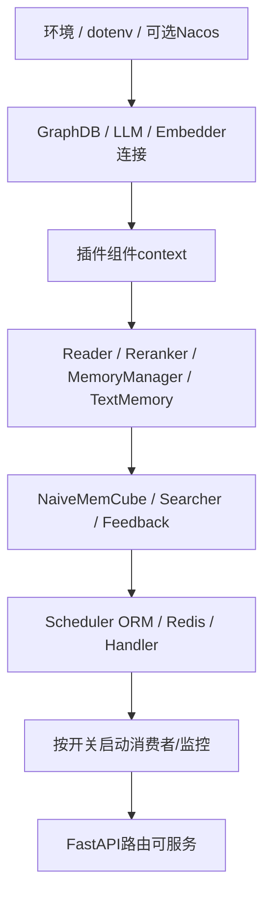

# MemOS部署机制、服务职责与依赖顺序

> 2026-10-02；源码提交 `a7367d07`。依据仓库启动命令、Docker/Compose/Helm、插件安装器、Bridge和Electron打包实现；没有执行安装、联网下载、容器构建或集群部署。以下注意事项是从实际配置确认的条件和缺口，不是可用性承诺。

## 1. 部署形态

| 形态 | 部署单元 | 适用职责 | 不包含什么 |
|---|---|---|---|
| Python库/本机API/MCP | Poetry包、Uvicorn/MCP进程 | 库操作、HTTP或工具接入 | 不自动安装所有外部数据库/模型服务 |
| Docker/Compose | API+Neo4j+Qdrant | 本地容器化API和两个后台 | 当前未提供Redis/RabbitMQ/MySQL/Milvus/全部模型 |
| Helm/Kubernetes | API、数据库Deployment/Service/PVC、可选Ingress | 集群配置/服务发现和探针 | 默认无API数据PVC、无模型sidecar |
| OpenClaw/DSH插件 | npm包加载到宿主进程 | 本地记忆捕获/召回及Viewer | 不要求Python MemoryOS服务器 |
| Hermes Bridge/daemon | Python provider + Node stdio/Viewer | 非TS宿主接入、本地界面 | stdio记忆与Viewer可独立运行 |
| Cloud插件 | 宿主JS包+配置UI | 调云记忆服务 | 不部署云端Memory存储/算法 |
| OpenWork桌面 | Electron包+工具子进程 | 桌面任务/OpenCode和云记忆 | E2E测试镜像不是生产服务镜像 |

## 2. Python本机与镜像

| 入口 | 构建/启动机制 | 职责与运行条件 |
|---|---|---|
| make install | poetry install --extras all --with dev --with test，安装pre-commit | 开发完整依赖；环境凭证/外部服务仍需配置 |
| make serve | uvicorn memos.api.server_api:app | 基础REST入口，Uvicorn默认host/port；不指向不存在的start_api |
| server_api.py直接执行 | argparse+uvicorn | CLI端口默认8001，与Docker8000不同 |
| 根Dockerfile | Python3.11-slim多阶段，requirements安装前缀复制，COPY src/docker，非root | 生产式镜像入口0.0.0.0:8000，/health探针 |
| docker/Dockerfile | 单阶段requirements+源码 | 开发镜像，uvicorn --reload，与源码volume配合 |
| Dockerfile.krolik | Poetry安装、额外库、overlay、Gunicorn --preload -w2/UvicornWorker | 扩展app安全/限流/admin路线；当前有缺口见第6节 |

基础两镜像只COPY源码并设置PYTHONPATH，没有安装MemoryOS分发元数据，因此entry point发现不能假定看到内置Dream。包安装和“源码能import”是不同条件。

### 2.1 真实启动依赖顺序

初始化发生在server_router模块导入时；不是服务监听后再按首次请求延迟创建所有依赖。MEMSCHEDULER_USE_REDIS_QUEUE选择Redis或Local队列，API_SCHEDULER_ON控制消费者；异步细化须有工作的消费者与对应Reader/存储，Redis并非必需，本地队列也能执行mem_read。模型/DB构造失败可能阻止app导入。FILE_LOCAL_PATH还须满足StaticFiles目录存在要求。

关闭由lifespan调用shutdown_components：停Scheduler、关RabbitMQ等；插件管理器shutdown并未在两个app lifespan中调用。多worker还各自拥有进程内缓存/信号，不能视为统一内存。

## 3. Compose服务职责与顺序

证据：[docker-compose.yml](../docker/docker-compose.yml)。

| 服务 | 职责 | 端口 | 数据/启动 |
|---|---|---|---|
| memos/API | REST、Reader/模型/Memory/Scheduler协调 | 8000 | 开发Dockerfile；根.env；挂../src与docker，depends_on两DB |
| neo4j | 图记忆节点/关系/检索 | HTTP7474、Bolt7687 | neo4j:5.26.6；named data/logs卷；HTTP健康检查 |
| qdrant | 可选向量存储 | REST6333、gRPC6334 | v1.15.3；storage卷；restart；未配健康检查 |

逻辑先启动DB/模型，再导入API，最后接受业务请求；Compose depends_on只保证启动依赖，未设置service_healthy，所以不等于DB可用后才启动API。已有Neo4jhealthcheck不自动成为API等待条件。

本Compose只定义三项；按选择后端可能根本不使用Qdrant，或还需要Redis、RabbitMQ、Postgres、Milvus、模型/Reranker等外部服务。不能把部署图画成每个请求固定通过Neo4j再Qdrant。

API自身日志、用户配置/元数据、下载/技能文件、部分ORM不因两数据库卷自动持久化；当前API源码volume也不是完整业务数据卷。

## 4. Helm/Kubernetes

| 资源 | 功能 | 前后依赖与注意 |
|---|---|---|
| ConfigMap/Secret | 非敏感/敏感配置注入 | 模型/DB地址与认证必须匹配实际服务 |
| API Deployment/Service | 默认1副本、8000 | 两BusyBox initContainer轮询DB TCP端口，然后启API |
| API probes | /health liveness/readiness | 只查看app响应，不检查模型/Redis/RabbitMQ/GraphDB完整健康 |
| Neo4j Deployment/Service/PVC | 图后台、HTTP/Bolt | 默认5.26.4；data10Gi/logs1Gi，HTTP探针 |
| Qdrant Deployment/Service/PVC | 向量后台、6333/6334 | 默认v1.15.3；storage10Gi |
| Ingress | 域名、path、可选TLS | 默认关闭；转API Service，不是独立业务服务 |

证据：[values.yaml](../deploy/helm/values.yaml)、[memos.yaml](../deploy/helm/templates/memos.yaml)、[ConfigMap](../deploy/helm/templates/configmap.yaml)、[Ingress](../deploy/helm/templates/ingress.yaml)。

当前依赖Deployment按enabled开关渲染，API等待initContainer却无条件存在；关闭内置Neo4j/Qdrant时可能等待不存在服务。ConfigMap固定内部DB地址，README中的外部URI覆盖写法不保证模板采纳。模型默认若指localhost，表示同Pod/容器，Chart没有提供相应sidecar，不能据此连接其他Pod。

API没有PVC；Chart appVersion/默认镜像tag为2.0.9而源码包为2.0.33。使用Chart需要明确镜像与配置快照，不能以当前源码说明解释旧镜像的全部行为。

## 5. Node插件、Bridge与桌面

### 5.1 v2本地插件

| 单元 | 安装/启动 | 职责/生命周期 |
|---|---|---|
| npm包 | tsc服务 + Vite Viewer，build:package/prepack | Node>=20；普通build不生成Viewer |
| OpenClaw | 停Gateway→安装包/production依赖→修宿主配置→启动Gateway→探Viewer | 同宿主进程加载adapter，不必另开stdio Bridge |
| Hermes | staging部署npm/Python provider→配置→替换→启动daemon | Node+Hermes Python环境；安装器nohup/Windows隐藏进程 |
| Hermes stdio | Python subprocess.Popen Node，stdin/stdout JSON-RPC | 通常--no-viewer；共享runtime复用Bridge；无HTTP端口 |
| Hermes Viewer daemon | 身份/版本探测→启动锁→detached Node→45s就绪检查 | 18800、日志/PID；与stdio桥生命周期分开 |
| DeepSeek Harness | Cordis bundle/patch、profile/宿主SDK加载 | in-process adapter；DSH安装分支有更高Node/pnpm要求 |
| Hub | hub.enabled角色启动 | 默认关闭，常见18912，0.0.0.0监听；SQLite共享投影 |

默认Viewer端口：OpenClaw18799、Hermes18800、DSH18801。Viewer通常loopback；Hub与Viewer暴露范围不同。OpenClaw/Hermes端口在加载配置时被固定覆盖YAML，DSH是宿主Schema viewerPort。

运行目录由MEMOS_HOME→MEMOS_CONFIG_FILE父目录→adapter defaultHome→agent默认路径选择，主要是config.yaml、data/memos.db、skills、logs、daemon。默认OpenClaw `~/.openclaw/memos-plugin`、Hermes `~/.hermes/memos-plugin`。OpenClaw安装代码与运行数据目录分开；Hermes默认安装prefix与runtime home同在~/.hermes/memos-plugin，不能泛化为全部宿主都分开。

Bridge保留.mts/.cts入口；Hermes launcher优先dist/bridge.mjs，安装器某准备路径仍倾向bridge.cjs，版本组合需核对。SIGINT/SIGTERM排空/关库、PID guard与退出预算管理生命周期。

代码能识别已有launchd/systemd supervisor并让重启交给它，但仓库未找到安装器默认生成plist/unit；当前nohup不等于systemd/launchd托管。

### 5.2 v1与Cloud

| 单元 | 职能/启动 | 数据/端口 |
|---|---|---|
| v1宿主插件 | 建SQLite/Embedder/Worker/Recall/Viewer；service.start及next-tick回退 | 默认Gateway18789，Viewer+10=18799，Hub+11=18800，可配置 |
| v1安装器 | 安装Node/包/native binding、改宿主JSON、重启Gateway | package>=18，但安装器要求Node22；DB stateDir/memos-local/memos.db |
| v1Viewer/Hub | 管理/共享HTTP | 监听0.0.0.0，与v2Viewer不同；需按实际认证范围部署 |
| Cloud插件 | JS ESM宿主Hook，云search/add | 无本地记忆DB；本地配置UI127.0.0.1从38463尝试24端口 |
| Cloud配置UI | 等Gateway ready、设置/更新状态，保存宿主JSON | token与云API key分开；卸载关闭UI |

v1Viewer18799与v2OpenClaw重叠，v1Hub18800与v2Hermes重叠，不同代/宿主共存要核对端口与数据路径。Cloud依赖远端服务，本仓库不能据客户端部署出云端数据库。

### 5.3 OpenWork桌面

pnpm workspace→Vite分别构建main/preload/React→electron-builder打DMG/ZIP/asar→afterPack拷架构Node→Electron main创建窗口/IPC→每任务node-pty/OpenCode→MCP工具子进程。

| 运行单元 | 职责 | 依赖 |
|---|---|---|
| Renderer | 页面/任务状态和交互 | preload API，不能直接用main Node权限 |
| main/preload | IPC、凭据/设置、任务/进程、云记忆 | electron-store、crypto、PTY、OpenCode |
| OpenCode task process | 模型执行/流式事件 | CLI、provider配置、auth.json、工具配置 |
| file-permission/question MCP | 用户权限/问题工具 | stdio Node/tsx；本地HTTP9226/9227转UI |
| dev-browser | 页面/浏览器控制 | Playwright/Express或Hono relay/WebSocket |

配置/历史在Electron userData，MemOS默认云URL/search-memory协议。打包Node硬编码20.18.1，下载脚本当前仅darwin x64/arm64；win/linux分支存在不证明打包资源完整。renderer/lib源码缺失需补齐/构建验证。E2E Docker使用Xvfb/Playwright/Electron mock任务，不是生产桌面服务容器。

## 6. 已确认部署注意事项

| 条件/缺口 | 影响 | 源码证据 |
|---|---|---|
| Docker requirements与pyproject不同 | qdrant-client1.14.3低于all>=1.16；缺若干reader/model/schedule依赖 | docker/requirements.txt与pyproject |
| requirements-full未被基础Dockerfile使用 | 不能按full清单判断镜像功能 | 两Dockerfile COPY requirements.txt |
| COPY源码未安装分发元数据 | memos.plugins entry points不保证发现Dream | Dockerfile、plugin manager |
| Krolik overlays/krolik缺失 | 当前build context COPY无法完成 | Dockerfile.krolik |
| Krolik CMD gunicorn但未见安装 | 启动命令可能缺可执行程序 | Dockerfile.krolik/依赖清单 |
| KrolikPoetry命令/文件输入 | --no-dev与Poetry>=2兼容、未COPY readme/lock需验证 | Dockerfile.krolik/pyproject |
| StaticFiles目录和env | FILE_LOCAL_PATH未满足可能阻止启动 | server_api.py |
| Compose仅start依赖 | API可能先于DB真正就绪 | depends_on无healthy条件 |
| /health为浅探针 | 不能代替外部服务健康检查 | API health函数 |
| Helm条件/地址/版本 | 禁用仍等待、外部env可能被固定内部地址覆盖、旧镜像tag | templates/values/Chart |
| API无完整持久卷 | 用户/ORM/文件/日志与DB后台卷分开 | Compose/Helm/临时SQLite helper |
| localhost模型配置 | 没对应sidecar时无法连外部Pod服务 | values默认模型地址 |
| host/Node版本差异 | 安装器约束高于package声明 | v1/v2/DSH安装分支 |
| 配置保存不全热更新 | 模型/算法需重启；Hub可即时重新启动 | v2 patchConfig/启动装配 |
| 任务/信号进程边界 | 多worker本地缓存/Dream信号不同，Redis状态与内存不能视为同一共享空间 | Scheduler/SignalStore |

## 7. 发布与验证机制

PythonCI通过多OS/Python矩阵安装、build wheel/sdist、Ruff、pytest/coverage；release workflow发布PyPI。npm插件有独立版本/发布确认/清单/成对版本脚本；Cloud和本地插件流程不同。桌面打包与UI测试各自执行，不归Python make test。

部署前应根据具体目标核对：入口/版本、必需组件、地址和凭证、安装依赖、数据目录/卷、启动就绪、关闭/恢复、接口/鉴权范围。本文没有部署服务或修改任何配置；实测结果与文档验证记录见 [7-测试用例.md](7-测试用例.md)。
