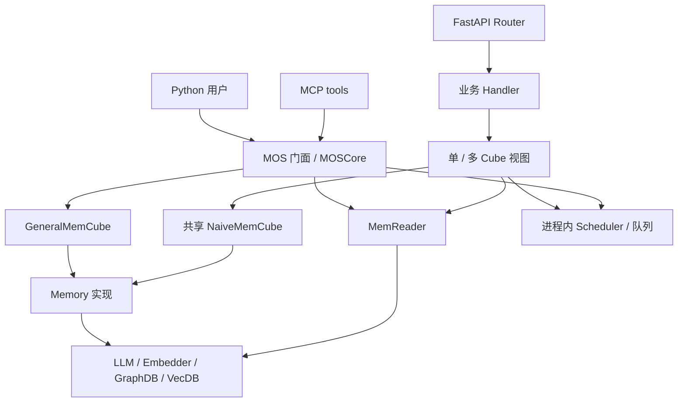
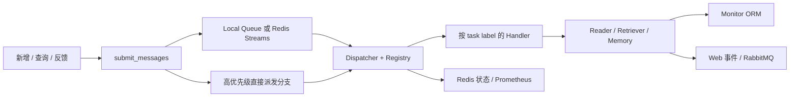
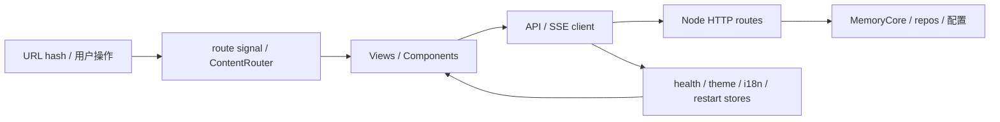
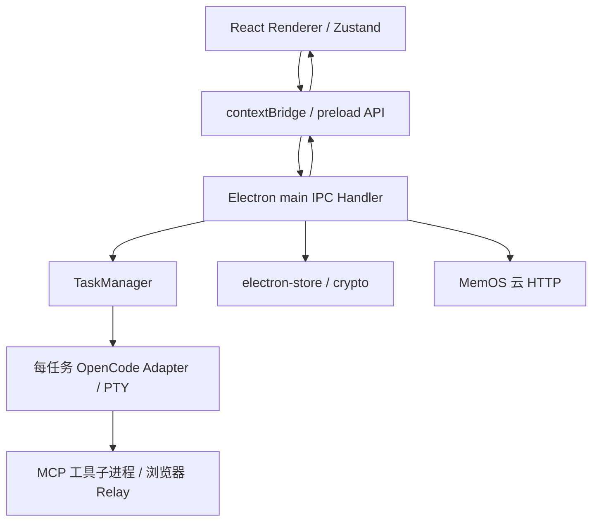

# MemOS 前后端架构模式

> 日期：2026-10-02；源码提交 `a7367d07`。架构模式依据对象构造、调用、存储和事件关系归纳；“分层/端口适配/事件驱动”等是分析结论，不代表源码作者统一使用了这些名称。本文覆盖 Python 主系统、四个 apps 及共享包。没有将静态结构视为已验证的运行架构。

## 1. 总体判断

| 子系统 | 前端模式 | 后端模式 | 运行边界 |
|---|---|---|---|
| Python MemoryOS | 无独立生产 SPA；API 文档是工具界面 | 模块化单体、多存储 provider、配置工厂、门面/组合、手动依赖注入、异步任务与插件管道 | 库进程/FastAPI/MCP 多入口，Scheduler 通常在服务进程内部 |
| 本地插件 v2 | 组件化 SPA、Signals 状态仓库、自实现 Hash Router、HTTP/SSE 订阅 | MemoryCore facade、契约/宿主适配器、事件驱动 Pipeline、SQLite repository | Node 本地进程，可经 stdio bridge/HTTP 暴露 |
| 本地插件 v1 | 内嵌 HTML/DOM 页面、轮询、页面服务与 API 同源 | 宿主插件入口、capture→queue→ingest→recall、SQLite store、工具 facade | 与 OpenClaw 宿主集成的本地 Node 系统 |
| Cloud 插件 | 原生配置表单、同源配置 API | 宿主生命周期适配 + 云 HTTP client | 本地不实现云端记忆算法/存储 |
| OpenWork | React SPA、路由/状态/组件分离 | Electron main/preload/renderer 进程隔离、IPC、每任务 CLI/PTY、云记忆适配 | 桌面程序和工具子进程，不是传统 Web BFF 服务 |

项目有多个独立可运行入口，但不能按目录多就称为微服务。Redis/RabbitMQ 与外部数据库存在，也不意味着核心已拆为独立部署的 memory/reader/scheduler 微服务。

## 2. Python 后端

### 2.1 模块化单体与多入口



证据：[MOSCore](../src/memos/mem_os/core.py)、[组件初始化](../src/memos/api/handlers/component_init.py)、[MCP 服务](../src/memos/api/mcp_serve.py)。HTTP Handler 直接使用共享组件，并不是所有 REST 请求经过 MOS。前者适合服务共享资源，后者提供库级用户/Cube 操作。

### 2.2 分层组织与实际耦合

| 层次/模式 | 实际落点 | 作用 |
|---|---|---|
| 接入层 | FastAPI Router、MCP、CLI、云 client | 协议、参数、响应/异常、流式输出 |
| 应用协调 | MOSCore、Handler、CubeView、Scheduler | 用户/Cube 路由、业务流程、后台任务 |
| 记忆领域 | Memory、Reader、Feedback、Agent、Dream | 内容抽取、召回、纠正、组织、上下文化 |
| 基础设施 | provider、ORM、队列、HTTP、日志/上下文 | 外部服务和状态存取 |
| 共享契约 | configs、types、item、schemas | 输入/输出、配置与消息结构 |

这不是严格无环分层：GraphDB/类型/Reranker 引用 MemoryItem，配置引用记忆子配置和调度 schema，Scheduler/单 Cube 视图引用 API 类型/配置/格式化，Reader 与 Memory 也有反向边。部分边是 TYPE_CHECKING/延迟 import。称为“有层次的模块化单体”比称为严格 Clean Architecture 更准确。

### 2.3 门面、组合、模板接口与多态

| 模式 | 证据 | 行为 |
|---|---|---|
| 门面 Facade | MOS/MOSCore | 用户调用 add/search/chat，内部协调多个组件 |
| 容器组合 | GeneralMemCube | text/act/para/pref 四个槽组合；将 load/dump 转给具体 Memory |
| 组合视图 Composite | SingleCubeView/CompositeCubeView | 共享物理容器上逻辑租户视图；写入顺序 fan-out，搜索有限线程并行 |
| 抽象接口与多态 | 各 BaseMemory/BaseLLM/BaseDB | 统一契约选择具体 provider，但接口覆盖不完全相同 |
| 策略 Strategy | 检索 fast/fine/mixture、Reranker strategies、Dream 阶段 | 按配置/模式切换算法或上下文拼接 |
| 流水线 Pipeline | Reader 多模态、SchedulerRetriever、Dream | 分阶段抽取/召回/增强/过滤/持久化 |

[NaiveMemCube](../src/memos/mem_cube/navie.py) 与 GeneralMemCube 是不同装配方式；SingleCubeView 的 cube_id 通常作为共享存储命名空间，不是自动创建新数据库。库 UserManager 的访问关系也不等于 HTTP readable/writable ID 回退逻辑。

### 2.4 配置工厂与依赖注入

```text
JSON/YAML/env → ConfigFactory(backend/config) → 具体 Pydantic 配置
→ 运行 Factory.from_config → provider 实例
→ component_init 手动连接对象 → HandlerDependencies / HandlerContext
```

SimpleTree/SimpleFeedback 的构造接收共享 LLM/Embedder/GraphDB/Reader/Searcher/Manager；Simple 指装配方式，不是算法被简化。服务初始化器是组合根，负责资源复用。工厂的弱引用缓存是按配置复用实例的机制，既不是 DI 容器框架也不是全局永久 singleton 保证。

当前配置接受列表、运行注册和构造签名有差异，LoRA/部分接口尚未实现；多态架构不等于全部 backend 可替换。参见 [1-模块关系.md](1-模块关系.md) 的工厂边界。

### 2.5 调度与事件驱动



队列是命令/任务分发，query/answer/add 等业务事件派生后续处理。Redis pending claim/ACK 支持恢复，但不应据此宣称所有 Handler exactly-once。RabbitMQ 主要是前端业务事件通道，与 Redis 内部任务队列分开。当前不是 Celery 架构。

异步 add 采用“两阶段处理”：先 fast 抽取/写入，再 mem_read 精细化/替换。它带来逐步完善的结果，不能将整个 HTTP 返回视为全部精细工作已经结束。

### 2.6 插件与内部扩展

entry point 发现→按 name/priority 选择→生命周期装配→Hook 回调链/唯一 provider。hookable 包装 before/after；普通 Hook 可按 pipe_key 传递结果。Dream 默认关闭，通过 add.after、Reader fine、search result、mem_dream 等扩展主流程。

属于插件式/管道式扩展与装饰器横切机制。源码自实现 Hook，不依赖 pluggy。外部 MCP 提供模型可调用工具，与内部 Plugin Hook 不同。

### 2.7 数据访问、缓存与横切关注点

| 模式 | 实际实现 | 边界 |
|---|---|---|
| ORM/数据访问层 | SQLAlchemy 用户/状态，GraphDB/VecDB adapters | Memory 正文与用户/Monitor 分属不同存储 |
| 多租户分区 | user_name/cube_id、独立 DB 或逻辑字段 | 不同后端隔离方式不一致；调用方必须传正确上下文 |
| 缓存/单飞 | TTL/LRU、Future 合并、工厂弱引用 | 精确文本缓存、实例缓存分别处理 |
| 请求上下文传播 | ContextVar + 自定义线程包装 | 普通线程不自动继承整个上下文 |
| 横切计时/日志/错误 | decorator、logging filter、语义异常和 API 转换 | 部分实际代码仍抛 ValueError/未实现异常 |
| 重试与 admission | Tenacity、出站 GCRA、HTTP middleware 限流 | 三种失败/控制边界需要分别处理 |

## 3. 本地插件 v2

### 3.1 契约与宿主适配器

```text
OpenClaw TS adapter ─────────────┐
DeepSeek Harness TS adapter ────┼→ MemoryCore 契约 → facade → Pipeline
Hermes Python → JSON-RPC bridge ┘
HTTP routes / Viewer ───────────→ facade 和管理能力
```

[agent-contract](../apps/memos-local-plugin/agent-contract/) 定义 DTO、事件、MemoryCore；[pipeline/memory-core.ts](../apps/memos-local-plugin/core/pipeline/memory-core.ts) 实现门面和 bootstrap。宿主只需转换事件/输入、注册工具、注入提示，而核心处理记忆。

这具有端口与适配器设计特征，但不是严格全仓 Hexagonal 架构：一些管理路由直接用配置、文件、Hub/repository 等能力，不能照 server/types 的旧注释声称所有 HTTP 路由只调用 facade。

### 3.2 事件总线与进化 Pipeline

session/episode→capture→reward→L2，然后 L3 与 skill 两个订阅分支；feedback/experience 更新证据，retrieval 消费 trace/policy/world/skill 投影。deps.ts 是明确的装配根，subscriber 用依赖参数获得 repo/LLM/bus。

这属于进程内事件驱动与分阶段业务管道，不是跨服务 Event Sourcing。虽然存 trace/audit/日志，但未证明全部状态都由事件日志回放重建。

默认 lightweightMemory.enabled=true 跳过 reward/L2/L3/skill/feedback 订阅。onTurnEnd 按 episode 类型调用 runLightweight/runLite，通常保留 OPEN；新话题、超时/session 结束等才 finalize 并触发完整模式的 reflect/reward。迟到回合恢复另有 finalize 分支。

### 3.3 Repository 与本地优先

SQLite 单机保存 sessions/episodes/traces/policies/world/skills 等；repo 封装表操作，migration 管理 schema，FTS5 与 Float32 BLOB 自实现余弦检索并存。Hub 提供共享同步，模型可本地/远端/宿主 fallback。

它是本地优先架构，不要求部署 Python MemoryOS 或外部向量数据库。完整模式仍可能依赖远端 LLM/embedding，不能将“本地数据库”理解为所有推理离线。

## 4. 前端模式

### 4.1 v2：组件 SPA + Signals 状态 + 同源 API



界面层、状态层、传输层、后端分开，符合单向状态更新和组件化组织；未使用 Redux/React Router。SSE 经 fetch reader 统一解析，以便带认证 header。路由在 hash 内，部署静态页面无需为每个业务路径提供服务端页面路由。

### 4.2 v1：服务端模板交付 + 命令式 DOM

HTTP 服务返回内嵌完整 HTML/CSS/JS，DOM 操作切换视图、fetch/轮询取数据。不是 React SPA，也不是动态 SSR hydration；管理页模板与后端 API 同一部署包，便于插件安装，但单文件承担更多界面逻辑。

### 4.3 Cloud：配置界面与云客户端适配

配置 UI 负责本地设置，不是云记忆查询的完整 Web 客户端。运行插件通过宿主 Hook 把 recall/add 转成云 HTTP；属于生命周期 Adapter/反腐转换层，将宿主消息/标识/过滤映射到云协议。云端架构不在此仓库完整实现，不能从客户端倒推出云微服务和表结构。

### 4.4 OpenWork：桌面三进程与任务进程管理



Renderer 展示/交互，preload 是能力边界，main 管理凭证、任务、文件权限和外部调用。TaskManager 以进程管理器方式给任务独立 adapter/PTY；UI 订阅流式事件。这更接近桌面 application/service 分离，不能套用“浏览器直接调用 FastAPI”的单一模型。

React Router HashRouter、Zustand store、组件/UI原语分层；MemOS 检索先附加 systemPromptAppend，完成后回写任务。工具 MCP 服务是独立进程，文件权限请求再经本地 HTTP/IPC 到界面。

## 5. 共享包、架构收益与约束

| 设计 | 收益 | 当前约束 |
|---|---|---|
| provider 抽象/工厂 | 可以按模型/存储场景选择 | 方法支持、配置/构造差异需逐后端核对 |
| 共享组件注入 | 控制模型与 DB 重复创建 | 全局/模块导入初始化使测试隔离、启动更敏感 |
| 队列与 Pipeline | 请求快速返回，后台增强/整理 | 状态查询、重放/重复处理、依赖服务管理需要单独考虑 |
| 插件 Hook | 在稳定节点扩展版本/Dream | 启用开关、唯一 provider、异常策略影响运行行为 |
| 本地 facade/adapter | 可跨宿主复用 v2 核心 | JSON-RPC、宿主生命周期与 namespace 必须保持契约一致 |
| 前端状态/通信分层 | 页面与数据传输解耦 | v1 为内嵌模式，OpenWork 为 IPC，不能统一替换客户端 |

根 packages/memos-core 与 v1 有复制/演化关系，packages/adapter-base/schema 提供契约；当前三目录无 package.json，未确认成为所有 apps 的实际共享依赖。不能仅凭目录名把它们画成已部署的共享服务。

本分析未把源码缺口改成架构事实：OpenWork 部分 renderer/lib 缺失、Krolik overlay 缺失、LoRA/图接口预留、默认轻量/Dream开关等都需要结合具体运行路线。更多数据流和部署边界见 [9-核心数据流.md](9-核心数据流.md)、[10-部署机制.md](10-部署机制.md)。
