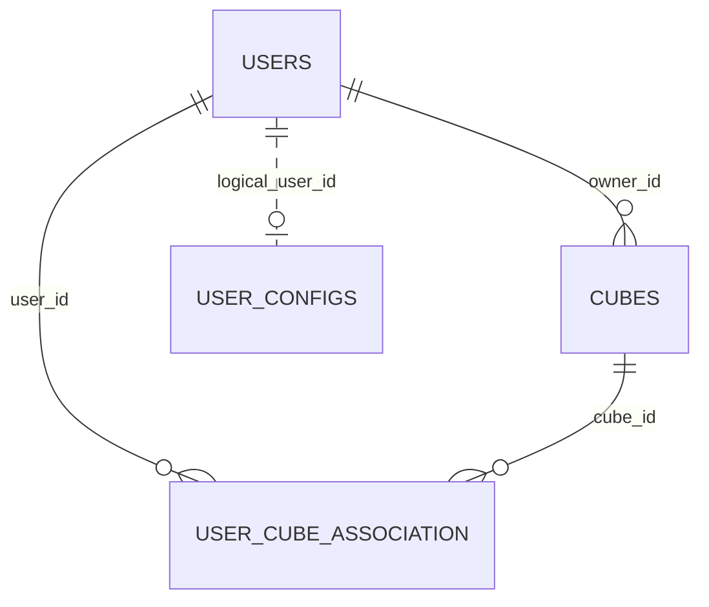
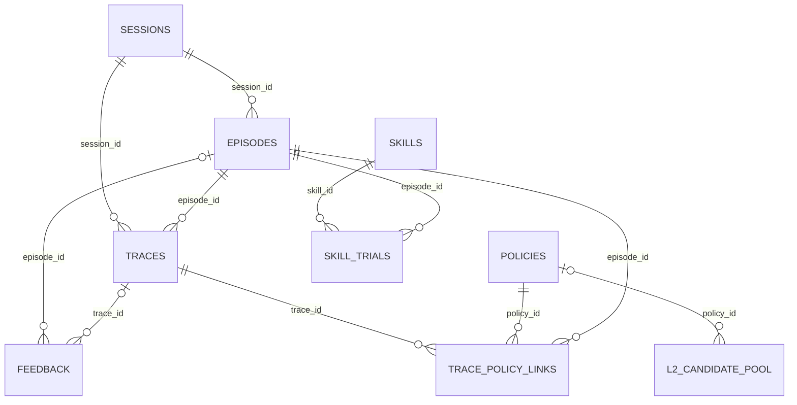
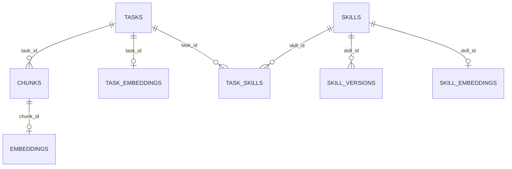

# MemOS 数据表、关联关系与强业务字段

> 2026-10-02；提交 `a7367d07`。依据 SQLAlchemy 模型、全部 SQL migration、SQLite migrate/ALTER、repository 和数据库调用整理，不读取真实数据库数据。按主表组织，区分数据库 FK、应用维护关系、JSON 来源数组、外部服务 ID。各子项目使用独立数据库，同名表不表示共享数据。

## 1. 存储范围与关系标记

| 子系统 | 存储 | 主要实体 |
|---|---|---|
| Python 用户管理 | SQLite/MySQL、SQLAlchemy | users、cubes、user_cube_association、user_configs |
| Python Scheduler | SQLAlchemy/Redis ORM | memory_monitor_manager、query_monitor_queue；运行/历史/锁状态 |
| Python Postgres 图后端 | JSONB + pgvector + edges | memories、edges |
| Neo4j/PolarDB AGE/VecDB | 图节点/边或collection | Memory节点、关系、point/向量payload；不是全部SQL表 |
| 扩展API认证 | PostgreSQL查询 | api_keys；当前未找到建表DDL |
| 本地插件v2 | better-sqlite3 SQLite | 20普通表、4FTS5虚拟表 |
| 本地插件v1/根复制core | SQLite | 27普通表、6FTS；两份migration有差异 |
| OpenWork | electron-store文件 | task-history、app-settings、provider/secure settings；不是SQL表 |

**强业务关系**在本文指字段必须被同一业务操作协调，或其含义依赖其他字段/实体：例如status与结束时间、vector与生产模型/维度、trial与skill统计、owner与访问权限、锁租约与版本。它不等同于数据库外键。

## 2. Python 用户主表

证据：[user_manager.py](../src/memos/mem_user/user_manager.py)、[mysql_user_manager.py](../src/memos/mem_user/mysql_user_manager.py)、[persistent_user_manager.py](../src/memos/mem_user/persistent_user_manager.py)。

### 2.1 users 为主

| 项目 | 字段/关系 |
|---|---|
| 主键/唯一 | user_id PK；user_name UNIQUE |
| 功能 | 用户身份、显示名、角色和活跃状态 |
| 同表强关系 | role决定ROOT/ADMIN/USER/GUEST行为；is_active决定是否可使用，delete_user主要软删除；created_at/updated_at描述生命周期 |
| 拥有关系 | cubes.owner_id FK指向users.user_id；一个用户可拥有多个Cube |
| 访问关系 | user_cube_association建立用户↔Cube M:N；可访问不等于拥有 |
| 配置关系 | user_configs.user_id逻辑对应用户，未声明SQL FK；PersistentUserManager删除配置后软删除用户 |

### 2.2 cubes 为主

| 项目 | 字段/关系 |
|---|---|
| 主键 | cube_id |
| 主要字段 | cube_name、owner_id、cube_path、is_active、created_at/updated_at |
| 同表强关系 | owner_id必须对应存在的owner；create_cube未检查owner.is_active；cube_path是实际内容位置/注册依据之一，与cube_id不是相同概念；软删除状态影响可见性 |
| 访问成员 | association(user_id,cube_id)复合PK，两列分别FK users/cubes |
| 创建约束 | 创建Cube同时将owner加入访问关联，拥有/成员两条记录需协调 |
| 数据边界 | SQL表记录Cube元信息，不存所有记忆正文；服务SingleCubeView命名空间也不意味着已存在该SQL记录 |

### 2.3 user_configs 为辅

user_id PK、config_data为MOSConfig JSON、时间字段。关系是users 1:0/1的应用约定；没有FK自动级联。MySQL持久化版本同构。RedisPersistentUserManager直接以user_id作为key保存配置，不是完整users/cubes CRUD的Redis替代。

SQLite ORM模型声明外键，不保证连接执行了PRAGMA foreign_keys=ON；当前UserManager构造未找到与TS store同样的开启逻辑。ORM关系delete-orphan与当前实际软删除路径也应分开理解。

## 3. Python调度、认证与图主表

### 3.1 Monitor状态表

| 表 | 主键 | 同表强关系 | 跨表/对象关系 |
|---|---|---|---|
| memory_monitor_manager | `(user_id,mem_cube_id)`复合PK | serialized_data为监控对象JSON；lock_acquired/lock_expiry控制租约；version_control为0—255循环字符串 | 逻辑指用户/Cube，无SQL FK；保存工作/激活记忆监控状态，不是正文主存储 |
| query_monitor_queue | 同上 | 查询队列JSON、锁与版本共同控制保存/合并 | 同范围对应查询监控，不FK另一Monitor表 |

证据：[base_model.py](../src/memos/mem_scheduler/orm_modules/base_model.py)、[monitor_models.py](../src/memos/mem_scheduler/orm_modules/monitor_models.py)。version_control是状态同步控制，不是文本记忆version。默认helper生成临时SQLite，不能当成固定持久化路径。

### 3.2 Postgres memories 为主

证据：[postgres.py](../src/memos/graph_dbs/postgres.py)。

| 表 | 主键/唯一 | 主要字段/关系 |
|---|---|---|
| memories | id TEXT PK | memory正文、properties JSONB、embedding vector(dim)、user_name、created_at/updated_at |
| edges | 自增id PK；UNIQUE(source_id,target_id,edge_type) | source_id/target_id逻辑对应memories.id；edge_type定义关系；没有端点FK |

同表强关系：properties的memory_type/status/version/history/sources与正文业务协调；embedding必须由对应正文/模型生成且维度符合schema；user_name限定租户，id却是全表PK，不含user_name。跨表关系：删除节点由应用先处理边再删正文，不是ON DELETE CASCADE。

### 3.3 api_keys：已知查询字段，DDL未确认

auth/API管理SQL用到id、key_hash、key_prefix、user_name、scopes、description、created_at、last_used_at、expires_at、is_active、created_by。key_hash参与验证，active+expires决定可用，成功更新last_used_at，撤销置inactive。当前未找到CREATE TABLE，所以不能猜PK类型/唯一索引/FK；user_name关联也只确认为业务关系。证据：[auth.py](../src/memos/api/middleware/auth.py)、[api_keys.py](../src/memos/api/utils/api_keys.py)。

### 3.4 图/向量模型的关系

| 存储 | 主对象 | 同对象强关系 | 关联 |
|---|---|---|---|
| Neo4j | `(:Memory {id})` | memory_type是属性，不是每类一SQL表；正文、metadata、embedding、status/时间 | PARENT/RELATED等边；working_binding/evolve_to/archive等ID属性逻辑关联 |
| PolarDB AGE | graph.Memory/关系标签 | AGE内部id与properties业务UUID并存；图属性/embedding列依赖实际部署schema | Cypher/SQL维护节点边；不把业务UUID画成普通SQL FK |
| Qdrant | collection point(id,vector,payload) | collection维度与模型输出一致；score是查询结果 | community图节点与point使用相同id逻辑配对，无跨产品FK |
| Milvus | id、memory/original_text、vector、payload、sparse_vector | memory经BM25生成sparse；dense维度匹配配置 | 显式/隐式偏好collection；不是图PreferenceMemory的同一实体表 |

[TextualMemoryMetadata](../src/memos/memories/textual/item.py)的status、version/history、sources、working_binding、evolve_to、archived_memory_id、covered_history、file_ids等构成内容/版本/来源关系，但数据库通常不为这些ID建立FK。换embedding模型即使维度相同也不保证语义兼容。

## 4. 本地插件v2：Session→Episode→Trace为主线

证据：[migrations目录](../apps/memos-local-plugin/core/storage/migrations/)、[repos目录](../apps/memos-local-plugin/core/storage/repos/)、[connection.ts](../apps/memos-local-plugin/core/storage/connection.ts)。连接明确开启foreign_keys；20张普通表，4FTS；编号001—012、018、019缺口不是隐藏表的证据。

### 4.1 会话、话题、轨迹及反馈

| 主/辅表 | 主键与数据库关系 | 同表强业务字段 | 跨表强关系 |
|---|---|---|---|
| sessions | id PK | agent和owner_agent_kind/owner_profile_id/owner_workspace_id描述归属；started_at/last_seen_at记录创建与活跃 | episodes/traces各有session FK；namespace列无单独主表 |
| episodes | id PK；session_id FK CASCADE | status open/closed与ended_at联动；reopen清结束时间；r_task是任务奖励；trace_ids_json为应用维护集合 | 含多trace；奖励回传到trace评分；trace_ids_json不是FK |
| traces | id PK；episode_id、session_id各FK CASCADE | turn_id/ts定位子步骤；正文/summary/reflection；value/alpha/r_human/priority；vec_summary/vec_action两类向量 | episode/session两FK独立，DB不保证episode属于相同session；FTS与正文更新联动 |
| feedback | id PK；episode/trace可空FK SET NULL | channel、polarity、magnitude、rationale、raw_json、ts | 两关联可独立为空；删除证据后保留反馈记录 |
| decision_repairs | id PK，无FK | context_hash、preference、anti_pattern、validated、ts | high/low_value_traces_json逻辑指trace集合，不自动清理 |

episode结束、turn结束和session结束不同；reopen使用UPDATE，INSERT OR REPLACE会触发CASCADE删除trace，不能当无副作用upsert。

reward业务关系：[backprop.ts](../apps/memos-local-plugin/core/reward/backprop.ts)将末trace价值设为人类奖励，向前按alpha、gamma、下一trace价值回传；priority结合非负价值与时间衰减。评分由业务代码计算，非SQL trigger。

### 4.2 policies为主：证据、候选与world model

| 表 | 约束 | 同表强关系 | 跨表关系 |
|---|---|---|---|
| policies | id PK | support/gain/status(candidate/active/archived)、experience_type/evidence_polarity/salience/confidence/skill_eligible、decision_guidance_json、正文/vec、metadata_json | source_episode/feedback/trace ID数组是JSON关系；与trace还有显式link表 |
| l2_candidate_pool | id PK；policy_id可空FK SET NULL | signature/similarity聚集证据，expires_at清理，promote写policy_id | evidence_trace_ids_json无FK；关联policy删除后置NULL |
| trace_policy_links | `(trace_id,policy_id)`复合PK；另episode_id，三FK CASCADE | INSERT OR IGNORE幂等链接 | DB不保证episode_id与trace.episode_id相同，应用负责一致性 |
| world_model | id PK | structure_json、confidence、status/archived_at；更新内容/结构/来源/vector的特定路径version+1 | policy_ids_json/source_episodes_json无FK；删除policy不会自动清JSON数组 |

policy→world→skill的来源数组是业务依赖，不能画成全程数据库FK链。人工字段更新不保证每次都走同一个version递增路径。

### 4.3 skills为主：使用与试验

| 表 | 约束 | 强字段及业务关联 |
|---|---|---|
| skills | id PK；UNIQUE(owner_agent_kind,owner_profile_id,name) | status/version/eta/support/gain；trials_attempted/passed同步eta；usage_count/last_used_at；source_policies/source_world/evidence_anchors JSON无FK |
| skill_trials | id PK；skill/episode FK CASCADE；session/trace FK SET NULL；pending部分唯一索引(namespace,skill,episode) | pending→pass/fail/unknown才写resolved_at/evidence；turn_id/tool_call_id只是定位；DB不保证session/episode/trace组合一致 |

eta是带prior的成功率估计，不是简单passed/attempted。奖励达到±0.5阈值判pass/fail，其余unknown；只有pass/fail更新统计。低eta且长期未用可归档。证据：[skills.ts](../apps/memos-local-plugin/core/storage/repos/skills.ts)、[skill_trials.ts](../apps/memos-local-plugin/core/storage/repos/skill_trials.ts)、[subscriber.ts](../apps/memos-local-plugin/core/skill/subscriber.ts)。

### 4.4 向量重试、审计及辅助表

| 表 | 约束/功能 | 强关系 |
|---|---|---|
| embedding_retry_queue | id PK；UNIQUE(target_kind,target_id,vector_field) | 多态目标引用trace/policy/world/skill，无FK；source_text/embed_role与vector_field对应；status/attempts/max_attempts/next_attempt_at；claimed_by/lease_until一起校验并清租约 |
| audit_events | 自增id PK | actor/kind/target/detail_json/ts；target可能实体ID/路径，非FK |
| api_logs | 自增id PK | namespace、tool_name/input/output、duration_ms/success/called_at；无trace/task FK |
| kv | key PK | JSON value+updated_at，进度/版本/Hub等通用业务键 |
| schema_migrations | version PK | name/applied_at与migration文件记录对应，不是记忆内容版本 |

v2本地vector BLOB没有每行provider/model/dimensions列；Float32字节长度÷4得到维度。普通表也没有统一norm2列；Hub共享记忆另有embedding_norm2。维护worker需要按当前模型/维度识别缺失，不应套用v1 producer字段。

### 4.5 Hub用户为主：共享投影

| 表 | 约束与关系 | 同表强关系 |
|---|---|---|
| hub_users | id PK；非空identity_key部分UNIQUE | role/status及approved/rejected/left/removed/rejoin时间；token_hash认证摘要 |
| client_hub_connection | id PK且CHECK=1，无FK | 当前hub_url/user_id/role/connected_at/identity/status/instance；远端user_id不FK本地hub_users |
| hub_shared_memories | id PK；UNIQUE(source_user_id,source_trace_id)；source_user→hub_users CASCADE | 正文/summary与embedding/norm2同步；visible/deleted_at tombstone；updated_at同步游标 |
| hub_shared_skills | id PK；UNIQUE(source_user_id,source_skill_id)；source_user→hub_users CASCADE | name/guide/bundle/version/quality_score共享投影 |

source_trace_id/source_skill_id来自远端来源，没有FK本地traces/skills。共享投影不能理解为覆盖本地私有实体。

### 4.6 FTS与命名空间

traces_fts/policies_fts/skills_fts/world_model_fts四虚拟表通过trigger维护文本镜像，检索再JOIN业务表；不是新的业务主表。JSON来源ID不会因实体删除自动清理；FK link/FTS trigger与JSON维护各有不同边界。

namespace列没有namespace主表。owner kind/profile与share_scope控制可见性；workspace_id虽然保存，但特定helper没有将它放入同样过滤谓词，不能据列存在就声称workspace绝对隔离。证据：[namespace.ts](../apps/memos-local-plugin/core/runtime/namespace.ts)、[_helpers.ts](../apps/memos-local-plugin/core/storage/repos/_helpers.ts)。

## 5. 本地插件v1：任务、记忆块与技能

证据：[sqlite.ts](../apps/memos-local-openclaw/src/storage/sqlite.ts)。migrate与ALTER共同组成最终schema，WAL/FK开启。27普通表、6FTS。

### 5.1 tasks、chunks与skills主表

| 表 | 主键/FK | 同表强关系/业务规则 |
|---|---|---|
| tasks | id PK；session_key无sessions表FK | active/completed与started/ended；topic/summary；owner；skill_status/reason描述生成进度 |
| chunks | id PK；后加task_id FK tasks；skill_id/dedup_target无FK | session_key/turn_id/seq分组；owner；content_hash检查重复但不UNIQUE；dedup_status/target/reason；merge_count/history；last_hit_at与created/updated |
| embeddings | chunk_id PK+FK CASCADE | vector/dimensions/producer(provider/model)/updated_at必须对应chunk及模型 |
| task_embeddings | task_id PK+FK CASCADE | 任务摘要向量、维度、producer、更新时间 |
| skills | id PK；name全局UNIQUE | version/status/tags/source_type/dir_path/installed/owner/visibility/quality_score |
| skill_versions | id PK；skill_id FK；UNIQUE(skill_id,version) | content/changelog/upgrade_type/metrics/quality/change_summary；source_task_id无FK |
| task_skills | `(task_id,skill_id)`PK，两FK | relation、version_at快照；version_at不FK版本表 |
| skill_embeddings | skill_id PK+FK CASCADE | 技能向量与dimensions/provider/model |

deleteTask应用先删task_skills、将chunks.task_id置NULL，再删task，不能写成ON DELETE SET NULL。deleteSkill手工处理task_skills/versions，embedding自动CASCADE；chunks.skill_id逻辑引用不自动清理。

### 5.2 本地辅助和共享映射

| 表 | 约束 | 业务关联 |
|---|---|---|
| viewer_events | 自增id | event_type/created_at，没有实体FK |
| api_logs | 自增id | tool/input/output/duration/success/called_at，无task FK |
| tool_calls | 自增id | 工具耗时/成功统计，不是chunks工具消息的FK表 |
| client_hub_connection | 单例id=1 | 远端URL/user/token/role/identity/status/instance，无用户FK |
| local_shared_tasks | task_id PK，无task FK | 本地task↔hub_task、visibility/group/synced_chunks/instance/original_owner |
| local_shared_memories | chunk_id PK+FK CASCADE | original_owner/shared_at |
| team_shared_chunks | chunk_id PK+FK CASCADE | 远端hub_memory_id/visibility/group/instance，无远端FK |
| team_shared_skills | skill_id PK，无skill FK | hub_skill_id/visibility/group/instance；重复CREATE不多算一张表 |

### 5.3 v1 Hub主表和内容投影

| 主/辅表 | 约束 | 强业务关系 |
|---|---|---|
| hub_users | id PK，username UNIQUE | role/status/token_hash、identity及审核/退出/删除时间 |
| hub_groups | id PK | name/description/time |
| hub_group_members | `(group_id,user_id)`PK，两FK CASCADE | 用户↔组M:N，joined_at |
| hub_tasks | id PK，UNIQUE(source_user_id,source_task_id)；user/group无FK | 远端任务投影、summary/visibility/time |
| hub_chunks | id PK；hub_task_id FK CASCADE；UNIQUE(source_user_id,source_chunk_id) | role/content/summary/kind、来源映射 |
| hub_embeddings | chunk_id PK+FK CASCADE | Hub chunk向量/dimensions/provider/model |
| hub_skills | id PK；UNIQUE(source_user_id,source_skill_id)；user/group无FK | bundle/version/quality/visibility/time |
| hub_skill_embeddings | skill_id PK+FK CASCADE | Hub skill向量/producer |
| hub_memories | id PK；UNIQUE(source_user_id,source_chunk_id)；user/group无FK | 独立共享记忆，不要求hub_task；source_agent、正文和visibility |
| hub_memory_embeddings | memory_id PK+FK CASCADE | Hub memory向量/producer |
| hub_notifications | id PK；user_id/resource无FK | read/type/resource/title/message/created_at |

六FTS为chunks/skills/tasks/hub_chunks/hub_skills/hub_memories镜像，外部content和SQLite rowid/triggers维护；rowid不是业务UUID。

根 [packages/memos-core sqlite.ts](../packages/memos-core/src/storage/sqlite.ts)同样有27普通/6FTS及相近关系，但缺少v1新增migrateEmbeddingProducerColumns等差异；不能说两份最终schema完全一致。该复制库也未作为apps共享数据库统一挂载。

## 6. Redis键空间与文件对象

| 逻辑对象 | 作用域/字段 | 强关联 |
|---|---|---|
| 用户配置key | user_id→MOSConfig JSON | 无users FK |
| Scheduler Redis ORM | lockable_orm:user:Cube 的data/lock/version | 同范围租约、版本与JSON状态 |
| API历史ORM | redis_api:user:Cube 的data/lock | 检索历史窗口和并发更新 |
| Streams消息流 | prefix:user:Cube:task_label | item_id、task_id、scope、consumer pending/ACK |
| 任务元数据/映射 | memos:task_meta:user Hash；memos:task_items:user:business_task Set | 业务任务→多个item_id；status/时间/类型；默认7天TTL |
| LLM GCRA | key_prefix:model | 理论到达时间与QPS/burst；配额不是users表关联 |
| OpenWork task-history | tasks[]文件数组 | id/status/messages/sessionId/时间，业务更新，默认保留上限100 |
| OpenWork settings | app/provider/secure文件对象 | memoryUserId关联外部记忆用户；凭据/模型设置，无SQL FK |

## 7. 一致性核对要点

真实FK、JSON数组、远端ID和逻辑命名空间必须分别处理。数据库只保证声明且启用的约束，跨库一致性由业务代码维护。当前不确定的认证DDL、AGE真实部署schema不能补写成事实。备份/迁移需要同时考虑正文、向量、来源、FK link、FTS和共享投影，不能仅导出单表就宣称完整恢复。
