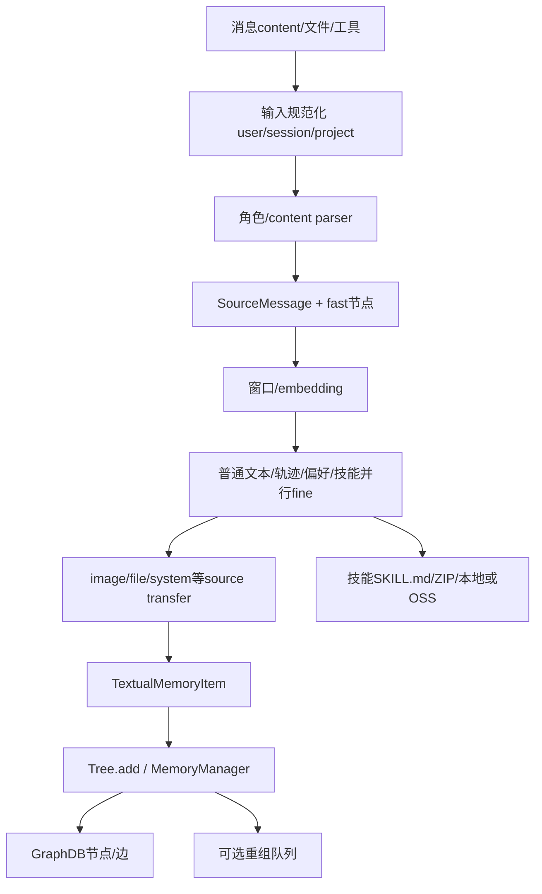
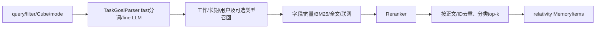
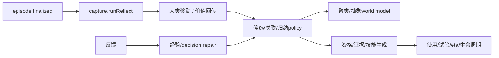

# MemOS核心数据流

> 2026-10-02；提交 `a7367d07`。以实际调用、任务label、对象和存储边界为准。图中箭头表示数据/控制方向；不是每种部署都同时执行所有路径。各字段和实体关系详见 [5-表关系.md](5-表关系.md)。

## 1. 数据流总览

| 流程 | 输入 | 主要转换 | 输出/存储 |
|---|---|---|---|
| Python配置启动 | env/JSON/YAML/Nacos | 校验→Factory→共享注入 | 模型/DB/Reader/Memory/Scheduler实例 |
| 普通文本写入 | 消息/正文 | LLM抽取/包装、embedding | 内存列表或VecDB payload/vector |
| 树/多模态写入 | 消息、file/image/tool/source | fast→fine、来源/类型、Manager路由 | Graph节点边，技能文件/向量 |
| 后台细化 | fast ID+task message | Reader transfer、写新/清旧/组织 | 精细记忆、状态/业务事件 |
| 检索 | query+Cube/filter/mode | 任务解析→多路召回→重排/去重 | 分桶记忆+relativity+引用 |
| 对话 | query/history+记忆 | prompt→LLM完整/stream→后处理 | answer、history、可选记忆回写 |
| 反馈 | 纠正文本+旧证据 | 判断/召回/ADD-UPDATE/版本 | 变更record、新/归档节点 |
| 调度工作记忆 | query/事件 | Monitor→检索增强→窗口更新 | ORM状态、可选KV cache |
| Dream | 新增ID/snapshot | Context/Motive/Recall/Reasoning/Diary/Persist | Context/Insight/DreamDiary |
| v2本地记忆 | 宿主回合/工具/反馈 | session/capture/retrieval、可选进化 | SQLite trace/policy/world/skill |
| v1本地记忆 | 宿主消息 | capture→ingest queue→chunk/摘要 | SQLite/FTS/vector、工具结果 |
| Cloud/OpenWork | 宿主Hook/IPC | 标识/消息转换→云search/add | 云上下文与任务回写 |

## 2. Python启动装配

```text
api.config导入：dotenv(override=True)→Nacos(env覆盖)
→ APIConfig getters / ConfigFactory
→ GraphDB、各职责LLM、Embedder
→ 插件shared context
→ Reader、Reranker、MemoryManager、SimpleTree
→ NaiveMemCube / Searcher / Feedback
→ Scheduler(ORM/Redis/Handler) → 将Scheduler句柄补回插件context
→ 可选消费者启动
```

输入配置只在相应构造时解析。Nacos后续更改env不自动重建所有实例，Factory缓存也可能保留已创建对象。库MOS启动另走MOSConfig/GeneralMemCube，不完全相同。

## 3. 写入与两阶段细化

### 3.1 向量记忆


NaiveTextMemory保存在进程内列表并JSON导出；它按词交集搜索，没有这条embedding链。GeneralText payload保留正文/metadata，vector用于召回。

### 3.2 多模态Reader→树记忆



sources保留原始证据，支持细化、引用和技能文件。偏好只从允许的user来源提取，清理检索注入/运行元数据；system主要提tool_schema。audio_parser=None；部分file fine输入分支未落地。自动技能要求工具轮次至少五，上传ZIP是另一条入口。

默认Manager batch只提交graph_nodes，没有提交准备的working_nodes；不能在图中默认画所有新增同时落WorkingMemory。

### 3.3 API async与sync

```text
AddHandler → CubeView
  sync：Reader按请求选择mode=fast或fine → text_mem.add → submit_messages(add)
        disabled_handlers可过滤后续任务执行
  async：Reader(mode=fast) → text_mem.add → 提交mem_read → 快速返回
                                      ↓
         Queue → Dispatcher → MemReadHandler
         → fine_transfer → 新记忆/RawFile写入 → soft_delete旧节点
         → 可选mem_organize → 状态完成/业务事件
```

async不会延后全部解析/写入；“task accepted”与“全部精细化完成”不同。Composite写入对各Cube顺序fan-out，检索则有限线程并行。

## 4. 检索与上下文

### 4.1 普通树检索



向量后端一般先返回ID/score，再get_nodes取得正文；PolarDB字段完整且开关启用可省这一步。工具/技能/偏好有各自top_k，因此总量可大于普通top_k。usage更新函数当前主体在docstring，不作为已发生存储副作用。

### 4.2 API模式分支

FAST→SearchService→TextMemory；FINE→DeepSearch/Agentic或检索-增强-补证；MIXTURE→当前结果与Redis历史合并，后台api_mix_search同步历史，Redis模式不可用回FAST。结果再经过插件扩展、阈值、sim/MMR去重、知识/会话重排、引用/上下文格式化。

跨Cubefilter分发有共用逻辑式与每Cube式两种，不能在同层混用。SingleCubeView带user_name/cube_id范围；库MOS另由UserManager取得可见Cube列表。

### 4.3 深度搜索

QueryRewriter→retriever.search→Reflection(sufficient/needs_raw/missing_info)→补充查询→循环。needs_raw使用已保存sources，不重新下载原文件。AdvancedSearcher.deep_search也是显式路线，Tree普通search创建AdvancedSearcher但不会自动调用deep_search。

## 5. 对话与反馈

对话输入query/history→检索记忆→system prompt/引用→chat LLM generate或stream→history更新→可选query/answer任务与AddHandler回写。stream后处理用async task或ContextThread；客户端收到文本不必等后台存储结束。

库MOS.PRO_MODE增加复杂查询拆分/子问题召回/分别回答/综合，失败回普通chat。HF路径可取KV cache；远端OpenAI模型不能消费本地tensor。LoRA当前无完整训练/聊天接入。

反馈流：判断关键词替换/语义纠正→无相关历史则Reader新增→否则抽corrected_info、embedding召回旧记忆→LLM ADD/UPDATE→校正ID/去重/修改幅度过滤→Manager/GraphDB→可选版本Hook/history/归档→清binding→answer+变更record。关键词分支有PolarDB专用方法依赖。

## 6. Scheduler、工作记忆与观测

```text
producer message(item_id/task_id/user/Cube/label/trace)
→ Local Queue或Redis Stream，或LEVEL_1直接派发
→ Registry(label→handler) → Dispatcher线程/直接执行
→ query派生mem_update / mem_read细化 / organize / feedback / Dream
→ StatusTracker waiting/in_progress/completed/failed + task映射
→ Prometheus埋点、Monitor ORM、Web/RabbitMQ事件
```

mem_update累积query、判断意图/时间→SchedulerRetriever召回/回答能力/增强/重排/过滤→替换工作窗口→更新Monitor→按开关ActivationMemoryManager将文本转换成KV。Monitor状态与Graph正文是不同存储。

trace由ContextVar经自定义线程传播，普通线程不自动获得。Redis ACK/pending负责消息状态，不证明副作用exactly-once；状态TTL、租约和业务幂等需要分别理解。

## 7. Dream可选流

新增after Hook→SignalStore按Cube积累ID→阈值/手工触发snapshot→mem_dream→Cube锁+唯一Hook→Context构建/动机/相似记忆/推理/日记/持久化。有效confidence/rationale才产生可用Insight写入；Context、Insight、Diary都在GraphDB。搜索Hook可召回Context加到text结果。

默认关闭；maintenance仅贡献说明。SignalStore是进程内，Composite新增信号当前优先解析第一writable Cube，不能假定每Cube同等记录。

## 8. 本地插件v2

### 8.1 宿主与回合边界

```text
OpenClaw/DSH Adapter，或Hermes Python→stdio JSON-RPC
→ MemoryCore.onTurnStart：建立session/episode、查询与注入
→ tool/subagent结果：执行证据
→ onTurnEnd：runLightweight或runLite → trace，通常episode仍OPEN
→ 新话题/超时/session结束：finalize
```

v2默认lightweight=true，只走轻量摘要/向量/检索过滤等，跳过完整进化订阅。完整模式：



L3与skill是分支，不是必须线性L3→skill。默认资源开关、证据阈值和模型可用性会决定是否产出。

### 8.2 检索/维护/共享

query builder→tier1 skill、tier2 trace/experience、tier3 world→关键词/向量多通道→融合/rank/去重/LLM filter→injectedContext。SQLite FTS镜像与Float32 BLOB向量，非FAISS。模型失败可留下embedding retry queue，worker按target/vector_field与租约重试；配置变化不自动令所有历史向量匹配。

Viewer→JSON/SSE client→Node routes→Core/repo投影；导入导出/维护/配置管理另有文件动作。Hub client发布或pull共享投影到Hub表；来源远端ID不FK本地实体，删除共享用tombstone等同步信息。

## 9. v1、Cloud与OpenWork

| 流程 | 数据流 | 关键边界 |
|---|---|---|
| v1写入 | messages→capture过滤注入→IngestWorker.queue→chunk/去重/TaskProcessor/摘要/embedding→SQLite | flush/关闭需等待；task/chunk/skill不同实体 |
| v1召回 | tool query→FTS/vector/LIKE/Hub候选→RRF→MMR→时间衰减→search/get/timeline渐进读取 | provider/model/dimensions签名决定缓存兼容 |
| Cloud召回/回写 | before prompt Hook→清用户query/过滤→云search→prompt block；agent_end→消息整理/去重复→云add | 客户端无云端DBschema，重复事件预算被测试 |
| OpenWork任务 | Renderer/store→preload IPC→main检索MemOS→systemPromptAppend→TaskManager/PTY→OpenCode事件→UI | MemOS默认云协议，任务可mock |
| OpenWork结束 |任务结果/messages→rememberTask→云add；title summarizer另走模型 | 桌面标题不等于记忆抽取 |
| OpenWork工具 | OpenCode→MCP子进程→本地permission/question HTTP→UI→答复 | stdio/HTTP/IPC三个协议边界 |

## 10. 跨流程ID与一致性

Python user_id/session_id/cube_id/memory_id/task_id/item_id/trace_id分别用于身份、会话、存储范围、正文、任务、子项、观测；不能互换。v2 session/episode/turn/toolcall/trace/policy/skill也分别定位不同层级。跨表FK、JSON来源、外部云ID、上下文trace的目的不同。

本文的核心流与当前未落地分支均以源码证据约束；运行图不表示每个配置组合可成功启动。后端接口见 [4-接口列表.md](4-接口列表.md)，中间件与部署见第8/10篇。
